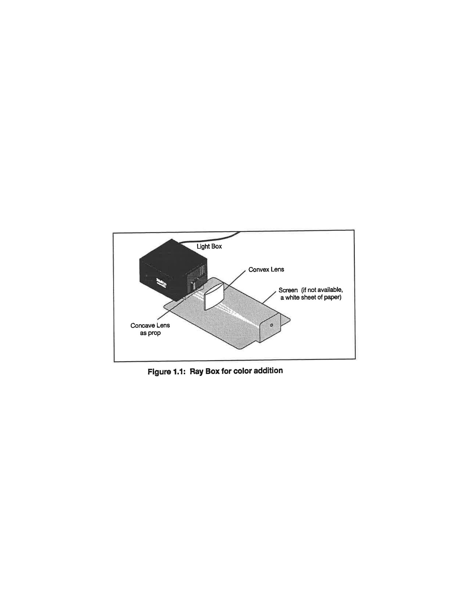
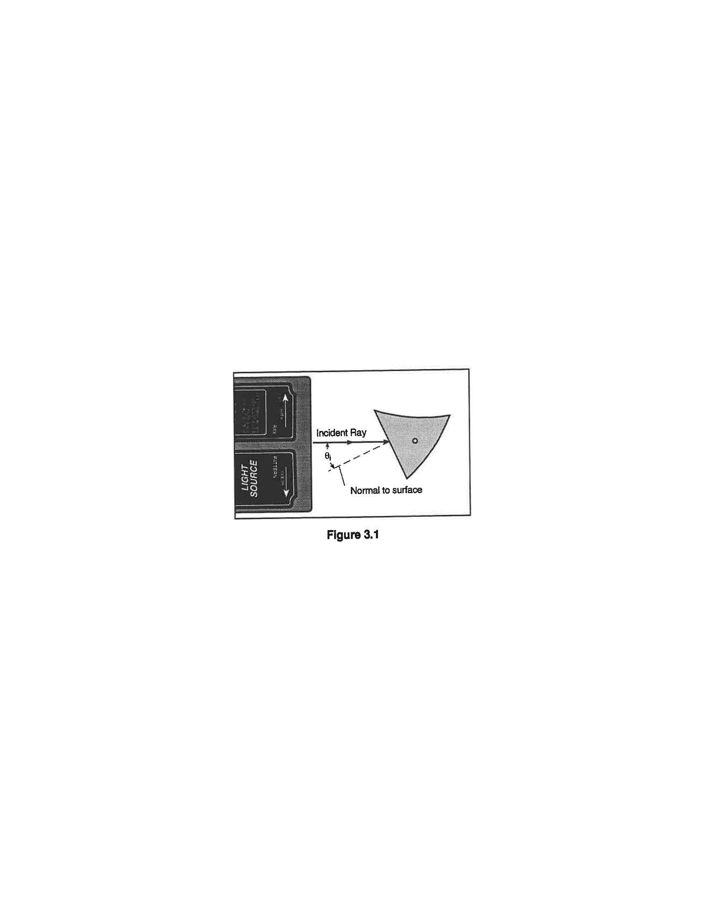
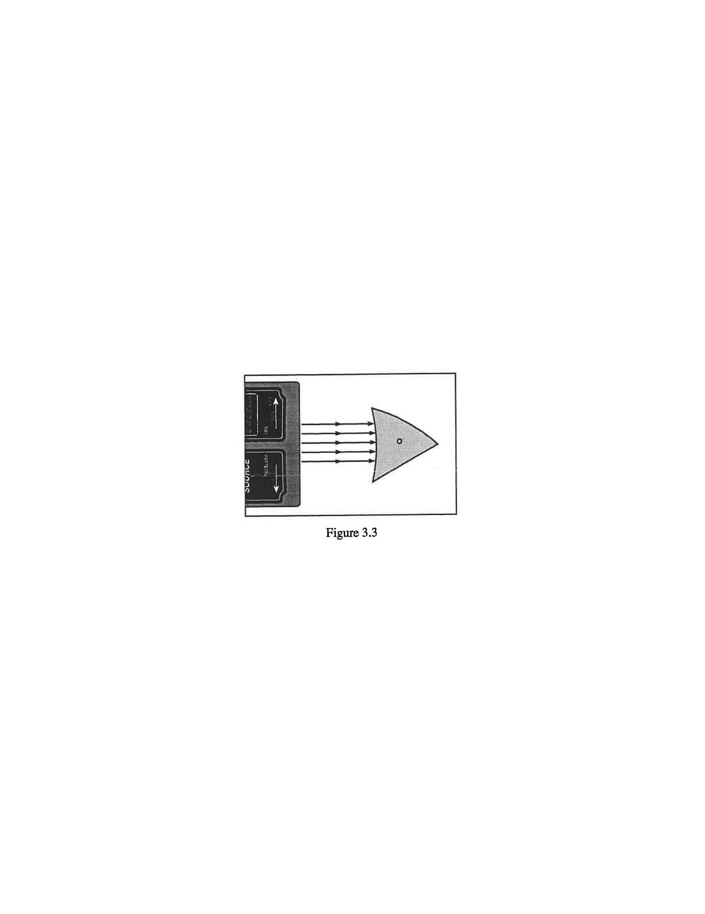
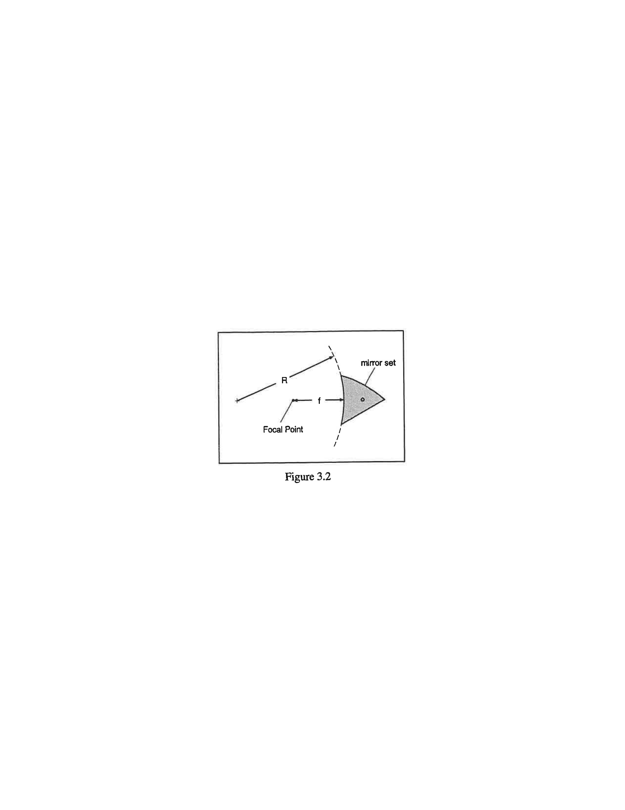
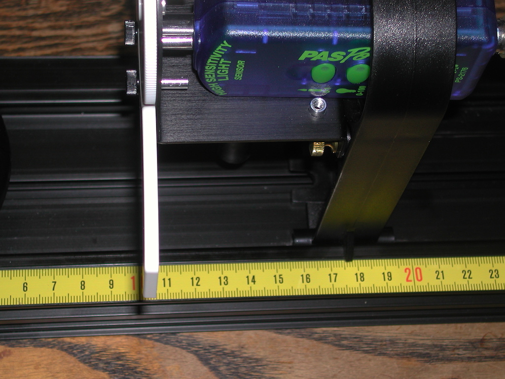

# O-1: Light

In this experiment you will be exploring the properties of light including its color, brightness, and the dynamics of reflections.

## Experimental Procedure

This experiment consists of three sub-experiments.

### Color of Light

This sub-experiment needs to be done in a room with low light levels, but total darkness isn't essential. Set up the experiment as shown in Figure 1.

*Figure 1: Geometry of the Color Addition experiment.*

1. Turn the wheel on the light source to select the red, green, and blue color bars. Fold a blank, white sheet of paper, as shown in Figure 1. Lay the paper on a flat surface and put the light source on it so that the colored rays are projected along the horizontal part of the paper and onto the vertical part.
2. Place the convex lens near the ray box so it focuses the rays and causes them to cross right at the vertical part of the paper. If necessary, move the flat edge on the paper so the lens stands stably without rocking.
3. What is the resulting color where the three rays come together? Record your observation in a table. List the colors added and the observed color(s).
4. Now block the green ray with a pencil. What color results from adding red and blue light together? Record the result in your table.
5. Go through and block the remaining colored rays one by one to see what color you get by the addition of the other two colors. Record the results in your table.
6. Replace the white screen with colored pieces of paper (red, green, and blue). Repeat the previous three steps for each sheet and make a table listing the colors you actually see with each piece of colored paper.

### Reflection of Light

*Figure 2: Optical diagram for the flat mirror.*

*Figure 3: Optical diagram for the curved mirrors.*

#### Flat Mirror

1. Place the light source in ray-box mode on a blank sheet of white paper. Turn the wheel to select a single ray.
2. Place the mirror on the paper. Position the plane [flat] surface of the mirror in the path of the incident ray at an angle that allows you to clearly see the incident and reflected rays (Figure 2).
3. On the paper, trace and label the surface of the plane mirror and the incident and reflected rays. Indicate the incoming and the outgoing rays with arrows in the appropriate directions.
4. Remove the light source and mirror from the paper. On the paper, draw the normal to the surface (as in Figure 2).
5. Measure the angles of incidence and of reflection. Measure these angles from the normal. Record the angle in a table.
6. Repeat steps 2–5 for three or four additional angles of incidence.

   Plot your measured angles of reflection as a function of the angles of incidence. What is the relationship between the two angles? The more angles you've measured, the more convincing your final plot will be.
7. Turn the wheel on the light source to select the three primary color rays. Shine the colored rays at an angle to the plane mirror. Mark the position of the surface of the plane mirror and trace the incident and reflected rays. Indicate the colors of the incoming and the outgoing rays and mark them with arrows in the appropriate directions.

#### Curved Mirrors

1. Turn the wheel on the light source to select five parallel rays. Shine the rays straight into the concave mirror so that the light is reflected back toward the ray box (see Figure 3, top). Trace the surface of the mirror and the incident and reflected rays. Indicate the incoming and the outgoing rays with arrows in the appropriate directions. (You can now remove the light source and mirror from the paper.)
2. The place where the five reflected rays cross each other is the focal point of the mirror. Mark the focal point.
3. Measure the focal length from the center of the concave mirror surface (where the middle ray hit the mirror) to the focal point. Record the results in a table.
4. Use a compass to draw a circle that matches the curvature of the mirror. You will probably need to make several tries with the compass set to different widths before you find the right one (see Figure 3, bottom). Measure the radius of curvature and record it in the table.
5. Repeat steps 1–4 for the convex mirror [the third side of the mirror]. Note that in step 3, the reflected rays will diverge; they do not cross. Extend the reflected rays back *behind* the mirror's surface to find the focal point.

### Brightness of Light

This sub-experiment needs to be done in a room with low light levels, but total darkness isn't essential. Set up the experiment as shown in Figure 4.

*Figure 4: Experimental setup.*

*Figure 5: Starting position.*

1. First, the sensitivity of the Light Sensor must be adjusted so it does not max out, but at the same time it cannot be so low that the signal is poor.
   1. Set the Basic Optics Light Source so the point light source is at $0.0\,\text{cm}$. The center of the point light source is indicated by the edge of the notch in the bottom of the light source bracket (see arrow on the bottom of the bracket). Set the front of the Light Sensor mask $10\,\text{cm}$ from the center of the point light source. Note that you must sight down the front of the Light Sensor mask to see where it lines up with the track measuring tape (see Figure 5). Alternately, you can use the position indicator foot on the holder, the leading edge of which is $7.5\,\text{cm}$ behind the front of the sensor mask. In the photo, the leading edge of the foot is at $17.5\,\text{cm}$.
   2. Rotate the aperture bracket to the white circle.
   3. Press the RECORD button and monitor the Intensity at $10\,\text{cm}$ in the box at the top right. Press the middle (0-100) button on the High Sensitivity Light Sensor. Apply power to the Point Light Source. The Intensity in the box at the right should be around 60%. If it is more than 90%, try starting further away from the source. If you start at a position different from $10\,\text{cm}$, change the value below to your initial position. Unplug the Point Light Source. Click STOP. Click Delete Last Run (at bottom right).
   4. Record the initial position you're using.
2. The first run is to help calibrate the system by measuring the levels of background light present.
   1. Turn off most of the room lights. With the Point Source off, we want the Relativity Intensity levels to not vary by more than a few percent as the Light Sensor is moved down the track. To check this (with the Point Source off), start with the Light Sensor $10\,\text{cm}$ from the center of the light bulb, click RECORD and then slowly move the sensor away from the light source until the $10\,\text{g}$ mass strikes the floor. Note that you should keep your hand and body behind the screen to avoid reflecting light onto the screen. Click STOP. Observe the Relative Intensity versus Position graph to the right.
   2. Click on the Graph Resize button on the top left of the toolbar above the graph. If the variation is more than 0.2%, click the Delete Last Run button, turn all of the room lights off and repeat the run. Click on the Data Summary button on the left side of the page. Click on anyplace that it says Run #1 and re-label it "Calibrate Run." Click Data Summary again to close it.
   3. Note that Relative Intensity is graphed versus the absolute value of the position (Abs. position) measured by the Rotary Motion Sensor since the measured value may be plus or minus depending on the set up. Also notice that '0' [zero] is where the sensor is when you clicked RECORD.
3. Now begin the actual measurements.
   1. Apply power to the Point Light Source.
   2. With the Light Sensor $10\,\text{cm}$ from the center of the light bulb (or whatever distance you used before), click on RECORD. Hold the back of the Light Sensor holder and move the Light Sensor slowly away from the light source until the $10\,\text{g}$ mass strikes the floor. As you do this, the thread will rotate the Rotary Motion Sensor, recording the distance the Light Sensor is from the bulb. Click STOP. Click Data Summary and re-label this as "Point Source Run."
   3. Reverse the Light Source so the screen is now at $1.0\,\text{cm}$ and facing the sensor.
   4. With the Light Sensor at the same starting position as in part, click on RECORD. Hold the back of the Light Sensor holder and move the Light Sensor slowly away from the light source until the $10\,\text{g}$ mass strikes the floor. Click STOP. As you did previously, click Data Summary and re-label this as "Extended Source Run."
4. The last step is the data analysis of the point source and the extended source. For the point source,
   1. Click the Curve Fit P tab and select the Point Source Run using the Data Display tool if it isn't already selected. Click on the Graph Rescale button so the graph fills the page. The scales on the left side and the right side must be the same. If they are not, move the hand icon over any number on the right side and when the parallel plate icon appears click and drag up or down to match the scale on the left.
   2. Examine the Calculator under the Curve Fit tab. Line 5 in the calculator calculates the theoretical values for the Intensity (I) as a function of position. Click on line 5 and examine the box below it to verify that the equation is

      $$
      I = \left\{\frac{A}{\left(\left|\text{position}\right|+B\right)^D}\right\} + C
      $$

      where $A$ has units of $\text{m}^2$, $C$ and $D$ are dimensionless constants, and $B$ has unit of $\text{m}$. The absolute value of position is taken since we want a positive distance, but the Rotary Motion Sensor can give negative values depending on how it is hooked up. The computer comes with nominal values for $A$, $B$, $C$, and $D$ in lines 1 thru 4. You need to choose better values for $A$, $B$, $C$, and $D$ to improve the agreement between the measured Relative Intensity and the Theory intensity ($I$). To do this consider the following questions as a group:
      1. What is the physical meaning of $C$? What value should you use and why?
      2. What is the physical meaning of $B$? *Hint: when you started the measurement, the computer read your position as zero, but was it?*
      3. If energy is going to be conserved, what should $D$ be?
      4. What should $A$ be?
5. For the extended source (the screen),
   1. Click the Curve Fit P tab and select the Extended Source Run using the Data Display tool if it isn't already selected. Click on the Graph Rescale button so the graph fills the page. The scales on the left side and the right side must be the same. If they are not, move the hand icon over any number on the right side and when the parallel plate icon appears click and drag up or down to match the scale on the left.
   2. Examine the Calculator under the Curve Fit tab. Line 11 in the calculator calculates the theoretical values for the Intensity ($I_2$) as a function of position. Click on line 11 and examine the box below it to verify that the equation is

      $$
      I_2 = \left\{\frac{A_2}{\left(\left|\text{position}\right|+B_2\right)^{D_2}}\right\} + C_2
      $$
   3. Note that the above equation is exactly the same as the previous except $A$ becomes $A_2$, $B$ becomes $B_2$, and so on. Set the values of $A_2$, $B_2$, $C_2$, and $D_2$ equal to the values you used for $A$, $B$, $C$, and $D$. Adjust the value of $A_2$ so the curves have the same value at an absolute position of zero. How good is the quality of the fit?
   4. Now re-run the fit setting $D_2=1$. You will also need to increase $A_2$ by a factor of 8–10 since at the zero position you are now dividing by $0.1$ instead of $0.12$.
   5. How good is the quality of the fit now?
   6. Although the fit is not perfect, the fit should be reasonably close up to $0.2\,\text{m}$ or so.

## Interpretation of Results

### Color of Light

- ▷ White light is said to be the mixture of all colors. What did your experimental results show?
- ▷ Did you see the same thing with white and colored papers? How do you explain your observations?

### Reflection of Light

#### Flat Mirror

- ▷ What is the relationship between the angles of incidence and reflection?
- ▷ Are the three colored rays reversed left-to-right by the plane mirror? Why or why not?

#### Curved Mirrors

- ▷ What is the relationship between the angles of incidence and reflection?
- ▷ The focal length of a cylindrical mirror should be half its radius of curvature. How do your results compare with this prediction?
- ▷ What is the radius of curvature of a plane mirror? What should its corresponding focal length be? Does this match what you observed for the flat mirror?

### Brightness of Light

- ▷ For the point source, you expected the brightness to fall as $1/r^2$ in order to conserve energy. Did it?
- ▷ For the extended object (the screen), you found the intensity fell as $1/r$ out to a distance of $20\,\text{cm}$ or so, and then your fit started to fail.
  - Why does a $1/r$ fit work at short distances instead of the expected $1/r^2$?
  - Why does the $1/r$ fit fail at the larger distances?
  - Would $1/r^2$ be a better or a worse choice at these large distances?
