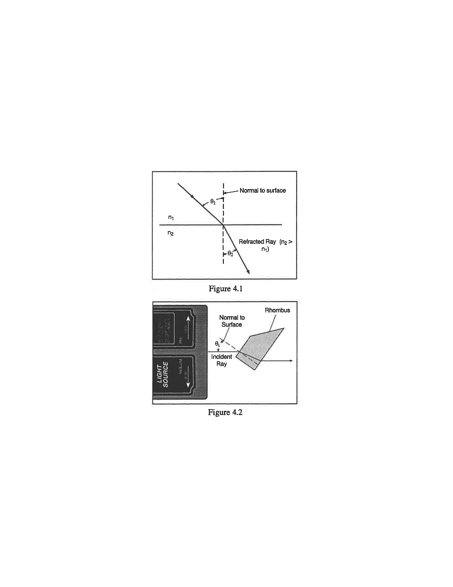
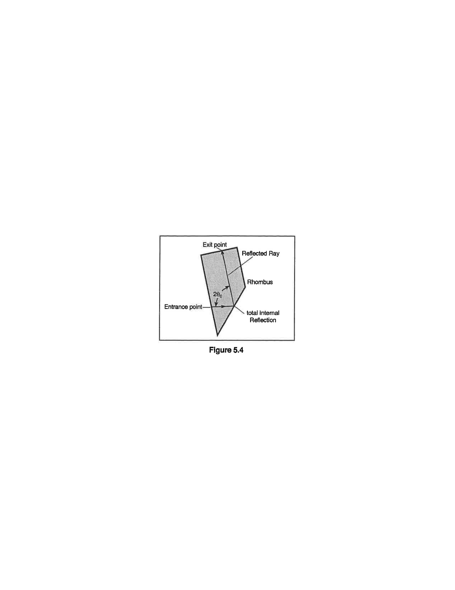
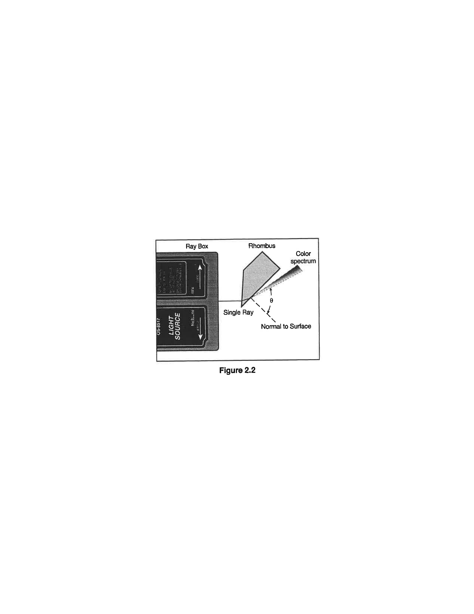

# O-2: Prisms

Prisms play many different roles in Optics; they can serve as beamsplitters, polarizing devices, and interferometers. A common function is to serve as a dispersive device. When a monochromatic light ray crosses from one medium (such as air) to another (such as acrylic), its path is bent (the light is *refracted*) by an amount that depends on the index of refraction of the two materials. If the index of refraction varies with frequency, then different colors are bent by different angles, producing a rainbow effect.

In this lab you will use a glass rhombus to explore how light behaves as it passes through transparent materials.

## Experimental Procedure

This experiment consists of three sub-experiments.

### Snell's Law of Refraction

The angle of incidence is defined as the angle the incoming light ray makes with a surface (measured from the surface normal). The refracted (or transmitted) angle is defined as the angle the outgoing light ray makes with the surface [again measured from the normal to the surface]. Figure 1 shows the arrangement of the two angles. In this first sub-experiment you will be trying to determine the relationship between the two angles.

*Figure 1: Angles of incidence and refraction (also called the transmission angle).*

*Figure 2: Orientation of the rhombus for the Law of Refraction experiment.*

1. Place the light source in ray-box mode on a sheet of white paper. Turn the wheel to select a single ray.
2. Place the trapezoid on the paper and position it so the ray passes through the parallel sides as shown in Figure 2.
3. Mark the position of the parallel surfaces of the trapezoid on the paper and trace the incident and transmitted rays. Indicate the incoming and the outgoing rays with arrows in the appropriate directions. Carefully mark where the rays enter and leave the trapezoid.
4. Remove the trapezoid and draw a line on the paper connecting the points where the rays entered and left the trapezoid. This line represents the ray inside the trapezoid.
5. Choose either the point where the ray enters the trapezoid or the point where the ray leaves the trapezoid. At this point, draw the normal to the surface.
6. Measure the angle of incidence, $\theta_i$, and the angle of transmission, $\theta_t$, with a protractor. Both of these angles should be measured from the normal. Record the angles in a table.
7. On a new sheet of paper, repeat the measurements for two additional angles of incidence. Add these measurements to your table. If you have time, doing more measurements will give an even better graph.
8. Graph the angle of transmission vs the angle of incidence. What is the relationship between the angles?

### The Critical Angle

Interesting things can happen when the angle of incidence is large. This is what you'll be exploring in the second sub-experiment.

*Figure 3: Orientation of the rhombus for the Critical Angle experiment.*

1. Place the light source in ray-box mode on a sheet of white paper. Turn the wheel to select a single ray.
2. Position the trapezoid as shown in Figure 3, with the ray entering the trapezoid at least $2\,\text{cm}$ from the tip.
3. Rotate the trapezoid until the emerging ray just barely disappears. Just as it disappears, the ray separates into colors. The trapezoid is correctly positioned if the red has just disappeared.
4. Mark the surfaces of the trapezoid. Mark exactly the point on the surface where the ray is internally reflected. Also mark the entrance point of the incident ray and the exit point of the reflected ray.
5. Remove the trapezoid and draw the rays that are incident upon and reflected from the inside surface of the trapezoid (see Figure 3). Measure the angle between these rays using a protractor. [You might extend these rays in your drawing to make the protractor easier to use.] Note that this angle is twice the critical angle because the angle of incidence equals the angle of reflection. Record the critical angle.

### Dispersion

As we will see in class, the angle of incidence and the angle of transmission are related through the index of refraction of the two materials. You saw in the previous sub-experiment, the light exiting was breaking apart into a rainbow. This is because the index of refraction varies slightly with the frequency [wavelength] of the light. In this final sub-experiment, you'll be looking at how it varies for your plastic rhombus.

*Figure 4: Orientation of the rhombus for the dispersion experiment.*

1. Place the light source in ray-box mode on a sheet of blank white paper. Turn the wheel to select a single white ray.
2. Position the trapezoid as shown in Figure 4. The acute-angled end of the trapezoid is used as a prism in this experiment. Keep the ray near the point of the trapezoid for maximum transmission of the light.
3. Rotate the trapezoid until the angle of the emerging ray is as large as possible and the ray separates into colors.
4. On the sheet of paper, record the direction of the incident ray, the surfaces [from which you can draw the normals later], and the angle of the transmitted red and blue rays.
5. These spread of angles are due to the variation of the index of refraction. The variation of the index of refraction with the color of the is called the *dispersion* of the material.

## Interpretation of Results

### Snell's Law of Refraction

For light crossing the boundary between two transparent materials, Snell's Law of Refraction states that

$$
n_1 \sin\theta_1 = n_2 \sin\theta_2
$$

*(1)*

where $n_1$ is the index of refraction on one side (either incident or transmitted) and $n_2$ is the index of refraction on the other side (see Figure 1). In these experiments, we can take the index of refraction of air to be $n=1.00$, but the index of refraction of the plastic is unknown.

- ▷ Replot your data as the sine of the transmitted angle vs the sine of the incident angle. Does that improve the agreement between the two?
- ▷ Looking at your graph, what must be the index of refraction of the plastic? What is its numerical value?

*Figure 5: Incident and refracted waves in Snell's Law of Refraction.*

### The Critical Angle

Snell's Law relates the incident and transmitted angles. At the critical angle, Snell's Law also gives us an easy way to measure indices of refraction because we know that the transmitted angle (from plastic to air) is exactly $90^\circ$.

- ▷ How does the brightness of the internally reflected ray change when the incident angle changes from less than $\theta_c$ to greater than $\theta_c$?
- ▷ Based on your measurements of the critical angle, use Snell's law (Equation 1) to find the index of refraction of the plastic.
- ▷ How does this measured index of refraction compare with your previous one?

### Dispersion

- ▷ What colors do you see? In what order are they? Which color is refracted at the largest angle?
- ▷ Use Snell's law (Equation 1) and your measurements to find the index of refraction for red light and for blue light. How do these indices of refraction compare with your previous two?
- ▷ As a percent-difference, how much does the index of refraction change between red and blue light?
