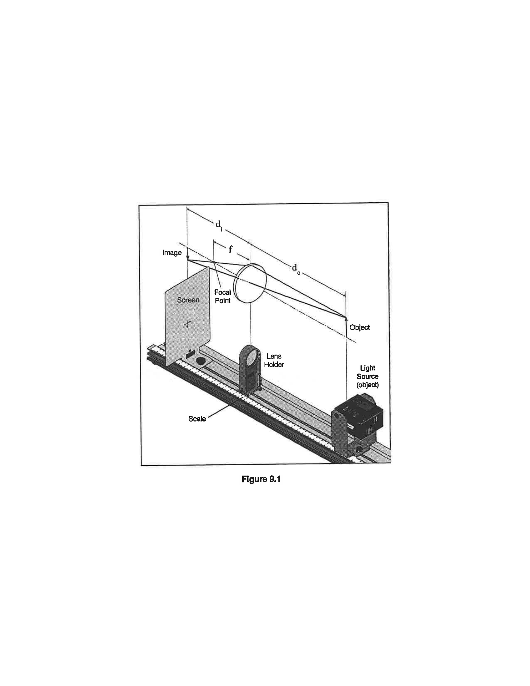
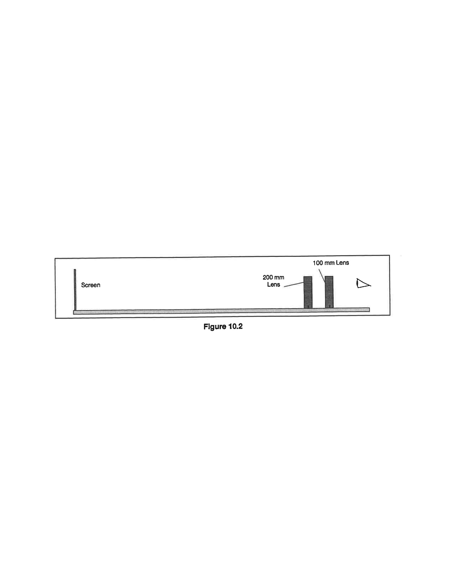
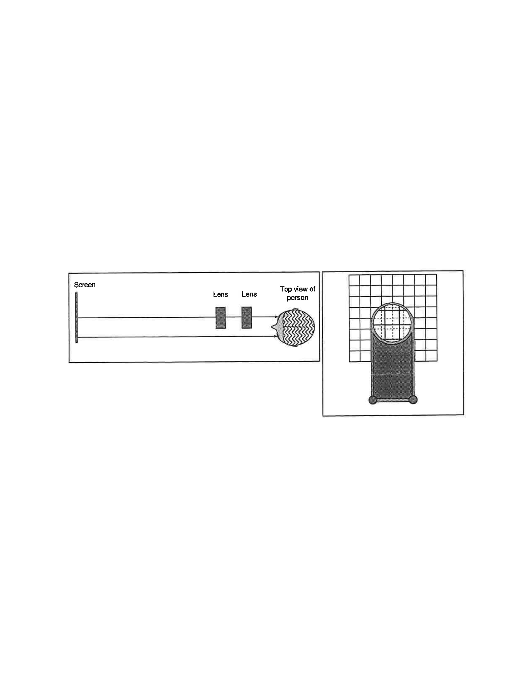
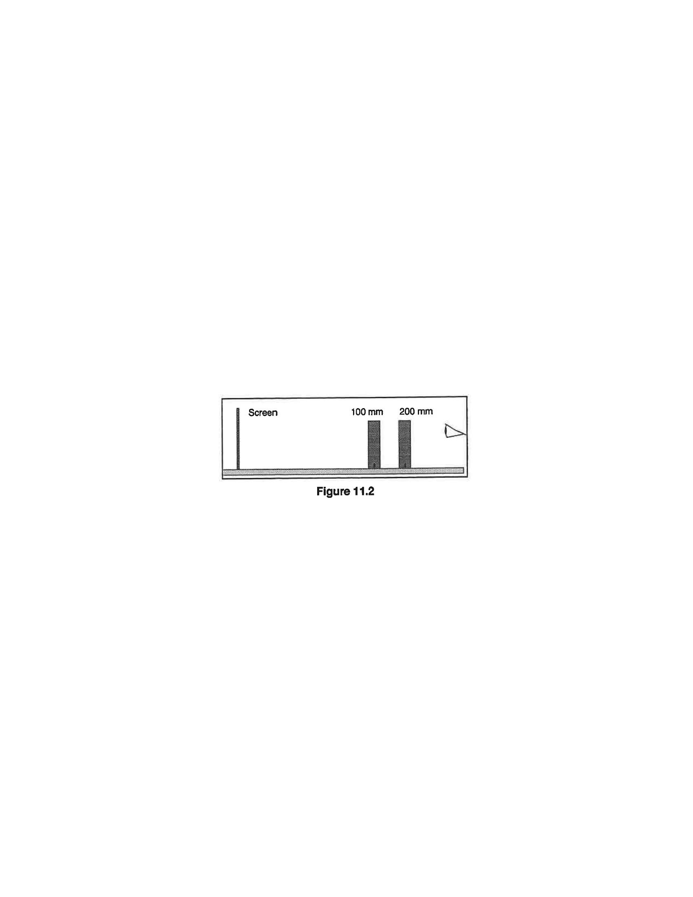

# O-3: Lenses

For any given lens, two numbers are required to characterize its behavior. There are more than one way to pick the numbers that parameterize your lens, but for this lab we'll use the simplest possible description. The first property is the diameter of the lens (we'll assume it's a round lens). This determines how much light the lens gathers and is part of what limits the quality of the image. The second property, and the one we'll be examining in this lab, is the focal length. If you use a lens to create an image of an object infinitely far away (a distant galaxy, for example), the focal length is defined as the distance from the lens to the image it makes of the galaxy. If the galaxy and the image are on opposite sides of the lens, then the focal length is positive and we say the lens is "convex"; if they are on the same side, then the focal length is negative and the lens is "concave."

In this lab you will be exploring how lenses can be used to create images and how combining different lenses can produce different effects.

## Experimental Procedure

This experiment consists of four sub-experiments.

### Focal Length of a Lens

In the first sub-experiment, you will determine the focal length of the lens by making a direct measurement of the focal length using a distant light source.

1. Hold the lens marked "100" in one hand and the screen in the other hand. Focus the image of a distant bright object (such as a window or lamp across the room) on the screen. Ideally, the source would be infinitely far away, but that isn't always possible. Nevertheless, the farther away your light source is, the more accurate your measurement of the focal length will be.
2. Have your partner measure the distance from the lens to the screen and record the result. This distance is the focal length of the lens. **Be sure you are seeing a nice clear image of the original light source!**

In the second sub-experiment, you will determine the relationship between other pairs of image and object distances.

*Figure 1: Lens position for Focal Length experiment.*

1. Place the light source and the screen on opposite ends of the optics bench $100\,\text{cm}$ apart, with the light source's crossed-arrow object facing toward the screen. Place the lens marked "100" on the track between them (see Figure 1).
2. Starting with the lens close to the screen, slide the lens away from the screen to a position where a clear image of the crossed-arrow object is formed on the screen. Measure the image distance and the object distance. Record the distances in a table.
3. Measure the object size and the image size for this position of the lens. Record the sizes.
4. *Without moving the screen or the light source*, move the lens to a second position where the image is again in focus. Measure the image distance and the object distance.
5. Measure the object size and image size for this position also. Note that you will not see the entire crossed-arrow pattern. Instead, measure the image and object sizes as the distance between two of the index marks on the pattern.
6. Repeat steps 2–4 with light source-to-screen distances of $90$, $80$, $70$, $60$, and $50\,\text{cm}$. For each source-to-screen distance, find the two lens positions where clear images are formed. You only need the distances; you don't need to re-measure the sizes for each of the new separations.

### Telescope

The primary function of a telescope is to enlarge the image of a distant object. A simple telescope can be made from just two convex lenses and will form a magnified image in the same place as the original object.

*Figure 2: Lens positions for the Telescope experiment.*

*Figure 3: Adjusting the telescope lenses.*

1. Tape the paper grid pattern to the screen to serve as the object.
2. The lens marked "200" is the objective lens (the one closer to the object). The lens marked "100" is the eyepiece lens (the one closer to the eye). Place the lenses near one end of the optics bench and place the screen on the other end (see Figure 2). Their exact positions do not matter yet.
3. Put your eye close to the eyepiece lens and look through both lenses at the grid pattern on the screen. Move the objective lens to bring the image into focus.
4. Now adjust your telescope to make the image occur in the same place as the object. To do this, you will look at both image and object at the same time and judge their relative positions by moving your head side to side. If the image and object are not in the same place, then they will appear to move relative to each other. This effect is known as parallax.
   1. Open both eyes. Look with one eye through the lenses at the image and with the other eye past the lenses at the object (see Figure 3, left).
   2. The lines of the image (solid lines shown in Figure 3, right) will be superimposed on the lines of the object (shown as dotted lines in Figure 3, right).
   3. Move your head left and right or up and down by about a centimeter. As you move your head, the lines of the image may move relative to the lines of the object due to the parallax.
   4. Adjust the eyepiece lens to eliminate parallax. **Do not move the objective lens!**
   5. When there is no parallax, the lines in the center of the lens appear to be stuck to the object lines.

   *Note: You will probably have to adjust the eyepiece lens by no more than a few cm.*
5. Record the positions of the lenses and screen.
6. Estimate the magnification of your telescope by counting the number of object squares that lie along one side of one image square. To do this, you must view the image through the telescope with one eye while looking directly at the object with the other eye. Inverted images have a negative magnification. Record the observed magnification.

### Microscope

Unlike the telescope which it closely resembles, a microscope's primary function is to magnify an object that is close to the objective (the lens opposite the one you look through). The microscope in this experiment will form an image in the same place as the object, but with a different size.

*Figure 4: Lens position for the Microscope experiment.*

1. Continue to use the paper grid pattern on the screen as the object.
2. For the microscope, the lens marked "100" is the objective and the lens marked "200" is the eyepiece (this is the opposite of how you used them for the telescope, see Figure 4). Place the eyepiece lens near one end of the optics bench and place the screen on the other end as in the previous part. The objective lens goes between them, but should be closer to the screen than the other lens.
3. Put your eye close to the eyepiece lens and look through both lenses at the grid pattern on the screen. Move the objective lens to bring the image into focus.
4. Adjust your microscope to make the image occur in the same place as the object. The general procedure is the same for the microscope as it was for the telescope.
5. Record the positions of the lenses and the object [screen].
6. Estimate the magnification of your microscope by counting the number of object squares that lie along one side of one image square. To do this, you must view the image through the microscope with one eye while looking directly at the object with the other eye. Inverted images have a negative magnification. Record the observed magnification.

## Interpretation of Results

### Focal Length of a Lens

First use your measured distances to find the focal length of the lens.

- ▷ Plot your measurements as the inverse image distance ($1/d_i$) versus the inverse object distance ($1/d_o$). The slope of the graph should be $-1.0$ and its $y$-intercept will be $1/f$, the inverse focal length. Fit a straight line to your data and determine both the focal length of the lens and the uncertainty of your measurement.
- ▷ How does your graphical measurement of $f$ compare with your original direct measurement of $f$?
- ▷ If the $y$-intercept is the inverse focal length, then what is the $x$-intercept.
- ▷ Based on your graph, what is the algebraic relationship between the image distance, the object distance, and the focal length? This equation is called the *thin lens formula*.

The ratio between the size of the image, $h_i$, and the size of the object, $h_o$, is called the *magnification*. As you saw, the size of the image changes as you move the lens around. In general, the magnification is related to the distances as

$$
M = -\frac{d_i}{d_o}
$$

- ▷ How does the magnification you computed from your measured heights, $M$, compare with the one computed from the ratio of your measured distances? Remember, if the image is upside-down, then the magnification will be negative.

### Telescope

Here we analyze your telescope using the lens makers formula you found from your graph.

Let $d_{o,1}$ be the distance from the object (the paper pattern on the screen) to the objective lens, and let $d_{o,2}$ be the distance from the eyepiece lens to the image. Since the image is in the plane of the object, this will also be equal in size to the distance between the eyepiece lens and the object (screen). Because the image appears to be located *behind* the eyepiece, we must record it as a *negative* distance.

- ▷ Calculate $d_{i,1}$ using $d_{o,1}$ and the focal length of the objective lens.
- ▷ Calculate $d_{o,2}$ by subtracting $d_{i,1}$ from the distance between the lenses.
- ▷ The magnification of a telescope is the product of the magnification of its individual lenses

  $$
  M = \left(-\frac{d_{i,1}}{d_{o,1}}\right)\left(-\frac{d_{i,2}}{d_{o,2}}\right)
  $$

  Calculate the theoretical magnification of your telescope from the measured distances.
- ▷ How does the calculated magnification compare with your measured magnification?

### Microscope

Once again, let $d_{o,1}$ be the distance from the object (the paper pattern on the screen) to the objective lens, and let $d_{o,2}$ be the distance from the eyepiece lens to the image. This too will be equal to the negative of the distance between the eyepiece and the object.

- ▷ Calculate $d_{i,1}$ using $d_{o,1}$ and the focal length of the objective lens in the thin lens formula.
- ▷ Calculate $d_{o,2}$ by subtracting $d_{i,1}$ from the distance between the lenses.
- ▷ Calculate the magnification as you did for the telescope.
- ▷ How does the calculated magnification compare with your measured magnification?
