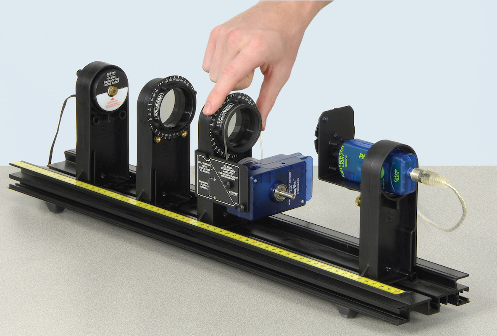

# O-4 | Polarization

This experiment consists of two sub-experiments to investigate polarization and discover the laws and the nature of the phenomena.

Up until now we have been treating light as a mathematical ray. As you saw in your *Electricity and Magnetism* class, though, light is also an electromagnetic wave. In this experiment, we will look at light whose electric field vector is restricted, wholly or partially, to lie in one specific plane. This is known as *polarized light*. In contrast, a source such as sunlight whose electric field points in random directions is referred to as *natural* or *unpolarized light*.

## Experimental Procedure

The layout for the first part of the experiment is shown in Figure 1.

*Figure 1: Geometry of the two-polarizer experiment. Going from left to right along the track are the laser, the fixed polarizer, the movable polarizer with the Rotary Motion Sensor, and the Light Sensor which measures the brightness of the output light. While not visible in this photograph, the Aperture Disk is connected to the Light Sensor.*



### Align the Polarizers

For this experiment, we will be using a laser light source. Many lasers, including our own, emit light that is already polarized. To get predictable results, the first polarizer *must* be aligned with the laser's own natural polarization direction before you begin. You will then align the second polarizer in the same direction so you have a known starting point.

1. Remove the holder with the Rotary Motion Sensor from the track. Slide all the components on the track close together.
2. Loosen the brass bolts so the fixed polarizer (the one without the Rotary Motion Sensor) can turn freely. Click RECORD and then rotate it through a full 360 degrees. Click STOP when done.
3. Click the Re-scale tool on the toolbar above the graph so the graph fills the page. Note that the transmitted intensity drops almost to zero (should be less than $0.5\%$) twice during the rotation. The two maximums will probably not be equally high due to the fact that the polarizer is not quite ideal.
4. Click RECORD and rotate the polarizer until the light intensity on the graph is at its maximum (use the higher of the two maximums if they differ). Click STOP when done.
5. Lock the polarizer in place with the brass bolts once its aligned.

You no longer need any of your old data sets, so click "Delete Last Run" at the lower right of the screen until the Capstone workspace is clear.

### Two Polarizer Experiment

Now you're ready to collect the data.

1. Push all the optical components as close together as possible to minimize the amount of stray light reaching the light sensor.
2. Note down the angle that is at the top of the movable polarizer.
3. Click RECORD and slowly rotate the polarizer (the one with the Rotary Motion Sensor) through $360^\circ$ (one revolution) in whichever direction gives positive angles, then click STOP. It's OK if you go a little bit beyond $360^\circ$, but be sure to do at least one full rotation. Try to move slowly and steadily through the minimum and maximum points. You can move faster between the turning points.

Now you need to record the angles off the graph

1. If the graph does not fill the page, click the Re-size tool at the upper left.
2. Position the hand icon over the lowest non-zero number on the left axis. When the hand changes to the parallel plate icon, click and drag until the number is at the top of the graph. This will stretch out the curve so it is easier to see the minimum.
3. Click on the Smart Cursor from the graph toolbar. Position the cross-hairs directly above the minimums and read the angle (the left number in the box) at each of the minima. Repeat to find the angles of the maxima.
4. Record these angles in a spreadsheet.

### Three Polarizer Experiment

1. Now repeat the previous experiment using three polarizers. Reverse the two polarizers so the movable polarizer is closest to the laser. Remember that the laser is polarized so essentially, the first polarizer is inside the laser.
2. Remove the movable polarizer. Loosen the brass bolts on the fixed polarizer.
3. Click RECORD and rotate the polarizer until the Relative Intensity is at the minimum. Click STOP and re-tighten the brass bolts.
4. Place the movable polarizer back on the track. Click RECORD and again adjust the movable polarizer for minimum, then Click STOP.
5. Now that the polarizers are aligned, repeat the previous experiment.

### Analysis

1. If the graph does not fill the page, click the Re-size tool at the upper left.
2. Position the hand icon over the lowest non-zero number on the left axis. When the hand changes to the parallel plate icon, click and drag until the number is at the top of the graph. This will stretch out the curve so it is easier to see the minimum.
3. Click on the Smart Cursor from the graph toolbar. Position the cross-hairs directly above the minimums and read the angle (the left number in the box) at each of the minima. Repeat to find the angles of the maxima.
4. Record these angles in your spreadsheet.
5. Click on Data Display triangle to display more than one set of data and then on the black triangle to select your two-polarizer and three-polarizer data sets.
   1. How do the peak heights of the 3-polarizer data compare with the heights of the 2-polarizer data?
   2. How do the peak positions [angles] of the 3-polarizer data compare with the peak positions of the 2-polarizer data?
   3. Record the peak heights of the two data sets and add the new intensity data to your spreadsheet.

## Interpretation of Results

Every polarizer has a preferred axis. Electric fields parallel to the axis pass through the polarizer; electric fields perpendicular to the axis are blocked and no light is transmitted. When you aligned the polarizer, what you really were doing was rotating the polarizer until its axis was parallel to the electric field of the light coming out of the laser.

If light is neither parallel nor perpendicular to the polarizer axis, then only the *vector component* of the electric field parallel to the axis will be passed. Following the usual rules for vector components, the transmitted electric field will have a magnitude $|E|_{out} = |E|_{in}\cos\theta$ where $\theta$ is the angle between the electric field and the polarizer's axis.[^1]

[^1]: You can also write this as a dot-product between the electric field vector and the [vector] polarization axis.

What the light sensor measures is the intensity of the light, the time average of the squared-magnitude of the electric field (which is, in turn, proportional to the time-averaged Poynting vector magnitude)

$$
I_{out} = \left\langle\left|\vec{E}_{out}\right|^2\right\rangle
$$

*(1)*

Note that intensity is proportional to $|E|^2$ and thus will never be a negative number.

### Two Polarizer Experiment

- ▷ Assuming an ideal polarizer, use Equation 1 and the description of polarization above to derive your expected intensity vs angle curve.
- ▷ In the Capstone calculator, plot your predicted curve and match it to your data
  1. Create a calculation for the theoretical curve. It will look something like

     ```
     I=[I zero (%)]*(cos([Angle (rad)]+[A (rad)]))^2 + [B (%)] with units of %
     I zero=15 with units of %
     A=0       with units of rad
     B=0       with units of %
     ```
  2. On the graph of Relative Intensity vs Angle, add another vertical axis and select the calculated I.
  3. In the calculator, 'I zero' is the peak amplitude, 'A' produces a constant horizontal shift and 'B' a constant vertical shift, should they be necessary. *Manually* adjust these constants as necessary until the curve matches your two-polarizer data.
- Record your best-possible values for $I_0$, $A$, and $B$.
- ▷ How well does your prediction match your data? What do the curve parameters 'A' and 'B' correspond to physically?

### Three Polarizer Experiment

- ▷ Assuming an ideal polarizer, use Equation 1 and the description of polarization above to derive your expected intensity vs. angle curve. *Remember to leave the electric field as a vector until the very end*.
- ▷ In the Capstone calculator, plot your predicted curve and match it to your data. The procedure is similar to what you used for the two-polarizer fit; only the function needs to be changed.
- ▷ How well does your prediction match your data?

Real light sources can be modeled as the weighted sum of an ideal polarized light source and an ideal natural light source (if you do out the math, Equation 1 predicts $I_{out} = I_0/2$ for an unpolarized light source).

- ▷ Estimate (as a fraction of the total) the amount of unpolarized light coming out of the laser.
- ▷ Is it reasonable to treat the laser as if it were $100\%$ polarized in our analysis?
