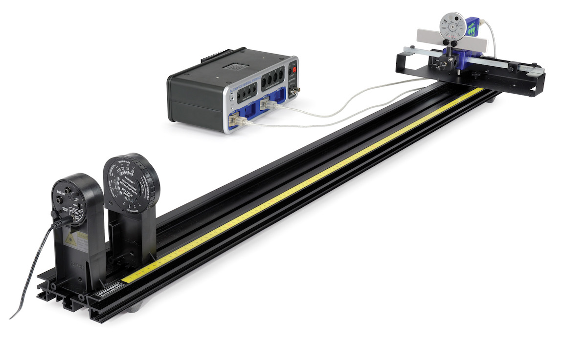

# O-6 | Interference

Geometrical Optics say that light passing through a pair of hole should produce a pair hole-shaped spot on a screen. Wave optics, on the other hand, says the light will spread out and what's observed will be the sum (the *superposition*) of the two outgoing waves, and that is in fact what's observed.

This lab is superficially similar to the Diffraction lab (O-5), but there are two key differences. First, the pattern you observe will be subtly different. Second, and more important, interference requires two (or more) waves while diffraction is observed even with a single light source or aperture. Unlike diffraction, the type of light source also matters when you're studying interference effects — we'll learn why in class, but laser light is almost mandatory when studying interference.

In this experiment, we will use the basic optics track, high precision slits, and a high sensitivity light sensor to investigate the interference of light.

## Experimental Procedure

### General Setup

- ▷ The apparatus should already be setup and ready for use (see Figure 1). If there are any general difficulties please contact the lab technician or instructor.

*Figure 1: Optical setup for the interference experiment.*

### Verify Software Settings

- The Rotary Motion Sensor and the Light Sensor should be plugged in.
- Click open the Hardware Setup button at the left of the screen. Click on the Rotary Motion Sensor icon. To the right of where it says Rotary Motion Sensor at the bottom of the Hardware Setup panel, click on the Gear icon. In the Linear accessory line, click on the white triangle and verify that it is set to "Rack & Pinion." Click the Hardware Setup button to close the screen when done.
- In Capstone, set the Common Sensor Sample Rate to $25\,\text{Hz}$.
- If necessary, create a graph of Relative Intensity vs. Distance.

### General Procedure

1. Measure the distance between the slits (front of Slit Disk) and the screen. You can use the scale on the track, but it is easier and more accurate to use a meter stick. Record the distance.
2. Record the wavelength of the two laser diodes (printed on their back).
3. Change to slit #2 on the Light Sensor bracket and push the 0–100 button to adjust the sensor's sensitivity. Turn out the room lights.
4. Observe the pattern on the screen as you rotate the Double Slit to each of its four positions ($a = 0.04\,\text{mm}$ and $d = 0.25\,\text{mm}$, etc.). If you can't see a pattern at all, ask an instructor to check the alignment of the laser.
5. The patter you see is actually the **product** of two patterns. The first pattern of bright and dark spots does not change and is produced by the finite width of the slits (you'll learn more about this one in the Diffraction experiment).[^1] The second pattern of bright and dark spots is produced by the interference between the two slits. This pattern **will** change as you change the slit spacing and it's the pattern we'll be talking about in this lab.
   - Can you identify the two patterns? What do they look like?
   - How does the interference pattern change as you change the slit spacing?
   - Takes notes on your observations.

[^1]: If you haven't done the Diffraction experiment yet, it's the pattern you get when you shine a laser beam through a single, rather than a double, slit.

### Red Laser

1. Be sure the red laser diode is installed. You will use the green laser diode in the next section.
2. Set the disk to the $a = 0.04\,\text{mm}$ and $d = 0.25\,\text{mm}$ position.
3. Move the Light Sensor so the Rotary Motion Sensor (RMS) is against the black stop block on the linear translator arm. Set the Light Sensor for max sensitivity (0–100).
4. Click on the RECORD button. Then slowly turn the RMS pulley to scan the pattern. Hold the rear of the RMS down against the linear translator bracket so it does not wobble up and down as it moves. Click on STOP when you have finished the scan. If the intensity maxes out (100%), change the gain setting on the light sensor and repeat the run. Click on Data Summary at the left of the screen. Double-click on the current Run #1 and re-label it "0.04a-0.25d Red". Click Data Summary closed.
5. Repeat for the $0.04\,\text{mm}$ wide slit with slit separation $0.50\,\text{mm}$. Set the Light Sensor bracket to slit #1 and press the 0–100 button. Label the run "0.04a-0.50d Red".
6. If you only see one or two data points per peak, even when moving slowly, you may need to increase the sample rate. This is most likely to happen with the $0.50\,\text{mm}$ slit spacing.

### Green Laser

1. Note where the index foot is on the bottom of the red laser with respect to the yellow scale on the Optics Bench. Replace the red laser with the green laser so the index foot is in the same position. If the feet are in the same place, then the distance from the slits to the screen will be the same as before.
2. Verify you can see the interference pattern using the green laser beam (ask for help if you can't see anything).
3. Set the disk to the $a = 0.04\,\text{mm}$ and $d = 0.25\,\text{mm}$ position.
4. Turn out the room lights and repeat the same procedure you used for the red laser. Save your data as "0.04a-0.25d Green".
5. Switch to the $d=0.50\,\text{mm}$ slit and repeat your measurements. "0.04a-0.50d Green".

### Data Analysis

Now that you have the data files, it's time to find the position of the interference maxima.

1. Select the "0.04a-0.25d Red" data file. Click the Scale-to-Fit button.
2. Click on the Coordinate Tool (graph toolbar). Right-click in the center of the crosshairs and select tool properties. If necessary, increase the number of significant figures to 4. We actually want four decimal places, which means we need to print four significant figures when the positions is greater than $0.1\,\text{m}$.
3. Expand the horizontal scale to see the maxima more clearly.
4. The [fixed] single-slit diffraction pattern will have a bright spot in its center.
   1. Without moving beyond that bright central bright spot, select an interference maximum that is far to the left as possible.
   2. By convention, the center-most bright interference spot is labelled $n=0$. The spots to either side of it are labelled $n=\pm 1$ (positive to the left, negative to the right), and so on. Record the $n$-value of your maximum.
   3. Drag the crosshairs to your maximum. Right-click on the Coordinate Tool and select Show Delta. Drag the delta to the corresponding $-n$th maximum on the right. Record the delta position, $\Delta x$, on a spreadsheet with the corresponding order $n$ of the pair.
   4. Repeat your measurement for as many $(n,\Delta x)$ pairs as you can find. Be careful — not all of them will be visible! When the single-slit pattern has a minimum, it will obscure some of the interference maximum too (that's why we started under the central bright spot). Be sure to include those missing peaks when you determine your $n$'s.
5. The quantity that actually matters is not the distance, $\Delta x$, but the angle $\theta$ (using the center bright spot to define the $\theta=0^\circ$ point). Use your measured distance from the slit to the screen and a bit of trigonometry to convert your distances to angles. Record the angles in your spreadsheet.

   *Be careful:* the angle you want is the angle from the center to the maximum. The distance you've measured, however, is from maximum to maximum, so you'll have to make some adjustments.
6. Repeat your analysis for the other red and green data files. Make a separate data table for each file.

## Interpretation of Results

### Qualitative Analysis

- From your observations, how did the double slit pattern change as you increase the slit separation?
- How did the double slit pattern change as you vary the wavelength?
- What is the general relationship between slit separation, wavelength, and the interference pattern. Are you able to discern the numerical dependences?

### Quantitative Analysis

As you saw in your lectures, when you combine two different waves, they can combine constructively or destructively. If the waves have different $\vec{k}$-values, they will sum differently — constructively in some places, destructively in others — creating a spatially varying pattern. This is what you're seeing here. Each slit is a source of light waves. Where they interfere constructively you see an interference maximum and where they interfere destructively you seen an interference minimum.

We will go through the full mathematical analysis in class, but as long as the spacing between the slits is much smaller than the distance to the screen, the angular position of the maxima will be given by

$$
\sin\theta_n = n \frac{\lambda}{d}
$$

*(1)*

where $n$ is the order of the maximum, $d$ is the separation between the slits, and $\theta_n$ is the angular position of the maximum ($\theta_n$ is positive if $n$ is positive, and negative if $n$ is negative).

- ▷ Explain your observations above in terms of Equation 1.
- ▷ While nothing like the uncertainty in the Diffraction experiment, nevertheless there is some uncertainty in the marked slit spacing. Assuming the marked laser wavelength is correct, what are the true spacings of your two pairs? You can use both red and green data simultaneously to get a more accurate answer.
- ▷ Using the corrected slit spacings and the known laser wavelength, how well do your measured angles compare with the predicted angles? Do you notice any trends in your errors?

### Comparison between single-slit and double-slit

**Warning:** You will not be able to do this section until after you have completed both Experiments O-5 (Diffraction) and O-6 (Interference)!

If you have not yet done the Diffraction experiment, you will have to finish it and then return here later to complete the Interference experiment. *Be sure to save your results and all recorded data and graphs before you change experiments.*

- ▷ Plot the $0.04\,\text{mm}$ run and the "0.04a-0.25d Red" runs on a single graph. Compare and contrast the two graphs, explaining your observations using the diffraction-minimum equation (Equation 1 of the Diffraction chapter) and the interference-maximum equation (Equation 1 above). Be quantitative, not just descriptive.
- ▷ Do the same for the "0.04a-0.25d Red" and "0.04a-0.50d Red" runs.
- ▷ Do the same for the "0.04a-0.25d Red" run and the "0.04a-0.25d Green" runs. You may want to change the colors of these runs to Red and Green in the Data Summary to make the graphs easier to understand.
