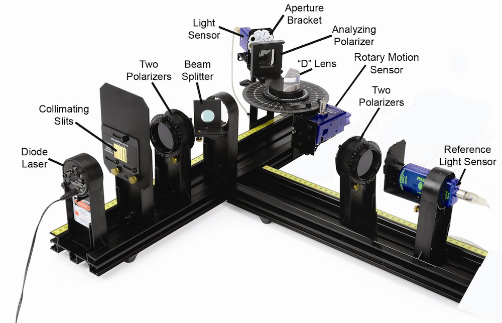

# O-7 | Fresnel Coefficients

As you saw in class, the intensity of light reflected by a dielectric interface is given by the Fresnel equations

$$
\begin{aligned}
R_\| &= \left|\frac{n_t\cos\theta_i - n_i\cos\theta_t}{n_i\cos\theta_t + n_t\cos\theta_i}\right|^2 \\
R_\perp &= \left|\frac{n_i\cos\theta_i - n_t\cos\theta_t}{n_i\cos\theta_i + n_t\cos\theta_t}\right|^2
\end{aligned}
$$

*(1)*

where $R = I_R/I_0$ is the relative amount of light reflected with a given polarization and $\theta_t$ is determined from Snell's law

$$
n_i \sin(\theta_i) = n_t\sin(\theta_t).
$$

The amount of polarization of the reflected light thus depends on the incident angle of the light, the initial polarization of the light (if any), and the index of refraction of the reflecting material. One consequence of the Fresnel equations is that reflected light can change its degree of polarization, becoming more (or sometimes less) polarized than the incident light.

In this experiment, you will be reflecting the light from a diode laser off the flat side of an acrylic semi-circular ("D"-shaped) lens. As the reflected light passes through an analyzing polarizer, it is detected by a light sensor. A second sensor monitors the intensity of the light before it reaches the "D" lens. The two together will allow you to measure the degree of polarization of the reflected light and find the Brewster angle.

## Experimental Procedure

A diagram of the experiment is shown in Figure 1. Before you begin, verify that the Rotary Motion Sensor and the two High Sensitivity Light Sensors are into the interface and visible in Capstone. Start with slit #5 on the aperture bracket.

*Figure 1: Diagram of the Brewster Angle apparatus.*

### Set the Light Sensor Range

Unlike the previous experiments, for this experiment it's easier to display just the current value of the sensors, rather than plotting the values as a function of time or angle. The graphs you do need will be built up from individually recorded values.

1. To get full use of the Light Sensor range, set the light sensor gain to 0–100.
2. Set up Capstone to show both the Reflected and Reference Light Intensities. It's probably more useful to show the values here, rather than the graph. The intensities should be displayed as a percentage of the total, as determined using the reference light sensor.
3. Begin recording data and rotate the first polarizer (the one nearest to the laser) to adjust the level to be as high as possible without exceeding 95% on the digits display of the Reflected Light Intensity and the Reference Light Intensity.
4. When done, you can stop the display.

If at any time in the experiment the intensity exceeds 95% for either light sensor, rotate the polarizer in front of the light sensor until it is back under 95%.

### Zero the Rotary Motion Sensor

Once the light sensor range is set up, the next step is to align the arm connected to the RMS.

1. To zero the angle on the Rotary Motion Sensor, first remove the "D" lens (it's held in place by a small magnet).
2. Rotate the spectrophotometer arm so the laser beam is centered on the Light Sensor slit. The spectrophotometer disk should be near $180^\circ$ but it doesn't matter if the number is slightly off.
3. Begin recording data and move the arm back and forth in front of the laser, watching the intensity in the digits display on the computer. Stop moving at the position that gives the maximum intensity.
4. Stop collecting data and **do not** move the arm until you begin the actual data run. This insures that the zero for the Rotary Motion Sensor is at the center of the beam.
5. Replace the "D" lens on the platform against the step and center it.
6. You can delete your old data runs now, we won't be using them again.

*A note about angle measurement:* the angle is computed by dividing the actual angle (measured by the computer) by two. The best procedure is to set the plastic Brewster's disk to a particular angle and then move the spectrophotometer arm to about the same angle read on the digits display. But, to get the laser beam exactly on to the slit, you must make fine adjustments while watching the digits display for the maximum light intensity. You can adjust either the disk or the spectrophotometer arm until the intensity is maximized.

### Measuring Polarization of Reflected Light

1. Turn out the room lights. A small light might be useful for seeing the computer keys to type in values and to put the analyzing polarizer on and off. The lights can be on except when taking a measurement.
2. Start recording. Do not stop the data collection until all of the procedure steps are completed.
3. Set plastic disk angle to $85^\circ$. The square analyzing polarizer should not be in place yet. Rotate the spectrophotometer arm to about $85^\circ$ and, while watching the digits display of the Reflected Light Intensity, fine tune the angle to get into the beam. It doesn't have to be exact, just so that you get enough light.
4. If the maximum intensity of light falls below 50%, rotate the round polarizer nearest the laser to increase the intensity above 50% to keep the measurement as precise as possible. Since we are plotting the ratio of the polarized intensity over the total intensity, changing the total intensity does not affect the ratio. As you proceed, it will eventually become impossible to make the maximum intensity above 50%, but keep it there as long as you can.
5. Place the square analyzing polarizer with its axis pointing horizontally on the arm just in front of light sensor slits (the axis should be marked on the polarizer).

   > *Note:* The square analyzing polarizer must sit level, flat on the arm.

   Record the angle, the Reflected Light intensity, and the Reference Light intensity. Since the polarizer is horizontal, the light passing through the polarizer is polarized perpendicular to the surface of the "D" lens.
6. Rotate the square analyzing polarizer so the axis is vertical and set it on the arm just in front of light sensor slits. Again, record the angle, the Reflected Light intensity, and the Reference Light intensity. This time, because the polarizer is vertical, the light passing through the polarizer is this time polarized parallel to the surface of the "D" lens.
7. As you move on to other angles, I recommended you continuously update a plot of the intensities vs. the angle on your spreadsheet so you can view the graph of the data as you proceed. This will alert you to when you are approaching the reflection minima so you can take data points at angles that are closer together, giving more detailed data to work from.
8. Remove the analyzing polarizer and go to the next angle, in increments of $5^\circ$. When the reflected intensity is approaching its minimum, take data points every $1^\circ$ (only one polarization will fall to zero, the other will remain finite). Continue collecting data until you have equal amounts of data on each side of the minimum so the curve is well defined. Then resume your $5^\circ$ steps to collect the rest of the data.

When done, repeat the whole procedure for the second laser.

## Interpretation of Results

- ▷ Make a graph of your measured [relative] reflected intensities versus angle. Plot both polarizations on the same graph.
- ▷ The angle where one of the $R$'s (Equation 1) drops to zero is called the *Brewster Angle*, $\theta_B$.
  - Looking at your graph, estimate the Brewster angle, $\theta_B$.
  - Based on your graph, what should be the degree of polarization of the reflected light at $\theta_B$?
  - To improve your estimate of the angle, fit a polynomial to the reflected intensity data near the minimum (the fit will fail if you try to fit too much data). Use the equation returned by the fit to calculate an improved estimate of the Brewster angle, $\theta_B$.
  - At the Brewster angle, Snell's law says that

    $$
    n_i \sin(\theta_i) = n \sin(\theta_t) = n \sin(90^\circ - \theta_B).
    $$

    Given that the light started in air, use your improved Brewster's angle to find the index of refraction of the plastic "D" lens.
- ▷ Equation 1 is the theoretical reflectances as a function of angle of incidence and index of refraction for both polarization. Use a computer to fit your experimental data as a function of $\theta_i$ to determine the index of refraction of the plastic (you can fit both curves simultaneously to improve your result). For this fit, I would recommend Mathematica instead of Excel.

  How does the value of the index of refraction you got from the fit compare with the value you measured using the Brewster's angle?
