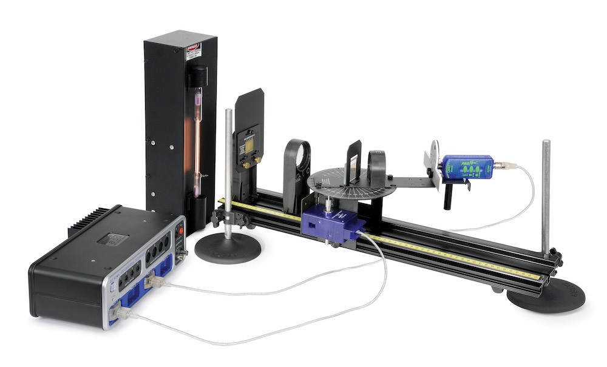
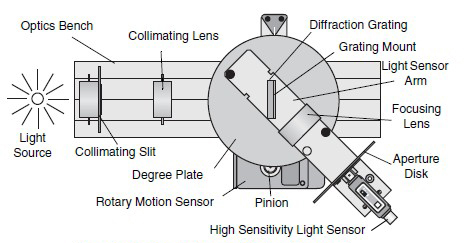
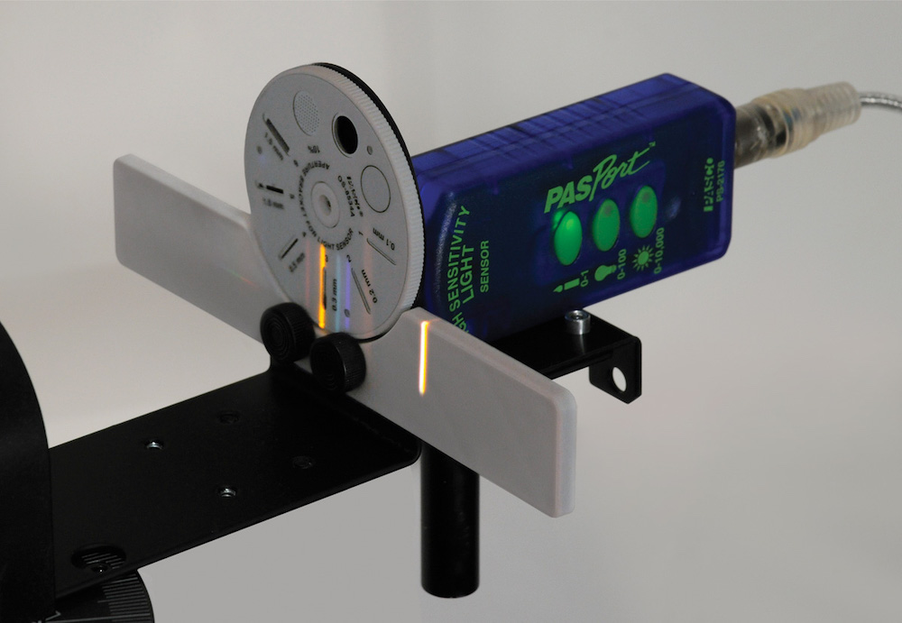

# O-8: Atomic Spectra

In Modern Physics (and also Astrophysics and Quantum Mechanics, if you've taken those classes), you learned about the energy levels of the hydrogen atom. In a hydrogen atom, the electrons are found only with very specific energies. The lowest possible energy state is called the ground state and is labelled $n=1$. The states with increasing energy are, in turn, labelled $n=2, 3, \ldots$. The energies are related through the simple formula

$$
E_n = -\frac{Ry}{n^2}.
$$

*(1)*

where the energy, $Ry$, is called the Rydberg constant and is somewhere between $10$ and $15\,\text{eV}$.

When an electron changes from one energy level to another, it can only do so if the change conserves energy. That means the either absorbing or emitting energy. The energy absorbed can come from many sources (for example, collisions with other atoms) but the energy emitted almost always takes the form of a photon. The energy of the photon emitted is equal to the change in the electron's energy and thus, by Equation 1, it will also be related to the final and initial $n$ values of the electron.

For hydrogen, this is the exact equation for the energy levels of the atom; it is in fact the *only* atom whose energy levels we are able to calculate. Nevertheless, the electrons in other atoms also occupy distinct energy states and these energies can be measured experimentally even if they can't be predicted in advance. In this experiment, you will be looking at the energy of photons emitted by different gasses.

## Experimental Procedure

Figure 1 shows the layout for this experiment.

*Figure 1: Setup of the atomic spectra experiment. The complete setup is shown above. Below shows the optical path and what the spectral lines should look like.*

### Light Source Collimation

First, the system must be collimated. I'll describe the procedure for the helium tube, which is the first one you will use, but the process is the same for all the tubes.

1. Place the lamp so it illuminates the Collimating Slit.
2. The Collimating Slit must be at the focal point of the first lens and the Aperture Disk must be at the focal point of the second lens. Move the spectroscopy table back to the end of the track so it is out of the way. Move the Collimating Lens at least $12\,\text{cm}$ from the slit. Have someone with 20/20 vision (corrected by glasses is fine) look through the lens at the slit. Move the lens toward the slit until it first comes into sharp focus. The slit should be about $10\,\text{cm}$ from the lens. Now move the spectroscopy table as close to the Collimating Lens as possible. Set the Focusing Lens $10\,\text{cm}$ from the Sensor Mask. We will adjust this more exactly in the next step.
3. Looking from the back side of the Collimating Slit, center the #4 slit in the hole and tighten the screw that holds the Collimating Slits in place.
4. Turn on the helium light source. Move the track up or down on the rod stands so the Collimating Slit is toward the brightest part of the helium tube. Swing the Light Sensor Arm out of the way so you can look through the grating along the Optics Track. Move the light source so that the light that you see though the slit is as bright as possible. Be careful not to move the track after it is set correctly.
5. Swing the Light Sensor Arm so that the Sensor Mask is along the track and the bright $0^{th}$ order spectrum (undeviated) is on the Aperture Disk. Adjust the Focusing Lens so the image on the Aperture Disk is as sharp as possible. The system is now collimated.

### Grating Spacing

The next step is to find the grating spacing. You'll calibrate your grating using one of the known lines of helium.

1. Press the 0–1 Light Sensor Button for maximum sensitivity, then use Collimating Slit #4, and Light Sensor Slit #2. These should provide a reasonable amount of light without losing too much precision.
2. While scanning, you will also want to turn off the room lights and turn the computer screen away from the light sensor.
3. Start the scan on one side of the central maximum and scan very slowly across the central maximum and the first side maximum.

   The angles may all be negative, depending on how you set up the spectrometer. If so, place the hand icon over where it says "angle" at the bottom of the screen and when the blue box appears, left click, select QuickCalc at the top of the pop-up and then select $-\theta$ in the pop-up that appears to the side.
4. Measure the angle from the central maximum to the first side maximum ($m=1$) for the yellow line.
5. Label the color of the lines on the graph.
6. Using the known wavelength of the yellow helium line, $587.46\,\text{nm}$, calculate the grating line separation, $d$,

   $$
   d = m\lambda / \sin\theta
   $$

   *(2)*

   This is the value of $d$ that you will use for the rest of this experiment.

### Measure Helium Emission Wavelengths

Now that you've calibrated the grating, find the wavelength of the other lines of the helium atom

1. As you record them, label the peaks by the observed color of the spectral line so you can tell which line is which later on.
2. Measure the angle from the central maximum ($m=0$) to the first side maximum ($m=1$) for all the visible colors (other than yellow, of course).
3. Use these angles to determine the wavelengths of these colors.
4. Where higher-order peaks ($|m|>1$) are visible, use these additional peaks to improve the accuracy of your measurement.
5. Record your measured wavelengths next to their corresponding colors.

To find the wavelengths, use the same diffraction equation you used to find the grating spacing, Equation 2, except now you'll turn the equation around to solve for $\lambda$.

### Other Elements

Now you're ready to measure the spectrum of hydrogen.

1. Replace the helium tube with the new tube. Each tube has its own lamp, so you just need to unplug the old one, move it out of the way, and replace it with your new.

   **Caution:** As you use them, the glass tubes will become *very* hot! Do not touch the glass!

2. Recollimate the lamp, adjusting the height of the spectrophotometer to match the center of the new tube.
3. For the hydrogen tube, it's recommended to also change the Collimating Slit to #2.
4. Repeat the procedure from the Helium Spectrum to measure the wavelengths of hydrogen.

The procedure for mercury tube is very similar to the procedure for the hydrogen spectrum.

**Caution:** Do not look directly into the mercury lamp. It is a strong emitter of ultraviolet radiation and long exposure is not good for your eyes.

- For the mercury tube, Collimating Slit #3 is recommended.
- The mercury lamp is bright enough, you should be able to pick up the second-order ($m=2$) lines as well. Scan *very slow* across the lines as you do to improve your accuracy.
- The orange line is a doublet — a pair of closely spaced emission lines. Zoom in on the orange lines so you can resolve both of them.

## Interpretation of Results

- ▷ For each helium and mercury tubes, look up the the wavelengths of the emission lines you measured. How do they compare with your experimental results?
- ▷ For each of the wavelengths you found for the hydrogen lines, calculate the energy of the photon emitted.
- ▷ Next, using these photon energies and Equation 1, determine the Rydberg constant $Ry$, the initial energy levels, and the final energy levels of the electron that emitted the photons.
