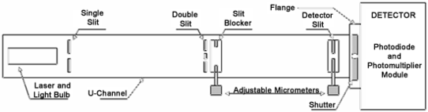
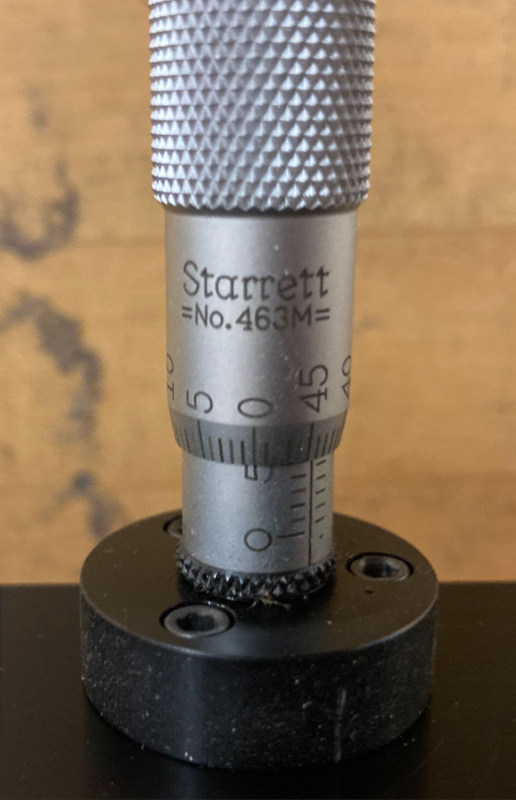
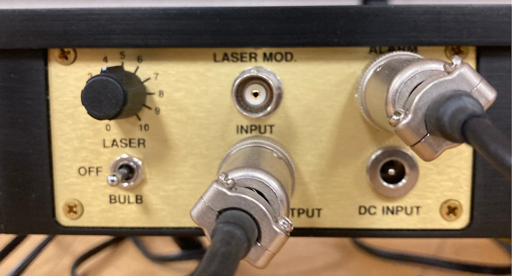
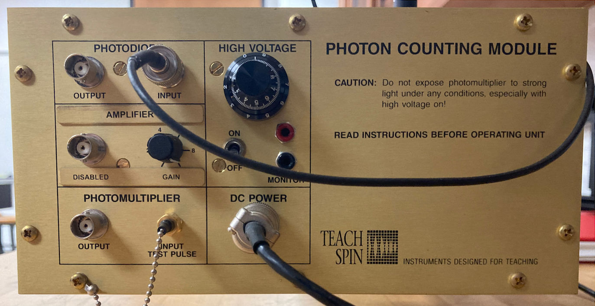
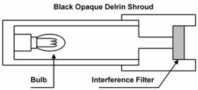

# O-9 | Single-photon Interference

In experiment O-6 (Interference), you looked at the interference of a light wave as it passed through parallel slits and in class we analyzed the interference treating the light as an electromagnetic wave.

Quantum mechanics tells us the particles behave as waves too, with a deBroglie wavelength $\lambda_d = h/p$ where $h$ is Planck's constant and $p$ is the momentum of the particle. Being a quantum mechanical effect, you can treat particles as waves and they will interfere even if there is [statistically speaking] only one particle passing through the slits at a time.

In this lab you will be treating photons as quantum mechanical particles and examining the interference pattern you get when the number of photons is so low that only a single photon at a time is passing through the interferometer at any given moment.

## Experimental Equipment

*Figure 1: Diagram of the single photon experiment.*

The instrument you'll be using consists of a black anodized aluminum U-Channel, a little over a meter in length, with a removable light-tight cover. At one end is the light source and at the opposite end is either a light detector.

Just in front of the light source is a single entrance slit. With either the laser or bulb illuminating this slit, the central maximum of the slit's diffraction pattern is aligned to cover a double slit assembly about $40\,\text{cm}$ down the U-channel. Just past the double slit, a moveable "slit blocker" can be manipulated manually using a micrometer mounted on the outside of the U-channel. Using the slit blocker, you can compare the patterns created by the double slit to those created by either of the single slits. Three double slit assemblies, each of distinct slit spacing, are included.

At the far end of the U-channel is another moveable single slit, the detector slit. It, too, is attached to a translational stage actuated by a micrometer. You move the detector slit across the interference pattern in front of either the photodiode or cathode of a photomultiplier to make quantitative measurements of either the light intensity or photon arrival rate as a function of position.

*Figure 2: Micrometer with dial markings. The fixed scale is the coarse position (in mm), the movable scale is the fine position, and the actual position is the sum of the two. The movable dial is marked 0–50 and each complete rotation of the micrometer moves slit by $0.50\,\text{mm}$, so the position of the slit can be determined with better than $0.01\,\text{mm}$ accuracy. **Warning:** it takes two rotations of the movable dial to advance the main dial by one millimeter!*

*Figure 3: Control panels for the light source [top] and detector [bottom]. Note the toggle switches to select the active light source and to turn on the detector high-voltage supply, as well as various control knobs.*

## Experimental Procedure

The equipment should already be properly positioned on the optical bench. If it is not, please ask the instructor to help you.

**CAUTION:** Do not look into the laser beam, either directly or as it reflects from either mirror. Also, when arranging the equipment, be sure the beam path does not traverse an area where someone might inadvertently look into the beam.

### Calibration

1. Verify that the photomultiplier shutter is closed and the high-voltage power is off (Figure 3, bottom) before you begin.
2. Open the system and turn on the laser (Figure 3, top).
3. Confirm that the single and double slits are properly aligned. When properly aligned, a viewing card or paper placed just behind the double slit/slit blocker assembly should show a pair of thin red lines of laser light. It may help to keep the room lights at a low level while you do this.
4. Now find and write down the reading on the micrometer that correspond to both slits blocked, only left slit open, both slits open, and only right slit open. You will need to know these numbers later. Be sure to read the final digit off the dial to improve your accuracy.
5. You are now ready to close up the system and begin the experiment.

### Light Intensity as a Function of Position

The black box with the brass front panel contains a photomultiplier tube [PMT] as well as a photodiode detector connected a current-to-voltage converter. The box is supplied with a special flange and a light shutter. The shutter is connected to the black plastic post at the front of the photon counting module. To open it, lift up on the post; to close it push down.

**DO NOT** open the shutter when the laser is turned on. Doing so can damage the the photomultiplier tube.

The photodiode is mounted on the outside of the shutter so that it is in the light path when the shutter is closed, and removed from the light path when the shutter is opened to let the light pass to the photomultiplier (see Figure 3, bottom). Put another way, with the shutter down light goes to the photodiode, and with it up light goes to the photomultiplier tube.

*Figure 4: Connecting the photodiode. The output is just a DC voltage, so you could also use an oscilloscope instead of a voltmeter.*

> **[Figure missing from source files — the original LaTeX references `Figures/singlePhotonBlock1.pdf`, which was not present in the manual's Figures folder.]**

The first step is to verify the optical path.

1. Close the shutter to place the photodiode in the optical path, close up the system, and turn the laser back on.
2. If it hasn't already been done, connect the photodiode to a voltmeter or oscilloscope (see Figure 4). If using an oscilloscope, $0.1\,\text{V per division}$ is a reasonable initial sensitivity, but you'll need to adjust it as you go.
3. Move the detector slit across the face of the photodiode and record the output voltage (which is proportional to the light intensity) as a function of position (via the micrometer scale).
4. Plot your measurements as a function of the micrometer position. Your plot should look like the intensity plots you saw in the Interference experiment O-6.
5. If your graph does not resemble what you saw in the Interference Lab, O-6, there is probably an issue with your system calibration. Do not proceed to the next section until you have a clear two-slit interference pattern.

   There's no need to use tiny little steps here — you're only doing this to verify that everything is in good working order and get an approximate operating level.
6. Turn off the laser when you're done.

### Creating the Single Photon Source

*Figure 5: Diagram of the single-photon light source. The light source should be pre-assembled for you.*

The single-photon light source consists of a #47 flashlight bulb connected to a variable voltage-regulated power supply. The bulb is housed in a black plastic tube with a removable narrow-band green interference filter at the output end. A schematic is shown in Figure 5.

Flashlight bulbs such as this are black-body radiators, which means as we turn the voltage down not only do they give off less light, but because the filament isn't as hot, the color shifts toward the red. By only allowing green photons into the tube, we dramatically reduce the photon number density inside the interferometer.

1. Open the system and move the laser out of the way (it's base is magnetic, just slide it to the side).
2. Replace and secure the top.
3. Connect the photomultiplier to the oscilloscope and the pulse counter according to Figure 6.
4. Set the bulb intensity to about half of its maximum.

*Figure 6: Connecting the photomultiplier tube to the counter and the oscilloscope.*

> **[Figure missing from source files — the original LaTeX references `Figures/singlePhotonBlock2.pdf`, which was not present in the manual's Figures folder.]**

### Optimizing the Photon Counting Unit

The high-voltage power supply determines the amplification inside the photo-multiplier tube. The discriminator voltage sets the minimum voltage a pulse must have to be recorded by the pulse counter.[^1] Both the high-voltage (operating voltage) and the pulse-height discriminator threshold voltage must be properly selected to optimize the operation of the photon counting unit. They must be set so that the photomultiplier will optimally count green photons and optimally reject the dark current.

[^1]: If you're curious, the actual high-voltage is $100\,\text{V}$ times what is shown on the dial and the actual discriminator threashold is $0.1\,\text{V}$ times what is shown on the dial.

1. Wire the oscilloscope as shown in Figure 6. Channel one of the oscilloscope will display the raw input to the counter and Channel two will show the raw output of the counter. This can be helpful when trying to figure out what the pulse counter is (or is not) doing.
2. Begin with the high-voltage supply at its minimum. The initial discriminator level is less important, but if you set it too low it will trigger on some sort of periodic noise (you'll see regular pairs of pulses on the oscilloscope monitor). "1.0" is probably a good starting point. Start with a time interval of $1.0\,\text{s}$ and adjust from there. For now, put the pulse counter switch to the "Auto" position. You can speed up or slow down the time between readings using the "Rep Rate" knob.
3. For a fixed discriminator level and with the photomultiplier shutter closed, measure the "dark current" (the count rate you record with no photons going through the system).

   You may need to turn off the bulb and open the shutter for this to work?

   When the number of counts is low, there may be considerable fluctuations in the count from one reading to another. Using a longer count time will help reduce the scatter (but remember to record in your data table which position the knob was in so you can convert back to counts per second when you're done).
4. Now open the shutter and measure the count rate for "green" photons from the bulb. If you turned the bulb off before, you should turn it back on now. Re-close the shutter when you're done with the measurement.
5. Repeat steps 3–4 to measure the dark current and photon count rates as a function of photomultiplier high-voltage (working from low voltage to high in steps of approximately $0.5$ on the dial).

   You should find that the dark current is a linear function of the voltage, but the photon count rate eventually saturates. You can stop collecting data once the count rate saturates, which will probably be around $7$–$8$ on the dial.
6. Based on your graph, decide what the optimal high voltage setting is and set that as your operating voltage.
7. Repeat the analysis, this time keeping the high voltage constant at your "optimum" voltage and instead adjusting the discriminator level to find its optimal value.
8. You may need to repeat your optimization procedure more than once if the values have changed significantly from their original settings.
9. Once you are happy with your settings, block one of the slits with the micrometer, open the photomultiplier shutter and measure the rate at which photons are coming through the remaining single slit. Record this number along with your calibration graph data; you will want them both later on.

### Verifying Single Photon Operation

*While not ideal, if you're pressed for time you can do this after collecting your data.*

Flashlight bulbs generate about $10^{16}$ photons per second in ordinary use, but the combination of operating at reduced power and the filter significantly reduces the number of photons in the tube. What you will get is a thermal source of randomly produced photons, capable of giving a photon event rate at the detector in the range of $10$–$10^5$ per second.

To verify that your are operating in single-photon mode, you must show that [on average] there is only a single photon in the tube at a time. This is equivalent to showing that the average time between photons is much bigger than the time-of-flight for a photon through the apparatus.

1. When you optimized the photon counting unit, you measured the rate at which photons were passing through the single slit. The photomultiplier is rated at 5% efficiency, so the actual photon arrival rate is $20\times$ greater than what you measured.
2. Use your measured count data to verify that you are, in fact, operating in single-photon mode.

### Observing Single Photon Interference

Now you are ready to observe the single-photon interference pattern.

1. Leave the dials at your "optimal" settings.
2. Measure the photon counts in $\Delta t = 10\,\text{s}$ intervals at various positions of the detector slit.
3. You can either leave the pulse counter free-running in "Auto" mode or, if it's more convenient, switch it to "Manual" mode. In manual mode, the counter doesn't begin counting until push down on the lever. It then continues for the time interval you requested and, displays the count, and then stops until you press the lever again.
4. Plot curves of intensity [i.e., count rate] versus position with both slits open.
5. When you're done, repeat the plots with the left slit blocked and the right slit blocked.

## Interpretation of Results

- ▷ How does the graph of the interference fringes with the single-photon bulb compare with your original graph using the laser (apart from the obvious "the laser is brighter")?
- ▷ Is the fringe spacing the same for both graphs or different? Why should that be the case?
- ▷ How does the intensity of your central peak compare with the intensities you measured through only the left or right slits? Can you explain the difference?
- ▷ The laser has a wavelength of $\lambda=670 \pm 20\,\text{nm}$. In the small angle approximation (the interference-maximum equation from the O-6 Interference chapter) what is the slit width? What is the wavelength of the light coming out of the green filter?
