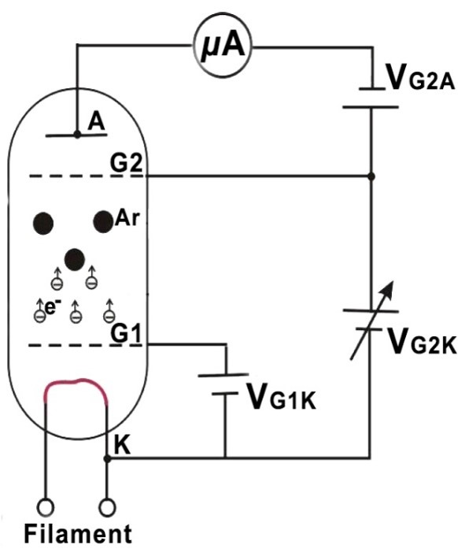
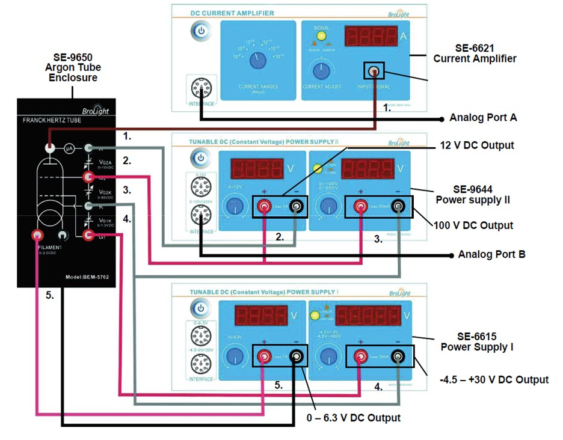
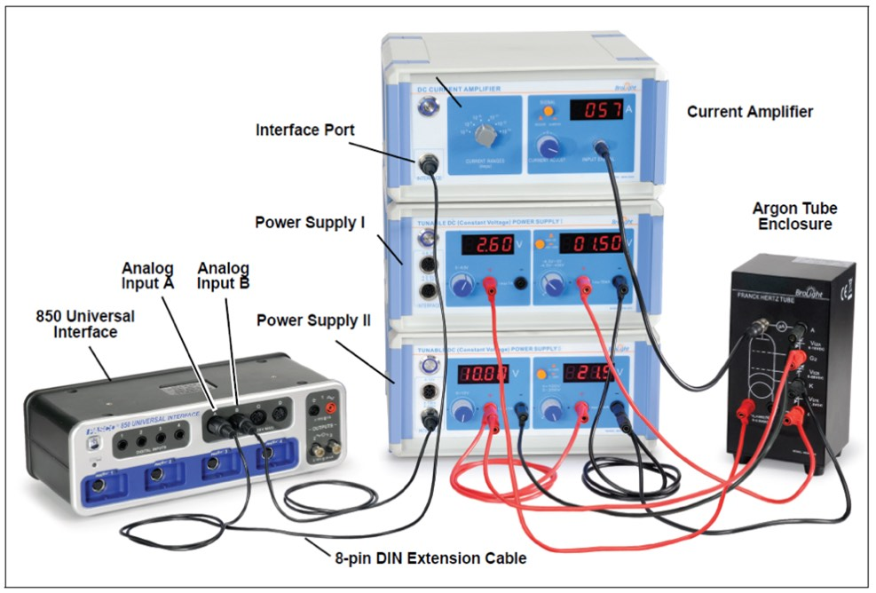

# L-1: Frank-Hertz

## 1.1 Introduction

As early as 1914, James Franck and Gustav Hertz discovered in the course of their
investigations an energy loss in distinct steps for electrons passing through mercury
vapor and a corresponding emission at the ultraviolet line ($\lambda = 254$ nm) of mercury.
They performed this experiment that has become one of the classic demonstrations
of the quantization of atomic energy levels. They were awarded the Nobel Prize for
this work in 1925.
    The experiment consisted of applying a potential difference which could be varied
to a vacuum tube. This causes electrons to be emitted and accelerated to a range
of electron energies. To help insure a collision will happen, there is a large differ-
ence between the anode (negative electrode) and the cathode (positive electrode)
in comparison with the mean free path length of argon. For reference, the mean
free path length is the average distance over which a moving particle travels before
substantially changing its direction or energy. An electric field was then produced
and effect the electrons, filtering out some of the electrons based on kinetic energy.
This is done by the use of a retarding potential.

**How It Works**

Electrons are accelerated by applying a known potential between two grids inside the
argon tube. When an electron has sufficient kinetic energy to excite one of argon’s
outer orbital electrons and has an inelastic collision with an argon atom, the electron
loses a specific amount of kinetic energy. This loss of electron kinetic energy causes
a decrease in the electron current in the argon tube. Within a very short time, the
excited argon electron will fall from the excited state back into the ground state level,
emitting energy in the form of photons.
   As the accelerating voltage is increased, the electrons undergo multiple collisions
and the excitation energy of the argon atom can be determined by the differences
between the accelerating voltages that cause a decrease in the current. From these

*Figure 1.1: Image of a vacuum tube (left) and diagram of the energy flow in our vacuum tube.*

changes, you will then measure Planck’s Constant.

**Principles of a Vacuum Tube**

The Franck-Hertz tube is an evacuated glass cylinder with four electrodes (a “tetrode”)
which contains low-pressure argon gas. The four electrodes are:

- An indirectly heated oxide-coated cathode which supplies the electrons,

- Two grids $G_1$ and $G_2$ which control the flow of electrons, and

- A plate which serves as an electron collector.

    In Figure 1.1, Grid 1 ($G_1$) is positive with respect to the cathode (K) by about
1.5 V. A variable potential difference is then applied between the cathode and Grid 2
($G_2$) which accelerates the electrons and gives them kinetic energy. The distance
between the cathode and the anode is large compared with the mean free path
length in the argon in order to ensure a high collision probability. On the other
hand, the separation between $G_2$ and the collector electrode (the anode, A) is small.
A small constant negative potential $V_{G_2A}$ (“retarding potential”) is applied between
$G_2$ and the collector plate A (i.e. A is less positive than $G_2$). The resulting electric
field between $G_2$ and collector electrode A opposes the motion of electrons to the
collector electrode, so that electrons which have kinetic energy less than $eV_{G_2A}$ at
Grid 2 cannot reach the collector plate. As will be shown later, this retarding voltage
helps to differentiate the electrons having inelastic collisions from those that do not.
    A sensitive pico-ammeter (current amplifier) is connected to the collector elec-
trode so that the current due to the electrons reaching the collector plate may be
measured. As the accelerating voltage is increased, the following is expected to
happen: up to a certain voltage, say $V_1$, the plate current $I_A$ will increase as more
electrons reach the plate. When the voltage $V_1$ is reached, it is noted that the plate
current, $I_A$, takes a sudden drop. This is due to the fact that the electrons just in
front of the grid $G_2$ have gained enough energy to collide inelastically with the argon
atoms. Having lost energy to the argon atom, they do not have sufficient energy to
overcome the retarding voltage between $G_2$ and collector electrode A. This causes a
decrease in the plate current $I_A$. Now as the voltage is again increased, the electrons
obtain the energy necessary for inelastic collisions before they reach the anode. Af-
ter the collision, by the time they reach the grid, they have obtained enough energy
to overcome the retarding voltage and will reach the collector plate. Thus, $I_A$ will
increase. Later on, when a certain voltage $V_2$ is reached, $I_A$ again drops. This means
that the electrons have obtained enough energy to have two inelastic collisions before
reaching the grid $G_2$, but have not had enough remaining energy to overcome the
retarding voltage. Increasing the voltage again, $I_A$ starts upward until a third value,

$V_3$, of the voltage is reached when $I_A$ drops. This corresponds to the electrons having
three inelastic collisions before reaching the anode, and so on. Frank and Hertz’s
observation, for which they won the Nobel prize, was that $V_3 - V_2$ always equals
$V_2 - V_1$, etc., which showed that the argon atom has definite excitation levels and
only absorbs energy in quantized amounts.
    When an electron has an inelastic collision with an argon atom, the kinetic energy
lost to the atom causes one of the outer orbital electrons to be pushed up to the next
higher energy level. This excited electron will, within a very short time, fall back
into the ground state level, emitting energy in the form of photons. As that happens,
the original bombarding electron continues moving toward the anode. Therefore, the
excitation energy can be measured in two ways: by the method outlined above, or
by spectral analysis of the radiation emitted by the excited atom.
    Spectrally, once electrons reach energy of about $eV_o$, they can convert their ki-
netic energy into a discrete excitement state of the argon atoms. As a result of
the inelastic collision, they pass the braking voltage. Within the argon atom, elec-
trons jumping between energy levels produces ultraviolet emissions. This resonance
voltage is denoted by $V_o$.

$$
eV_o = hf
$$

where $e$ is the charge of the electron, $h$ is Planck’s Constant, and $c$ is the speed of
light. (Hint: Are there any other relationships for $eV_o$ or $hf$ ? )

## 1.2 Procedure

Attention: Make sure all of the voltage knobs are turned com-
pletely counter-clockwise and the power supplies are off before you
connect the circuit.

  1. Verify that the following steps have been completed:

      (a) Connect the 0–6.3 V from Power Supply I to the Filament on the Frank-
          Hertz case (see Figure 1.2).
      (b) Connect the -4.5–30 V from Power Supply I to $G_{1K}$ on the Frank-Hertz
          case. Push the button in on the power supply to choose the -4.5–30 V
          range.
      (c) Connect the 0–100 V from Power Supply II to $G_{2K}$. The button should
          be out on the power supply to choose the 0–100 V range. (see Figure 1.3)
      (d) Connect the 0–12 V from Power Supply II to $G_{2A}$.
      (e) Connect the DC Current Amplifier BNC to the BNC on the Frank-Hertz
          case. Turn the knob to the $10^{-10}$ setting.

*Figure 1.2: Diagram of power supply connections.*

*Figure 1.3:   Complete power supply and signal connections for the Frank-Hertz experiment.*

  2. You can now turn on the power supplies and the current amplifier.

  3. On Power Supply I, adjust the -4.5–30 V knob until the digital display reads
     zero.

  4. Push the button in on the Current Amplifier and adjust the current reading to
     zero. Then put the button in the out position for measurement.

  5. Look on the top of the Frank-Hertz case for the suggested filament voltage.
     Set the voltage on Power Supply I to that voltage and let the filament heat up
     for about 15 minutes.

  6. Connect the Current Amplifier interface port to Ch. A on the 850 Interface.

  7. Connect the Power Supply II 0–100 Vinterface port Ch. B on the 850 Interface.

  8. Set the $G_{1K}$ voltage to 1.5 V.

  9. Set the $G_{2A}$ voltage to 10 V. Note: These are suggested settings for the
     experiment, but other values could be tried. You can do the experiment by
     parameters that are marked on the Argon Tube Enclosure.

 10. In a Capstone Current vs Voltage graph with a sample rate of 20 Hz select a
     Quick Calc of $-I$. Start recording.

 11. Slowly and steadily increase the accelerating voltage from zero to about 80 V
     over a period of about three minutes.
      Caution: Watch the current and if it suddenly rises, immediately
      reduce the accelerating voltage to zero to avoid damaging the
      tube.
 12. Stop recording.

## 1.3 Data Analysis

  1. Create a table of the difference between peaks and troughs in PASCO.
  2. On the graph, use the Coordinates Tool to find the voltages of all the peaks
     and troughs and record them in the PASCO table.
  3. Export the table as a “.csv” file and read the data into Excel. Find each of the
     period values.
  4. Calculate the standard deviation of the voltage difference and compare to the
     standard deviation calculated by Excel. Calculate the mean voltage difference.
  5. Round the mean to the appropriate number of digits, taking into consideration
     the standard deviation.
  6. From your mean voltage calculate the wavelength of emitted light and its un-
     certainty.

## 1.4 Interpretation of Results

- Why is the spacing to the first peak different than that of the spacing between
    successive peaks?
- An alternate analysis method is to graph peak voltage vs index and trough
    voltage vs index and use the slope instead of the mean. Use the slope and its
    standard deviation to find the wavelength of the emitted light.
- Should you use the positions of the peaks or the valleys to determine the
    excitation energy, or both? Explain.
- How would increasing the temperature of the gas affect your observations?
    How would this impact the sharpness and number of peaks?
- How does your value with its uncertainty compare to the actual value of the
    wavelength of the emitted light?
