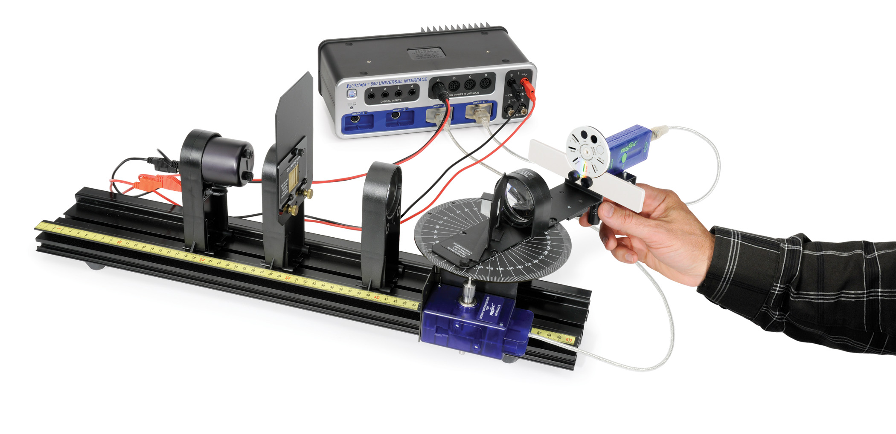
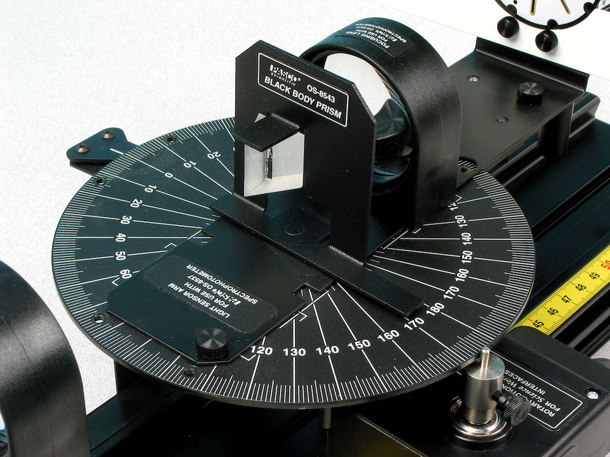
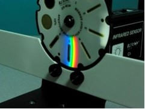
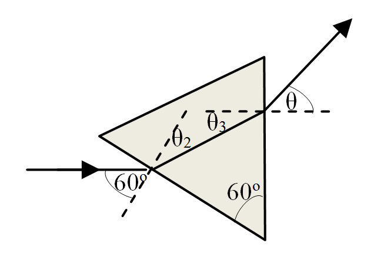
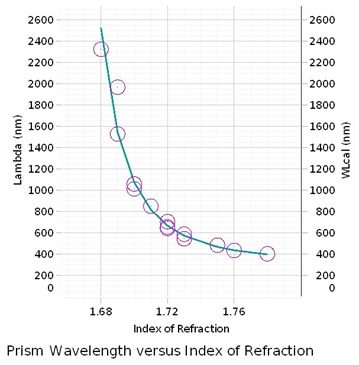
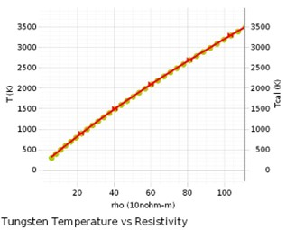

# L-2 | Blackbody Radiation

## 2.1 Introduction

In this experiment you will measure the relative light intensity as a
function of wavelength for an incandescent light bulb. To do this,
you will use a prism spectrophotometer and measure the relative light intensity as a function of angle. A Broad Spectrum Light Sensor is used with a prism so that the entire spectrum from approximately 400 nm to 2500 nm can be scanned without the overlapping orders that would be produced by a diffraction grating. Once done, the wavelengths corresponding to the angles are calculated using the equations for a prism spectrophotometer. The relative light intensity can then be plotted as a function of wavelength, giving the characteristic blackbody curve. As you increase the temperature of the bulb, you will then see corresponding shifts to the blackbody curve.

The temperature of the filament of the bulb can be estimated different ways. Indirectly, by determining the resistance of the bulb from the measured voltage and current, you can work backwards to find the temperature-dependent resistivity. You can also find the temperature directly from the measured blackbody curves.

*This experiment should be performed in a room with reduced light levels although complete darkness is not required.*

**Theory**

Explaining the shape of the blackbody curve, which you're about to measure, was one of the key discoveries that led to the development of Quantum Mechanics.
For any real object, the emitted spectral intensity, $I_{\lambda}(\lambda,T)$, as a function of wavelength of radiation emitted by an ideal body (a blackbody since an ideal emitter must also be an ideal absorber) is given by Planck's Radiation Law

$$
I_\lambda(\lambda,T)=\frac{2\pi h c^2}{\lambda^5}\left(\frac{1}{e^{h c/(\lambda\, k_B T)} - 1}\right)
$$
*(2.1)*

where $c$ is the speed of light in a vacuum, $h$ is Planck's constant, $k_B$ is Boltzmann's constant, $T$ is the absolute temperature of the body, and $\lambda$ is the wavelength of the radiation.

The wavelength with the greatest intensity is given by taking the derivative of the spectral intensity distribution and setting it equal to zero. After simplifying, the result is known as Wien's law

$$
\lambda_{max} = (\text{constant})/T = (0.002898\ \text{m}\cdot\text{K})/T
$$
*(2.2)*

The temperature of the blackbody light filament can be calculated using the resistance of the filament while it is lit. We find the resistance, $R$, by using Ohm's Law. The resistance of the tungsten filament is a nonlinear function of the temperature. Using the measured resistance to calculate the temperature is discussed in Appendix 1.

The wavelength is determined by measuring the angle at which the light is dispersed by a prism. The relationship between the angle and the wavelength is discussed in Appendix 1.

## 2.2 Procedure

**Setup**

*Figure 2.1: Experimental setup for the blackbody radiation experiment.*

*Figure 2.2: The prism apex should oriented toward the light source.*

Verify that apparatus is setup as in Figures 2.1 and 2.2 and set the Voltage Sensor sample rate to 20 Hz.

**Software Setup**

Verify that the steps below have been done correctly.

1. Create a graph of Relative Intensity vs. Angle in radians in Capstone.

2. Create a table. Make both columns User-Entered Data Set. The first column will be for the table angle with units degrees. The second column will be for the Shaft angle with units radians.

3. Insert a third column and create a calculation

$$
\text{Corrected angle}=\frac{\text{Table angle (°)}}{\text{Shaft Angle (rad)}}
$$
*(2.3)*

   and make the units $deg/rad$.

4. Click the Signal Generator. Set the waveform for DC and the Voltage for 7.0 V. Do not turn on the signal generator until you are instructed to do so below (running the signal generator shortens the life of the bulb).

**Apparatus Setup**

*Figure 2.3: Top view of the experimental apparatus. The image is actually from the Atomic Spectra lab (L-4), but the only difference is that lab uses a diffraction grating while this lab uses a prism.*

*Figure 2.4: Spectrum on Light Sensor Mask*

1. Set the collimating slits on Slit #4. Set the Aperature Disk in front of the Light Sensor on Slit #4.

2. Collimating the system: the Collimating Slit must be at the focal point of the first lens and the Sensor Mask and Aperture Disk must be at the focal point of the second lens. Move the spectroscopy table back to the end of the track it is out of the way. Place the Blackbody Light Source near the end of the track and the Collimating Slit near the blackbody light source. Move the Collimating Lens (see Figure 2.3) at least 12 cm from the slit. Have someone with 20/20 vision (corrected by glasses is fine) look through the lens at the slit. Move the lens toward the slit until it first comes into sharp focus. The slit should be about 10 cm from the lens. Now move the spectroscopy table as close to the Collimating Lens as possible. Set the Focusing lens 10 cm from the Sensor Mask. We will adjust this more exactly later.

3. Click the Signal Generator at the left of the screen. Turn on the Signal Generator by clicking ON.

4. Set the moveable arm at the center of the track so that the un-deviated light that passes above the prism from the slit strikes the Sensor Mask. Adjust the Focusing Lens so the image on the Sensor Mask is as sharp as possible. The system is now well collimated. Look at the light coming from the Blackbody Light Source. Observe and record which colors are visible.

5. Rotate the movable arm until you see the spectrum. Look at the spectrum on the Light Sensor screen.

**Data Collection**

1. Rotate the scanning arm until it touches the stop. This will be the starting position for all the scans.

2. Before starting to record, review the steps you will perform during recording: The Broad Spectrum Light Sensor tends to drift so the following steps need to be performed as written. With the sensor are pressed against the stop, press the Tare button on the Broad Spectrum Light Sensor (the button is illuminated) to zero it. Observe the width of the visible pattern.

3. Using the handle below the light sensor, sweep rapidly from the stop to a position about one visible spectrum width to the left (ultraviolet side) of the pattern.

4. Slowly rotate the scanning arm through the spectrum to point about two visible spectrum widths to the right (infrared side) of the visible pattern. You should try to complete this operation in less than 30 seconds from when you press the Tare button, but try to sweep at a uniform rate.

5. Continue rapidly all the way past zero degrees (the position where the light sensor is directly opposite the light source), slowing as you sweep across the white light peak at zero degrees.
   It is important that you only sweep in one direction! If you attempt to go back, the Rotary Motion sensor will lose track of where you are!

6. You must be holding the scanning arm against the stop when you press RECORD! If it is not against the stop, each run will have a different zero position and you will not see the position of the peak correctly. Now click RECORD and perform the scan as described in steps 1–7.

7. Click Stop. On the Signal Generator, click Off. Click on the Signal Generator Button to close the Signal Generator panel.

8. If the curve does not fill the graph, click on the Re-size Tool at the upper left of the graph toolbar. The angles may all be negative, depending on how you set up the spectrometer. If so, place the hand icon over where it says "angle" at the bottom of the screen and when the blue box appears, left click, select QuickCalc at the top of the pop-up and then select $-\theta$ in the pop-up that appears to the side. On both sides of the spectrum peak the Relative Intensity should be approximately zero. It does not matter if the intensity zero drifts as you sweep to the central white-light peak as long as you can see the peak. If either of these is not true, click the Delete Last Run button at the lower right and repeat the run. When you have a good run, click the Data Summary button at the left edge of the page, double click on the good run (probably Run #1) and re-label it 7 V Run. Click the Data Summary button to close the Data Summary panel.

9. Examine the Relative Intensity vs. Angle graph. Note that it says that the unit for the angle is radians. Since we have only rotated the table by about 80° this is clearly not correct. The reason is that the Rotary Motion Sensor measures the angle that its own shaft turns through, but we need the angle that the table turns through. The diameter of the table is approximately 60 times the diameter of the Rotary Motion Sensor shaft. It turns out that the number of radians for the shaft is approximately equal to the number of degrees for the table. We will measure the true correction in step 10.

10. Press the TARE button on the Broad Spectrum Sensor. With the table set so the index mark is on 50° click RECORD. Rotate the table 100° to the other 50° mark, let it sit on the 50° mark for about ten seconds (drift in the reading will then make the stop point obvious) and click STOP. Click Data Summary (top left of screen) and label this run Calibrate. Close the Data Summary panel. On the graph, select the Calibrate Run. Find the angle (rad) that the shaft turned through. The initial angle should be exactly 0. To find the final angle, click on the Data Selection icon on the graph toolbar. A highlighted region with handles should appear on the graph. Drag the handles to highlight the region between 100° and 106°. Click the Scale-to-Fit tool. You should now be able to read the angle to the nearest tenth of a degree. Record this value in the table in the Shaft Angle column. It should be close to the one already in the table calculated using Equation 2.3, but change the value to the one you measured as the instruments may vary slightly.

11. Calculated the ratio to be used in step 12 using the ratio

    $$
    \frac{100°}{\text{shaft angle}}
    $$

12. Click on the Calculator on the left side of the screen and create a calculation

    $$
    \text{true angle}=XX*\text{abs}([\text{angle (rad)},\,\nabla])
    $$

    and give it units of "°" (degrees), entering the value from step 11 for $XX$. On the graph delete the selection and scale the graph back to normal.

13. Create a new page and two digits displays with the Voltage Ch.A and Output Current and create a graph of Relative Intensity vs. True Angle. Make sure the correct run data is selected. Determine the maximum of the central peak and use this data to calculate the correct true angle using the equation below:

    $$
    \text{Correct True Angle}=\text{initial angle} - \text{true angle}
    $$

    With the initial angle being the one corresponding to the peak.

14. Repeat steps 1 through 7 for voltages of 4 V and 10 V.

    **Caution: If 10 V is applied to the blackbody light for an extended amount of time, the life of the bulb will be reduced. Only turn on the bulb when taking measurements.**

    Notice (with your eyes) how the spectrum changes. On a new page in Capstone, create a graph of Light Intensity vs. True Angle using the correct data from the 4 V Run. Compare the central peak angle to the one from 7 V Run and verify that they are within 1° of each other. Then check the 10 V Run. If the central peaks disagree by more than 0.1°, you did not start from the same position (against the stop) and should redo the run(s).

## 2.3 Data Analysis

**Analysis 1: Wien's Law**

1. Find the wavelength at which the intensity is a maximum using the Tungsten Intensity vs. Wavelength graph.

2. Solve for the filament temperature $T$ using Equation 2.2.

3. Repeat this for the remaining voltages.

**Analysis 2: Ohm's Law**

1. Find the resistance of the filament using Ohm's Law and what you know about circuits.

2. From the resistance and given information from Appendix 2, and using Equations 2.9 and 2.10, calculate the implied resistivity of tungsten.

3. Use the table in Appendix 2 to get the corresponding temperature, $T$.

4. Repeat this for the remaining voltages.

**Analysis 3: Planck's Equation**

1. Export the data of $I_{meas}(\lambda)$ to Excel.

2. Using the Equation 2.2 create a table of theoretical intensity.

   Note: You have already measured $I(\lambda)$, so $T$ and $I_o$ are the only free parameters.

3. Plot $I_{meas}(\lambda)$ and $I_{theor}(\lambda)$ for 7 V run on the same graph.

4. Manually adjust $T$ and $I_o$ to match the data collected using Equation 2.1. (Hint: Keep the data the same and adjust the theoretical curve instead!)

   The *root mean square error*

   $$
   \text{RMSE} = \sqrt{\frac{1}{N}\sum_{i=1}^{N}(\text{Predicted}_i-\text{Actual}_i)^2}
   $$

   is a quantitative measure of the difference between your data points (actual) and the theoretical curve (predicted) and the sum runs over all wavelengths. The better the match, the smaller the RMSE will be.

5. Repeat this analysis for the remaining voltages.

## 2.4 Interpretation of Results

- If all the colors (from red to violet) are present what would this show about white light?

- Are all the colors (from red to violet) are present? What does this show about the light bulb?

- Does the peak shift towards shorter or longer wavelengths as the temperature is increased?

- How does the intensity change as the temperature is increased? Does this agree with what Equation 2.2 predicts?

- How did the color of the bulb change with temperature? How did the color composition of the spectrum change with temperature? Considering the peak wavelengths, why is a bulb's filament red at low temperatures and white at high temperature?

- At about what wavelength is the peak wavelength of our Sun? What color is our Sun? Why?

- For the highest temperature, is more of the intensity (area of the intensity vs. wavelength graph) in the visible part of the spectrum or in the infrared part of the spectrum? How could a light bulb be made more efficient so it puts out a greater percentage of its light in the visible?

- Does your calculated temperature agree with that inferred from the filament resistance?

- Does the shape of the Blackbody curve match the theoretical Tungsten curve? Can the bulb really be considered a blackbody?

## Appendix 1: Finding the wavelength as a function of angle.

*Figure 2.5: Path taken by the light through the prism, showing the relevant angles.*

**Wavelength Calculation**: The index of refraction of the prism glass varies with the wavelength of the light. To determine the wavelength as a function of the angle, the relationship between the index of refraction and the angle is determined using Snell's Law at each face of the prism and some geometry and basic trigonometry.

$$
\sin 60° = n\,\sin\theta_2
$$
*(2.4)*

$$
\sin\theta = n\,\sin\theta_3
$$
*(2.5)*

where $n$ is the index of refraction of the prism.

$$
\begin{aligned}
n\,\sin\theta_3 &= n\,\sin(60°-\theta_2) \\
&= n(\sin 60°\,\cos\theta_2-\cos 60°\,\sin\theta_2) \\
&= n\,\sin 60°\,\cos\theta_2-\cos 60°\,\sin 60°
\end{aligned}
$$

(using Equation 2.4)
Rearranging this and using Equation 2.5 yields

$$
n\,\cos\theta_2=(\sin\theta/\sin 60°) + \sin 60°.
$$
*(2.6)*

Squaring Equations 2.4 and 2.6 and adding them together gives

$$
n^2(\sin^2\theta_2+\cos^2\theta_2)=n^2=[(\sin\theta/\sin 60°)+\sin 60°]^2+\sin^2 60°
$$

Putting in values for $\sin 60°$ and $\cos 60°$ yields

$$
n=\sqrt{\left(\frac{2}{\sqrt{3}}\sin\theta+\frac{1}{2}\right)^2+\frac{3}{4}}.
$$
*(2.7)*

We use this equation to calculate index of refraction, $n$, values for our measured angles. We then use the $n$ values to calculate the wavelength using values relating the index of refraction to wavelength for the prism (provided by the supplier of the prism).

We need an equation based on the data in the table to use in our calculations. We use a polynomial and choose the values of the constants to fit the prism data. The results are not unique but fit the data within the uncertainty in the index implicit in the data table of at least 0.005. The equation is

$$
\lambda = A + B(n-E)^{-1} + C(n-E)^{-2} + D(n-E)^{-3}
$$
*(2.8)*

where $\lambda$ is the wavelength in nm, and the constants have values: $A=320$ nm, $B=1$ nm, $C=0.2$ nm, $D=0.19$ nm, and $E=1.635$. On the graph, the open circles represent the prism supplier's data with the size of the circles showing the uncertainty, and the curved line is from the above equation.

*Figure 2.6: Prism wavelength vs. index of refraction, showing the polynomial fit (Equation 2.8) to the supplier's data.*

| Index of Refraction | Wavelength (nm) |
|---|---|
| 1.68 | 2325.40 |
| 1.69 | 1970.10 |
| 1.69 | 1529.60 |
| 1.70 | 1060.00 |
| 1.70 | 1014.00 |
| 1.71 | 852.10 |
| 1.72 | 706.50 |
| 1.72 | 656.30 |
| 1.72 | 643.00 |
| 1.72 | 632.80 |
| 1.73 | 589.30 |
| 1.73 | 546.10 |
| 1.75 | 486.10 |
| 1.76 | 435.80 |
| 1.78 | 404.70 |

## Appendix 2: Finding the Temperature

**Finding the Temperature**: the resistivity of Tungsten over a broad range of temperature is shown in the table below (CRC Handbook, 63rd edition, page E-387). A function that approximates the data is also given

$$
T(K) = 103 + 38.1\rho - 0.095\rho^2 + 0.000248\rho^3
$$
*(2.9)*

where $\rho$ is the resistivity in units of $10^{-8}$ Ω·m. The graph shows the fit between the measured values of $T(K)$ from the table (circles) and the values from Equation 2.9 (line).

*Figure 2.7: Tungsten temperature versus resistivity data.*

*Tungsten Temperature vs. Resistivity data.*

| Resistivity (×10⁻⁸ Ω·m) | Temperature (K) | Resistivity (×10⁻⁸ Ω·m) | Temperature (K) |
|---|---|---|---|
| 5.65 | 300 | 56.67 | 2000 |
| 8.06 | 400 | 60.06 | 2100 |
| 10.56 | 500 | 63.48 | 2200 |
| 13.23 | 600 | 66.91 | 2300 |
| 16.09 | 700 | 70.39 | 2400 |
| 19.00 | 800 | 73.91 | 2500 |
| 21.94 | 900 | 77.49 | 2600 |
| 24.93 | 1000 | 81.04 | 2700 |
| 27.94 | 1100 | 84.70 | 2800 |
| 30.98 | 1200 | 88.33 | 2900 |
| 34.08 | 1300 | 92.04 | 3000 |
| 37.19 | 1400 | 95.76 | 3100 |
| 40.36 | 1500 | 99.54 | 3200 |
| 43.55 | 1600 | 103.3 | 3300 |
| 46.78 | 1700 | 107.2 | 3400 |
| 50.05 | 1800 | 111.1 | 3500 |
| 53.35 | 1900 | 115.0 | 3600 |

We may ignore the expansion of the filament to good approximation, so the resistivity is directly proportional to the resistance

$$
\rho/\rho_0 = R_{fil}/R_0 = (R_{meas}-R_{holder})/R_0 = (V/I-R_{holder})/R_0
$$

or

$$
\rho=\rho_0\left(\frac{V/I - R_{holder}}{R_0}\right)
$$
*(2.10)*

where $\rho_0$ is the resistivity at room temperature ($\rho_0 = 5.65\times10^{-8}$ Ω·m), $R_0$ is the resistance of the filament at room temperature ($R_0 = 0.93$ Ω), $R_{fil}$ is the resistance of the filament at some temperature, $R_{holder}$ is the resistance of the lamp holder, $R_{meas} = V/I$ is the measured resistance of the bulb holder plus lamp, $I$ is the current through the filament, and $V$ is the voltage measured directly across the lamp holder. By measuring $V$, $I$, and $R_{holder}$ and using Equations 2.9 and 2.10 we determine the temperature of the filament.
