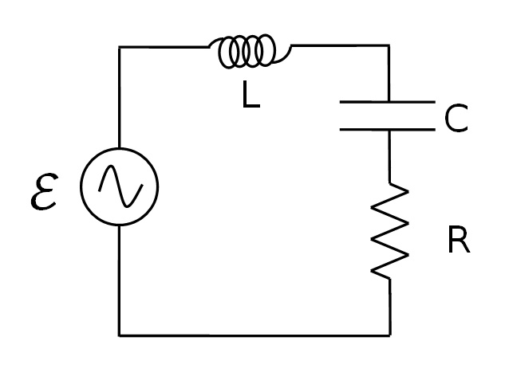
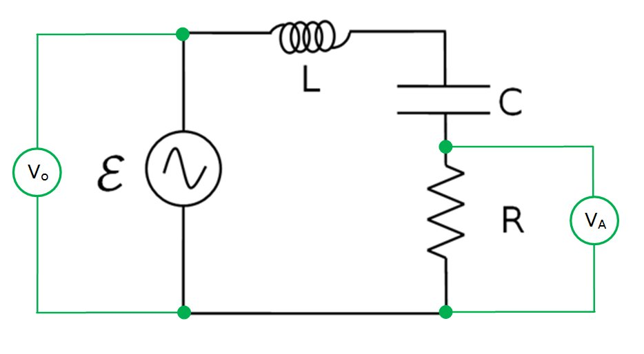
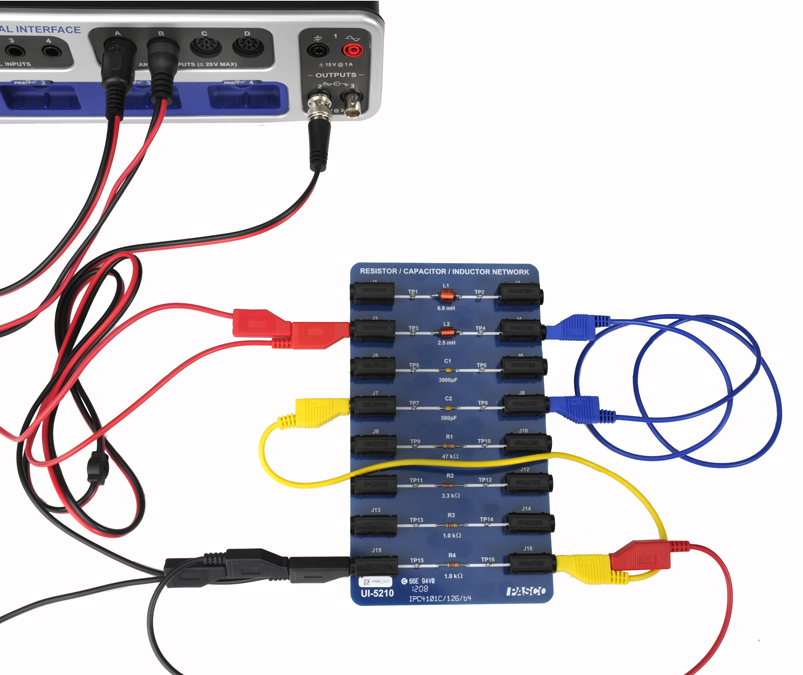

# L-3: LRC Circuit Resonance

## 3.1 Introduction

In this lab, the current through a series LRC circuit is examined as a function of the applied frequency, and the effects of changing the values of the resistance, inductance, and capacitance are observed. You will also measure the phase difference between the applied voltage and the current below resonance, at resonance, and above resonance.

**Theory**

The circuit we will be using consists of an inductor, a capacitor, and a resistor connected in series and a sine wave generator as our signal source. Since it is a series circuit, the current will be common to all the components and, since the source is a sine wave, must be given by

$$
I = I_{max}\cos(\omega t)
$$

*(3.1)*

The voltage across the resistor will be in phase with the current, but the voltage across the inductor leads the current by 90° and the voltage across the capacitor lags by 90°. Adding the three EMF voltages, $\mathcal{E}$, results in a total voltage across the circuit that still varies sinusoidally but has a phase shift $\varphi$ with respect to the current given by

$$
\varepsilon = \varepsilon_{max}\cos(\omega t + \varphi).
$$

*(3.2)*

The three components ($R$, $L$, and $C$) each obey the AC analogs of Ohm's Law

$$
V_R = IR, \qquad V_L = IX_L, \qquad V_C = IX_C
$$

where $X_L$ and $X_C$ are the AC analogs of resistance called the inductive reactance and the capacitive reactance respectively. Unlike a normal resistance, which relates to energy dissipation, reactances represent stored energy. The capacitive reactance and the inductive reactance are given by:

$$
X_C = \frac{-1}{\omega C}
$$

*(3.3)*

$$
X_L = \omega L
$$

*(3.4)*

*Figure 3.1: Circuit diagram.*

The maximum current and total voltage are then related by

$$
\mathcal{E}_{max} = I_{max}Z
$$

*(3.5)*

where $Z = R + iX$ is called the impedance and is the AC analog of resistance for the entire circuit. The phase shift is related to the other variables by

$$
\tan\varphi = \frac{X_L + X_C}{R}
$$

*(3.6)*

Since the voltage across the resistor is in phase with the current, the phase of the current can be measured by measuring the phase of the voltage across the resistor. The same will not be true for the inductor or the capacitor.

Using the reactances in Equations 3.3–3.4, the impedance $Z$ is

$$
Z = \sqrt{R^2 + \left(X_C^2 + X_L^2\right)}.
$$

*(3.7)*

At resonance, the current is maximum and thus the impedance must be at its minimum. The minimum impedance (Equation 3.7) occurs when $X_L + X_C = 0$, yielding $Z = R$. Setting Equation 3.3 equal to Equation 3.4 yields the resonant frequency of the circuit

$$
\omega_{res} = \frac{1}{\sqrt{LC}}.
$$

*(3.8)*

## 3.2 Procedure

**Setup**

1. Connect the BNC-to-Banana cord to the #2 Signal Generator and connect the red cord to one end of the 2.5 μH inductor on the circuit board. Connect the other end of the inductor to the 560 pF capacitor in series and the 1.0 kΩ resistor in series. Then connect the black cord to the open end of the resistor.
2. Connect a Voltage Sensor to Channel A on the 850 interface and attach the leads across the resistor, making sure the black cable from the voltage sensor is connected to the grounded side of the resistor.
3. Connect a Voltage Sensor to Channel B on the 850 interface and attach the leads across the leads of the Output #2 cable, making sure the black cable from the voltage sensor is connected to the black side of the signal generator.
4. Open the Signal Generator 850 Output 2 and choose the Sine Wave at a frequency of 10,000 Hz and an amplitude of 7 V. Leave the output on AUTO.

*Figure 3.2: Series LRC Circuit*

*Figure 3.3: LRC Circuit with Sensors*

5. Create a table in Excel with columns for the frequency, the output voltage ($V_B$), the resistor voltage ($V_A$), the voltage ratio, and the phase shift time. For the voltage ratio use the calculation

$$
V\ \text{Ratio} = \frac{\text{Resistor}}{\text{Output}} = \frac{V_A}{V_B}
$$

   the data in the rest of the columns will be user entered.

   You will also want to record in your spreadsheet the values of $R$, $L$, and $C$ you're using.

6. Create a graph in Capstone of V Ratio vs. Frequency in kHz.
7. Create an oscilloscope with both voltages on the same axis (this is done by choosing similar measurement in the measurement selector on the axis). ms are the units of time on the horizontal axis.
8. Set the common sample rate to 10 MHz in Capstone.

**Plotting the Resonance Curve**

In this first part of the lab, you will vary the frequency of the applied voltage and record the response (current) of the circuit. The response is measured by measuring the voltage across the resistor since the current is in phase with this voltage and it is proportional to it.

One further complication is that you must divide the resistance voltage by the output voltage (of the 850) to account for any changes in the output voltage. This works because if the output voltage doubles, then the resistance voltage also doubles and the ratio $V_R/V_o$ remains constant. This is faster than trying to adjust the output voltage each time to keep it constant.

1. Begin with the signal generator set on 10 kHz. Record this frequency in Table I. Click on Monitor. If the trace is rolling left or right, click the trigger on the oscilloscope. Adjust the horizontal scale on the scope so about three cycles show.
2. Stop monitoring and use the coordinates tool to measure the amplitude of each of the voltages and type the results in Table I. The coordinate tool should show three significant figures for voltage, the snap to pixel distance should be 1 (snap disabled) and the delta tool should be on. Make the signal (especially $V_A$) you are measuring as large as possible. Always measure the positive peak. Set the horizontal line tangent to the peaks. Leave the vertical scale expanded until after step 3 below. That will make it easier to measure the phase shift.
3. Find the phase shift between the two voltages: using the delta tool, measure the difference in time between the first two points where the two signals cross the x axis ($V = 0$) with a negative slope. Record this phase shift. Then decrease the horizontal scale so about three cycles are visible. The cross-hairs should always be on $V_B$ and the delta tool on $V_A$ so that the sign of the phase shift time given by the delta tool will be correct. When current (in phase with $V_A = V_R$) is to the left of $V_B$ (= total voltage), then total voltage lags current (negative phase shift) since total voltage shows up later in time.
4. Increase the frequency of the output by 10 kHz and repeat the measurements.
5. Continue to increase the frequency in steps of 10 kHz up to 250 kHz. Above 250 kHz, continue in 25 kHz steps up to 500 kHz.
6. To find the resonance peak more precisely, we need more data near the peak. We want readings at 5 kHz intervals for the region within ±20 kHz of the resonance peak. For example, if the peak were at 140 kHz, you would add points at 125 kHz, 135 kHz, 145 kHz, and 155 kHz. To do this, on Table I you would click and drag to highlight the 130 kHz row. From the graph toolbar, click on insert empty cells above. Then add a run at 125 kHz. Repeat for each desired data point.
7. Exchange the 1 kΩ resistor for the 3.3 kΩ resistor and repeat the entire procedure. Create a new table in Excel for this data.

**Phase Difference**

As before, the current through the resistor will be in phase with the voltage across the resistor, so we can know the phase of the current by measuring the phase of the resistor voltage.

The phase difference between the resistor voltage and the output voltage is the amount (in radians) that the resistor voltage peaks are shifted from the output voltage peaks. To determine the amount of shift, measure the amount of time the peaks are shifted by ($\delta t$) and calculate the ratio $\delta t/T$ to find what percentage of a full cycle they are shifted. Thus the phase difference, $\phi$, is equal to this percentage times $2\pi$ radians.

$$
\phi = 2\pi\,\delta t/T
$$

Since the frequency $f = 1/T$,

$$
\phi = 2\pi f \delta t
$$

*(3.9)*

1. In Excel, calculate the phase shift using Equation 3.9 and the data recorded in the tables.
2. Create a graph of phase shift vs. Frequency in kHz using Excel.

## 3.3 Data Analysis

**Resonance Curve**

1. Display the runs for both of the resistors on a graph in Excel.
2. Measure the height of the peak for each curve and the frequency of each peak. Record them.
3. Measure the width of the curve at half the max height for each resistor.
4. Calculate the theoretical resonant frequencies.

## Computer Model

1. Create a calculation in Excel:

$$
\frac{V_R}{V} = \frac{R}{\sqrt{(R+r)^2 + \left(\omega L + \frac{1}{\omega C}\right)^2}}
$$

2. Verify that the above equation corresponds to the voltage ratio, $(V_R/V) = R/Z$, using Equation 3.7, except that the total resistance is here $R + r$, where $r$ is the resistance of the coil.
3. Vary the values of $r$, $L$, and $C$ to fit the curve as well as possible for frequencies below 200 kHz (see the discussion of coil resistance below).

## 3.4 Interpretation of Results

**Resonance Curve**

- How do the height and width of the curves change when you increase the resistance?
- Calculate the theoretical resonant frequencies and compare them to the measured values with a percent difference. Remember that the frequency of the signal generator is $f$, which is related to the theoretical frequency by

$$
f_{res} = \frac{\omega_{res}}{2\pi}
$$

  where

$$
\omega_{res} = \frac{1}{\sqrt{LC}}.
$$

- Does the resistance change the resonant frequency? How does the resistance of the inductor affect the results?
- Why don't the peaks equal one at the resonant frequency?
- Why isn't the resonant curve symmetrical about the resonant frequency?

**Phase Difference**

- What should the phase shift be at resonance? How well do your two runs agree with this?
- As the frequency goes to zero, to what value does the phase shift go? Look at your graph and at the theoretical equation and consider the limit as the frequency goes to zero. (Hint: see Equations 3.6, 3.7, and 3.8)
- As the frequency goes to infinity, to what value does the phase shift go? Look at your graph and at the theoretical equation and consider the limit as the frequency goes to infinity.
- Does the current lead or lag behind the applied voltage below the resonant frequency?
- Which is larger above the resonant frequency: the capacitive reactance or the inductive reactance?
- How does changing resistance affect the phase vs. frequency graph?

**Computer Model**

- What does changing $R$ do?
- What does changing $C$ do?
- What does changing $L$ do?
- The fit at high frequency is not perfect because the coil resistance, which causes an energy loss due to heating, is frequency dependent and increases with frequency. At 500 kHz the measured value of $V_R/V$ is about 30% too low. What resistance $r$ does this imply?
- Once we have a functioning model we can use it to examine the system. For example, instead of doing the 3300 Ω experiment, we could just use the model. Try it by changing $R$ to 3300 Ω. That's a lot easier!
