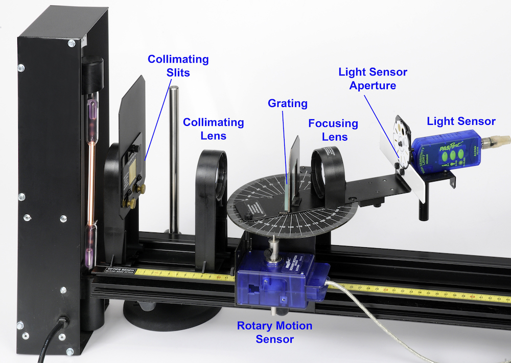
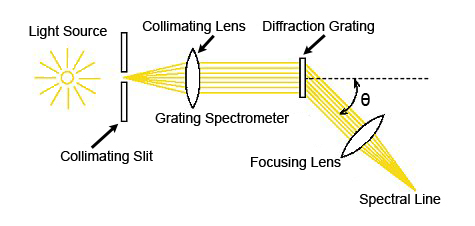
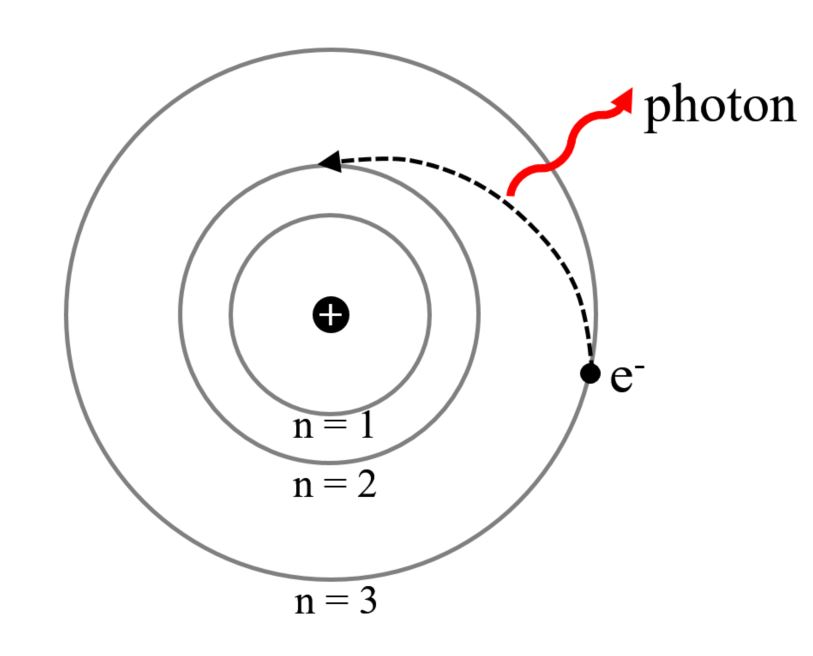

# L-4: Atomic Spectra

## 4.1 Introduction

The atomic spectra of hydrogen, helium, and mercury are scanned by hand using
a grating spectrophotometer that measures relative light intensity as a function of
angle. From the resulting graph, the wavelengths of the spectral lines are determined
by measuring the angle from the central maximum to each line. First and second
order lines are examined. The spectrum of helium is used to calibrate the diffraction
grating.
    The wavelengths of the spectral lines are compared to the accepted values and,
in the case of hydrogen, the electron orbit transitions corresponding to the lines are
identified.

**Theory**

As light passes through a diffraction grating, the light bends to form a diffraction
pattern. The angles to the maxima in the diffraction pattern are given by

$$
d \sin\theta_m = m \lambda
$$

*(4.1)*

where $d$ is the separation between the lines on the grating, $\lambda$ is the wavelength of the
light, and $m = 0, \pm1, \pm2, \ldots$ is the order number ($m = 0$ is the undiffracted light,
positive peaks are one side, negative peaks are on the other side).
   Light is given off by an atom when an excited electron decays from a higher
energy orbit to a lower energy orbit. The energy levels of the electron in a hydrogen
atom are given by

$$
E = -\left(\frac{m_e e^4}{8\epsilon_o^2 h^2}\right)\frac{1}{n^2}
$$

*(4.2)*

where $m_e$ is the mass of the electron, $e$ is the charge of the electron, $\epsilon_o$ is the
vacuum permittivity, $h$ is Planck's constant, and $n$ is the energy level of the electron

*Figure 4.1: Experimental setup for this experiment. Light from the slit passes through the grating, which breaks up the light by color, and then on to the light*

sensor. The bottom figure shows the path taken by the light.

*Figure 4.2: While electrons don’t actually orbit the atom, it sometimes helps to pretend that they to understand the processes involved. In the picture above, an*

electron jumps from the n = 3 to the n = 1 energy level, giving of a photon in the
process.

($n = 1, 2, 3, \ldots$). Plugging these numbers into Equation 4.2 gives

$$
E = (-13.6\ \text{eV}) \times \frac{1}{n^2}.
$$

*(4.3)*

The energy of the photon, $\Delta E$, equals the energy lost by the electron

$$
\Delta E = -(E_f - E_i) = +13.6\ \text{eV}\left(\frac{1}{n_f^2} - \frac{1}{n_i^2}\right)
$$

*(4.4)*

For the visible photons given off by hydrogen, the final energy level is $n_f = 2$. The
wavelength, $\lambda$, of the photon is determined using

$$
c = \lambda f
$$

*(4.5)*

where $c$ is the speed of light and $f$ is the frequency

$$
\Delta E = hf
$$

*(4.6)*

## 4.2 Procedure

Set-Up
  1. If the spectrophotometer needs to be assembled, refer to the assembly instruc-
     tions in the Spectrophotometer manual. NOTE: The diffraction grating should
     be on the side of the grating mount that is toward the collimating lens and the
     light source. The grating side of the plate glass must be on the 0-180-degree
     line on the degree table.

  2. Put the spectrophotometer on two rod stands so you can adjust the height to
     match the height of the various light sources.

  3. Plug the Rotary Motion Sensor and the High Sensitivity Light Sensor into the
     interface.

  4. Attach a grounding wire from the spectrophotometer to ground. A spade
     lug should be connected to the apparatus using the screw on the side of the
     spectrophotometer table. Your teacher will explain how to attach to ground.
     CAUTION: Do not plug wires into wall sockets!

**Collimating the System**

  1. Carefully insert the helium spectral tube into the Spectral Tube Power Supply
     and plug in the Power Supply.

  2. The Collimating Slit must be at the focal point of the first lens and the Aperture
     Disk must be at the focal point of the second lens. Move the spectroscopy
     table back to the end of the track so it is out of the way. Move the Collimating
     Lens (see Figure 3) at least 12 cm from the slit. Have someone with 20/20
     vision (corrected by glasses is fine) look through the lens at the slit. Move the
     lens toward the slit until it first comes into sharp focus. The slit should be
     about 10 cm from the lens. Now move the spectroscopy table as close to the
     Collimating Lens as possible. Set the Focusing Lens 10 cm from the Sensor
     Mask. We will adjust this more exactly in step 3.

  3. Looking from the back side of the Collimating Slit, center the # 4 slit in the
     hole and tighten the screw that holds the Collimating Slits in place.

  4. Turn on the helium light source. Move the track up or down on the rod stands
     so the Collimating Slit is toward the brightest part of the helium tube. Swing
     the Light Sensor Arm out of the way so you can look through the grating along
     the Optics Track. Move the light source so that the light that you see though
     the slit is as bright as possible. Be careful not to move the track after it is set
     correctly.

  5. Swing the Light Sensor Arm so that the Sensor Mask is along the track and
     the bright 0th order spectrum (undeviated) is on the Aperture Disk. Adjust
     the Focusing Lens so the image on the Aperture Disk is as sharp as possible.
     The system is now well collimated.

**Software Setup**

  1. Open PASCO Capstone.

  2. The Rotary Motion pin rotates approximately 60 times for each revolution of
     the spectrophotometer disk. To account for this, create a calculation in the
     Capstone Calculator                     “Table Angle = [Angle, Ch P2 (◦ )]/60”
     with units of degrees (◦ )

  3. In Capstone, create a table of “Light Intensity” (% of scale max) and “Table
     Angle.”

  4. Set the common sample rate for the sensors on 25 Hz.

  5. Each time you start a scan for a different spectral tube, you may want to create
     a new page in Capstone and a new table in Excel.

                          Helium Suggested Settings
                    Light Sensor Button       0–1
                      Collimating Slit        #4
                      Light Sensor Slit       #2
                        Hydrogen Suggested Settings
                    Light Sensor Button       0–1
                      Collimating Slit        #3
                      Light Sensor Slit       #2
                         Mercury Suggested Settings
                    Light Sensor Button       0–1
                      Collimating Slit        #3
                      Light Sensor Slit       #2
                    Mercury Doublet Suggested Settings
                    Light Sensor Button       0–1
                      Collimating Slit        #3
                      Light Sensor Slit       #1

             Table 4.1: Suggested settings for the varius bubls bulb

**Procedure**

**Determining the Grating Line Separation**

Use the yellow line in the helium (He) spectrum to determine the separation, $d$, of
the lines on the grating. The yellow line of helium has a wavelength of 587.46 nm.

  1. Suggestions for the sensor settings are given in Table 4.1. While scanning, turn
     off the room lights and turn the computer screen away from the light sensor.

  2. Start the scan on one side of the central maximum and scan very slowly across
     the central maximum and the first side maximum. The angles may all be
     negative, depending on how you set up the spectrometer. If so, place the hand
     icon over where it says “angle” and when the blue box appears, left click,
     select QuickCalc at the top of the pop-up and then select $-\theta$ in the pop-up
     that appears to the side.

  3. Manually measure the angle from the central maximum to the first side maxi-
     mum ($m = 1$) for the yellow line.

  4. Using the wavelength of the yellow helium line, 587.46 nm, calculate the grating
     line separation using Equation 4.1. This is the value of $d$ that you will use for
     the rest of this experiment. Record this value along with the corresponding
     angle in Excel.

  5. From the Capstone graph, record the position (angle) of all the peaks visible
     in an Excel table. As you go, record the color of the corresponding spectral
     lines as well.

**Hydrogen Spectrum**

  1. Suggestions for the sensor settings are given in Table 4.1.

  2. Notice that the new settings require that you change the sensitivity of the
     Light Sensor in the Setup window. To do this, click on Setup at the top of this
     page and double-click on the Light Sensor icon. Then go to the calibration and
     select High for the Sensitivity.

  3. Replace the helium tube with the hydrogen tube. CAUTION: These tubes can
     be very hot! Adjust the height of the spectrophotometer to match the center
     of the hydrogen tube. Start the scan on one side of the central maximum and
     scan very slowly across the central maximum and all the different colors of the
     first side maxima ($m = 1$).

  4. Repeat Step 5 above for the hydrogen spectrum. You may want to apply some
     smoothing on the graph. Zoom in on the first order peaks to enlarge them.

**Mercury Spectrum**

WARNING: Do not look directly into the mercury lamp. It contains invisible ultra-
violet light which increases the risk of cataracts.

  1. Suggestions for the sensor settings are given in Table 4.1.

  2. Notice that the settings require that you change the sensitivity of the Light
     Sensor in the Setup window. To do this, click on Setup at the top of this page
     and double-click on the Light Sensor icon. Then go to the calibration and select
     Low for the Sensitivity.

  3. Replace the hydrogen tube power supply with the mercury source. Adjust the
     height of the spectrophotometer to match the center of the mercury source.

  4. Start the scan on one side of the central maximum and scan very slowly across
     the central maximum and all the different colors of the first side maxima ($m=1$).

  5. Repeat helium step 5 for the mercury spectrum.

**Mercury Doublet**

One of the mecury “lines” is actually a pair of closely spaced emission lines (a dou-
blet).

  1. Start the scan on one side of the central maximum and scan across the central
     maximum and all the different colors of the first side maxima ($m = 1$) and
     then continue to scan very slowly across the second order lines ($m = 2$).

  2. Using the Smart Tool on the graph, measure the angle from the central maxi-
     mum to the each of the two second order orange lines. Zoom in on the orange
     lines so you can resolve both of the lines. Record these angles.

   On that same graph,

  1. Measure the angle from the central maximum to the first side maximum
     ($m = 1$) for as many mercury lines as you can find.

  2. Use the angles from step 1 to determine the wavelengths of these colors.

  3. The root mean square error (RMSE) is a way to estimate the uncertainty of
     your data when every measurement has a different value.
     For your mercury data, compare your measured wavelengths with the actual
     mercury wavelengths and calculate the RMSE

$$
\text{RMSE} = \sqrt{\frac{1}{N}\sum_{i=1}^{N}(\text{measured}_i - \text{actual}_i)^2}
$$

     The RMSE is approximately equal to the standard deviation of your measure-
     ments (and the more peaks you include in the sum, the better an approximation
     it will be).

  4. Calculate the wavelengths for the doublet.

  5. Look up the accepted values for the wavelengths of the doublet and compare to
     your calculations to the exact avlues, using the RMS error function to determine
     the uncertainty of your measurements.

Hydrogen Energy Levels
  1. Measure the angle from the central maximum to the first side maximum
     ($m = 1$) for at least two different colors other than yellow.

 2. Use the angles from step 1 to determine the wavelengths of these colors. Use
    the grating line separation that you determined with the yellow helium line.

 3. For each of the wavelengths you found for the hydrogen lines, calculate the
    energy of the photon using Equations 4.5 and 4.6.

 4. Now, using these energies, calculate the number of the initial energy level from
    which the electron decayed from when it emitted each of the photons using
    Equation 4.4.

 5. Compare the calculated $\lambda$ to your experimental value by graphing. Fit the
    data, adjust $\theta_{calc}$ if necessary.

## 4.3 Interpretation of Results

- What is the visible difference between hydrogen absorption and emission in a
    spectrum?

- What would the absorption spectrum of a black-body object look like?

- Why can we not use hydrogen energy levels with $n = 1$?

## Additional Figures

