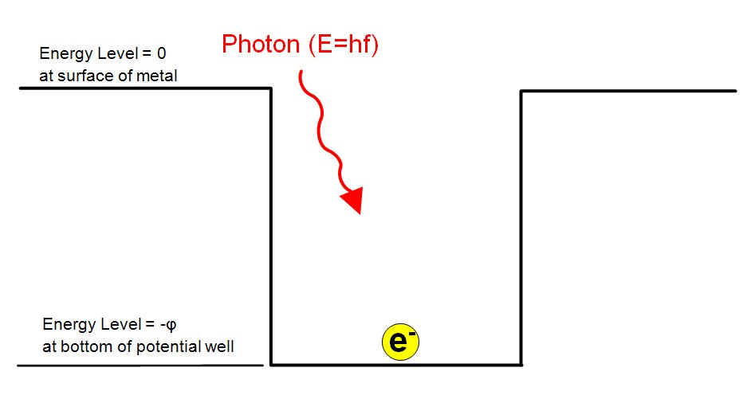
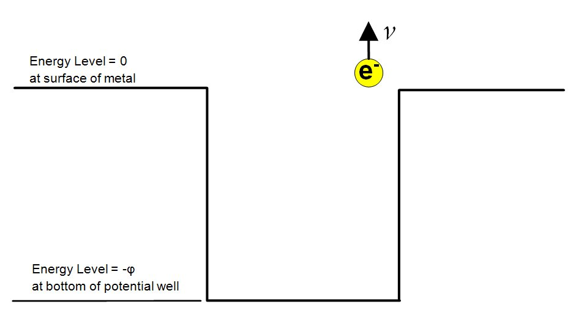
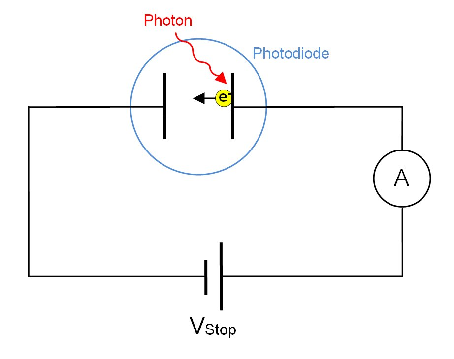
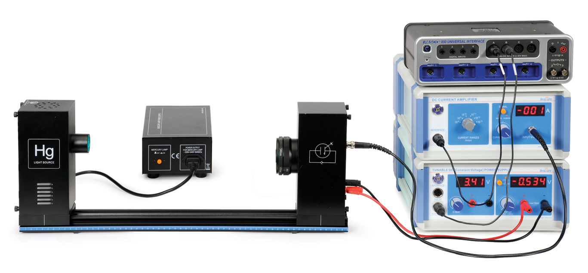
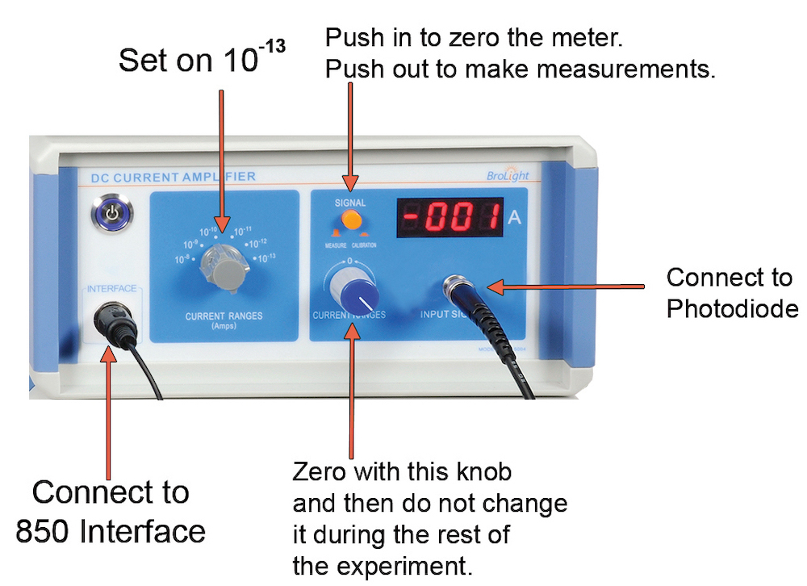
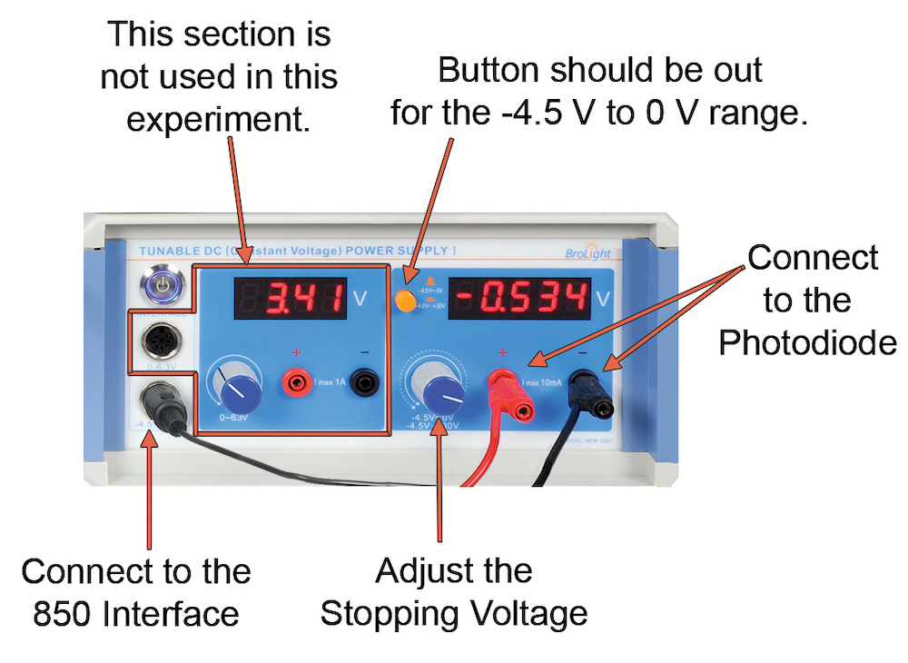
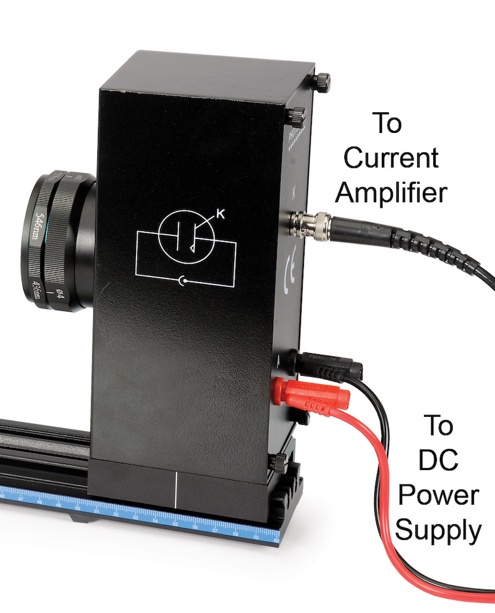
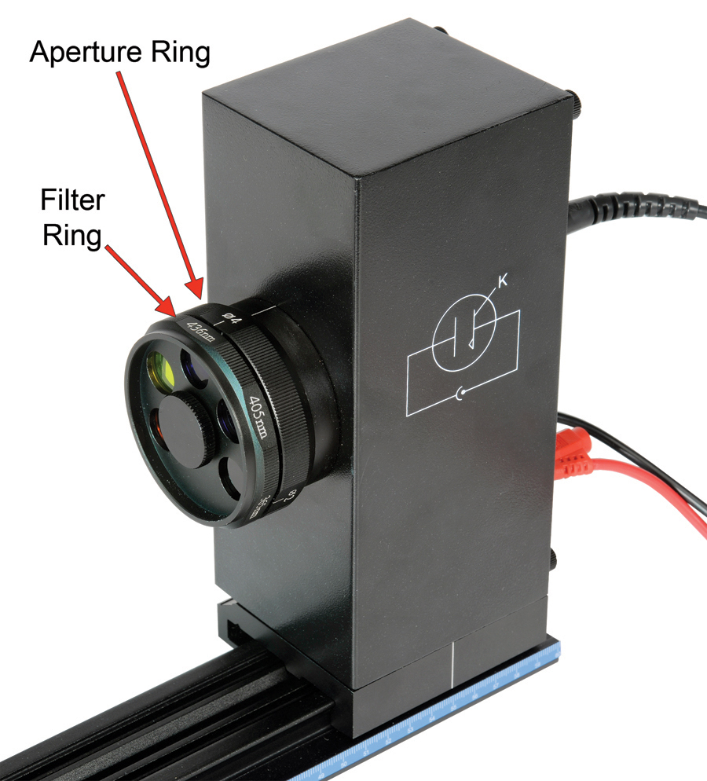

# L-5 | Photoelectric Effect

## Pre-Lab Questions

1. What is a stopping voltage (definition, equation, and units)?
2. What is a work function (definition, equation, and units)?
3. When an electron is ejected in the photoelectric effect what is its energy?
4. What is the equation of energy for a photon?
5. How are these energies related in the Photoelectric effect?
6. How does the photo-current relate to kinetic energy of the electron?
7. What do you expect the equation of the graph of voltage vs frequency to be?
8. What form do you predict the graph would take? What does the y-intercept and slope represent physically?
9. If the frequency of the light shining on the metal is increased, will the photo-current increase?
10. If the frequency of the light shining on the metal is increased, will the kinetic energy of electrons being emitted increase?
11. If light with the same frequency and same intensity shines on two different metals with different work functions, will both metals emit electrons?
    1. Will these electrons have the same kinetic energy?
    2. Will the photo-current be larger for the metal with the smaller work function?

## 5.1 Introduction

The photoelectric effect is the emission of electrons from the surface of a metal when electromagnetic radiation (such as visible or ultraviolet light) shines on the metal. At the time of its discovery, the classical wave model for light predicted that the energy of the emitted electrons would increase as the intensity (brightness) of the light increased. It was discovered that it did not behave that way. Instead of using the wave model, treating light as a particle (photon) led to a more consistent explanation of the observed behavior.

In this lab, you will study the effect varying the light intensity and frequency has on the energy of the emitted electrons and the magnitude of the photo-current. You will also determine Planck constant.

**Theory**

The electrons in a metal are in potential energy wells (see Figure 5.1). When light shines on the metal, the energy of the photon is absorbed by the electron and converted into potential energy and kinetic energy. If the photon has sufficient energy to raise the electron out of the potential well, the electron will be ejected from the surface of the metal.

If the energy of the photon is equal to the work function, the electron makes it out of the well with no kinetic energy and thus will not actually leave the surface of the metal. If the energy of the photon is greater than the work function, the electron makes it out of the well with some kinetic energy and the electron leaves the surface of the metal. If the energy of the photon is less than the work function, the electron does not make it out of the well.

*Figure 5.1: Photon strikes the surface of the metal (left), which ejects an electron (right) if the photon has enough energy.*

In this experiment, the kinetic energy of the emitted electron is measured by applying a potential difference (V) across the photodiode to just barely stop the electron from reaching the collector plate in the photodiode tube (Figure 5.2). The voltage is adjusted until there is a significant relationship between kinetic and potential energy.

*Figure 5.2: Diagram of the photodiode circuit. The power supply adds a stopping voltage while the ammeter measures the current flowing.*

If different frequencies of light are incident on the metal, the electrons will be emitted with different kinetic energies, and thus it will take different potential differences to stop the electrons.

## 5.2 Procedure

**Setup**

*Figure 5.3: The complete experimental setup.*

*Figure 5.4: Current amplifier (left) and DC power supply (right) settings and wiring.*

1. Mount the mercury lamp and the photodiode case on the track as shown in Figure 5.3.

2. Connect the power cord from the Mercury Light Source enclosure into the receptacle labeled "POWER OUTPUT FOR MERCURY 220 V" on the Mercury Lamp Power Supply. Connect the Mercury Lamp Power Supply to an outlet.

3. Turn on the Mercury Lamp and let it warm up for at least 10 minutes. Leave the cover on the lamp to avoid looking directly into the lamp.

4. Connect a DIN-plug-to-DIN-plug cable between Channel A on the 850 Interface and the DC Current Amplifier (see Figure 5.4). Connect a DIN-plug-to-DIN-plug cable between Channel B on the 850 Interface and the DC Power Supply port labeled -4.5 V to 0 V (the lower port) (see Figure 5.4).

5. Do not connect any cords to the photodiode yet.

6. On the DC Current Amplifier, turn the CURRENT RANGES switch to $10^{-13}$ A. Press the calibration button in to zero the meter. Turn the knob until the meter reads 0.00 A (see Figure 5.4).

7. Press the Calibration button to put it in the OUT position for measuring.

**For the rest of the experiment, do not change the knobs on the DC Current Amplifier.**

*Figure 5.5: Photodiode connections (left) and filter ring and aperture ring locations on the photodiode.*

8. On the DC Power Supply, make sure the button is out to select the -4.5 V to 0 V range (see Figure 5.4).

9. Connect the cables to the photodiode:
    1. Connect the special BNC-plug-to-BNC-plug cable between the port marked "K" on the Photodiode enclosure and the BNC jack on the DC Current Amplifier.
    2. Connect the red banana-plug patch cord between the port marked "A" on the Photodiode enclosure and the red banana jack on the right side of the DC Power Supply.
    3. Connect the black banana-plug patch cord between the black banana jack on the Photodiode enclosure and the black banana jack on the right side of the DC Power Supply.

10. During the experiment, you will be changing the aperture and the filters.
    1. To change the aperture, pull out on the Aperture Ring and rotate it until it clicks into place.
    2. To change the filter, do not pull out; just rotate the Filter Ring until it clicks into the next position.

11. In Excel, create a table including the wavelength of the filters and their corresponding frequencies, with a column open for voltages and currents with units of $10^{-10}$. Reasonably decide on the number of significant figures to use.

12. Create a digital display in PASCO Capstone for the current and voltage.

**Data Collection**

1. Select the 8 mm aperture and the 365 nm filter on the photodiode.

2. Remove the Mercury Light Source cover and press the Preview button on the Control Bar at the bottom of the page. Click in the first row of the Stopping Voltage in the table.

3. Adjust the VOLTAGE ADJUST knob on the DC Power Supply until the stopping voltage is found. Record this value in your table.

4. Repeat the procedure for all the filters and then for the other aperture sizes.

5. Put the cover back onto the Mercury Light Source.

## 5.3 Data Analysis

1. In Excel, graph the data and fit for each aperature.

2. Find Planck Constant and the uncertainty from each fit and record the slope, y-intercept, uncertainty value, R value and correlation. (*Hint: research the* LINEST *Excel function*)

3. Find the work function for the metal for each graph.

**Stopping Voltage vs. Light Intensity**

To investigate the effect that light intensity has on the energy of the emitted electrons, the intensity is varied by changing the aperture, while keeping the wavelength constant. (*Hint: You should create your own tables.*)

1. For each aperture find the average and the standard deviation of the stopping voltages.

2. The aperture diameter has been changed. Did the stopping voltage change as the light got brighter?

3. What does the result indicate about the relationship between the kinetic energy of the electrons and the light intensity?

## 5.4 Interpretation of Results

1. How does the graph compare to your prediction?
2. Where were you conceptually correct/incorrect?
3. How does the equation of the graph relate to the equations found in Pre-Lab Questions 3, 4, 5, and 6?
4. What are the relationships between frequency vs photo-current and kinetic energy?
5. How does your answer change for Pre-Lab Question 11?
6. Which wavelength gave the emitted electrons the greatest kinetic energy? What color is it?
7. If the power supply is turned off what would be the cutoff frequency? What wavelength (color) does the cutoff frequency correspond to?
8. How does the current change when the aperture diameter changes?
9. Was the stopping voltage different for different light intensities? How does the kinetic energy of the electron depend on the light intensity?
10. In the pre-lab did you correctly predict what would happen? If not, what really happened? Identify which parts of the experiment apply to each question.
