# L-6: Light Intensity vs. Distance and Speed of Light

NOTE: You will be writting your lab report on Light Intensity vs. Distance.

## 6.1 Light Intensity vs. Distance

### 6.1.1 Introduction

The relative light intensity versus distance from a point light source is plotted. As the Light Sensor is moved by hand, the string attached to the Light Sensor that passes over the Rotary Motion Sensor pulley to a hanging mass causes the pulley to rotate, measuring the position. The experiment is repeated with an extended source.

This experiment needs to be done in a room with low light levels, but not totally dark.

Various curves are fitted to the data to see which fits better.

This laboratory could also be used to model the Coulomb interaction, showing how an effect, whether lines of force or virtual particles, would be decreased as it is spread over an increasing area.

**Theory**

If light spreads out in all directions, as it does from a point light source, the intensity at a certain distance from the source depends on the area over which the light is spread. For a sphere of radius $r$, what is the equation for the surface area?

$$A = \_\_\_\_\_\_\_\_$$

*(blank — student fills in)*

Intensity is calculated by taking the power output of the bulb divided by the area over which the light is spread

$$I = \frac{P}{A}$$

*(6.1)*

where $I$ is the intensity, $P$ is the power and $A$ is the area.

Put the surface area of a sphere into the intensity equation. How should the intensity of a point source depend on distance?

$$I = \_\_\_\_\_\_\_\_$$

*(6.2) (blank — student fills in)*

### 6.1.2 Procedure

**Setup**

*Figure 6.1: Experimental setup for this lab. The light is fixed at one end and the sensor moves along the track. A weight strung over the rotary motion sensor is used to record the change in position of the sensor.*

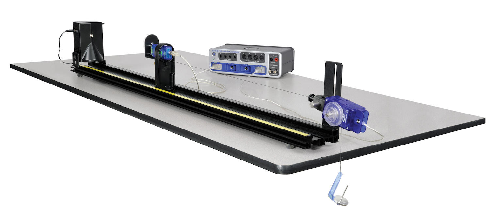

1. Set up the equipment as shown above. The thread is attached to the Aperture Bracket and passes over the large pulley on the Rotary Motion Sensor to a hanging 10 g mass. The thread must be long enough so the white Aperture Disk can be 15 cm from the point source, but should not hit the floor when the Aperture Bracket is moved back as far as possible on the track. The thread should be horizontal and aligned parallel with the track but need not be centered on the Aperture Bracket. The Rotary Motion Sensor should be set so the thread is aligned with the pulley groove and does not pull sideways on the pulley.

2. Attach the High Sensitivity Light Sensor to the Aperture Bracket using the 6 cm threaded black handle.

3. Plug the Rotary Motion Sensor and the Light Sensor into the 850 Universal Interface.

**Sensitivity of the Light Sensor**

The sensitivity of the Light Sensor must be adjusted so it does not max out and so it is not set so low that the signal is poor.

1. Set the Basic Optics Light Source so the point light source is at 0.0 cm. The center of the point light source is indicated by the edge of the notch in the bottom of the light source bracket (see arrow on the bottom of the bracket). Set the front of the Light Sensor mask 10 cm from the center of the point light source. Note that you must sight down the front of the Light Sensor mask to see where it lines up with the track measuring tape. Alternately, you can use the position indicator foot on the holder, the leading edge of which is 7.5 cm behind the front of the sensor mask. In the photo, the leading edge of the foot is at 17.5 cm.

2. Rotate the aperture bracket to the white circle.

3. Press the RECORD button and monitor the Intensity at 10 cm in the box at the top right. Press the middle (0-100) button on the High Sensitivity Light Sensor. Apply power to the Point Light Source. The Intensity in the box at the right should be around 60%. If it is more than 90%, try starting further away from the source. If you start at a position different from 10 cm, change the value below to your initial position. Unplug the Point Light Source. Click STOP. Click Delete Last Run (at bottom right).

Initial Position = 10.0 cm

**Calibration Run**

1. Turn off most of the room lights. With the Point Source off, we want the Relative Intensity levels to not vary by more than a few percent as the Light Sensor is moved down the track. To check this (with the Point Source off), start with the Light Sensor 10 cm from the center of the light bulb, click RECORD and then slowly move the sensor away from the light source until the 10 g mass strikes the floor. Note that you should keep your hand and body behind the screen to avoid reflecting light onto the screen. Click STOP. Observe the Relative Intensity versus Position graph to the right.

   Click on the Graph Resize button on the top left of the toolbar above the graph. If the variation is more than 0.2%, click the Delete Last Run button, turn all of the room lights off and repeat the run. Click on the Data Summary button on the left side of the page. Click on anyplace that it says Run #1 and re-label it Calibrate Run. Click Data Summary again to close it.

2. Note that Relative Intensity is graphed versus the absolute value of the position (Abs. position) measured by the Rotary Motion Sensor since the measured value may be plus or minus depending on the set up. Also notice that 0 is where the sensor is when you click RECORD.

**Point Source/Extended Source Runs**

1. Apply power to the Point Light Source.

2. With the Light Sensor 10 cm (or at the distance from Procedure A, part 3 where the Relative Intensity drops below 90%) from the center of the light bulb, click on RECORD. Hold the back of the Light Sensor holder and move the Light Sensor slowly away from the light source until the 10 g mass strikes the floor. As you do this, the thread will rotate the Rotary Motion Sensor, recording the distance the Light Sensor is from the bulb. Click STOP. As in part 1 above, click Data Summary and re-label this as Point Source Run.

3. Reverse the Light Source so the screen is now at 1.0 cm and facing the sensor.

4. With the Light Sensor at the same starting position as in part 2, click on RECORD. Hold the back of the Light Sensor holder and move the Light Sensor slowly away from the light source until the 10 g mass strikes the floor. Click STOP. As in part 1 above, click Data Summary and re-label this as Extended Source Run.

### 6.1.3 Data Analysis

**Power**

1. Examine the Calculator under the Curve Fit tab. Line 5 in the calculator calculates the theoretical values for the Intensity (I) as a function of position. Click on line 5 and examine the box below it to verify that the equation is

$$I = \frac{A}{(|\text{position}|+B)^D}+C$$

   where $A$ has units of m², $C$ and $D$ are dimensionless constants, and $B$ has units of m. The absolute value of position is taken since we want a positive distance, but the Rotary Motion Sensor may give negative values depending on how it is hooked up. Nominal values for $A$, $B$, $C$, and $D$ are given in lines 1 through 4. You need to choose better values for $A$, $B$, $C$, and $D$ to improve the agreement between the measured Relative Intensity and the Theory intensity (I). To do this consider the following questions:

   (a) What is the physical meaning of $C$? What value should you use and why?

   (b) What is the physical meaning of $B$? *Hint: when you started the measurement, the computer read your position as zero, but was it?*

   (c) Based on the equation you developed in the Theory section, what should $D$ be?

   (d) What should $A$ be?

**Extended Source**

1. Click the "Curve Fit P" tab and select the Extended Source Run using the Data Display tool if it isn't already selected. Click on the Graph Rescale button so the graph fills the page. The scales on the left side and the right side must be the same. If they are not, move the hand icon over any number on the right side and when the parallel plate icon appears click and drag up or down to match the scale on the left.

2. Examine the Calculator under the Curve Fit tab. Line 11 in the calculator calculates the theoretical values for the Intensity (I2) as a function of position. Click on line 11 and examine the box below it to verify that the equation is

$$I2 = \frac{A2}{(|\text{position}|+B2)^{D2}}+C$$

3. Note that the above equation is exactly the same as in the Power section (see line 5 in the Calculator) except A becomes A2, B becomes B2, and so on. Set the values of A2, B2, C2, and D2 equal to the values of A, B, C, and D. Adjust the value of A2 so the curves have the same value at absolute position = 0. How well does your data fit the $1/r^2$ theory curve?

4. Now set D2 = 1. You will also need to increase A2 by a factor of 10 since at position = 0, you are now dividing by 0.1 instead of $0.1^2$.

5. Although the fit is not perfect, it should be reasonably close up to 0.2 m or so. That is, the intensity falls off like $1/r$ rather than $1/r^2$. Why does the $1/r$ fit fail as the distance becomes greater than 0.2 m?

### 6.1.4 Interpretation of Results

1. How well did the theoretical intensity match the measured intensity? What does this show?

2. If $D = 1$, would it be possible to pick $A$, $B$, and $C$ to make the theoretical intensity match the measured intensity? Try it!

3. If $D = 3$, would it be possible to pick $A$, $B$, and $C$ to make the theoretical intensity match the measured intensity? Try it!

4. Suppose you repeated this experiment with a long fluorescent bulb and the Light Sensor is moved away from the bulb along an axis perpendicular to the light bulb and near its center. Would you expect the light intensity for this line of light to depend on distance in the same way as it does for a point light source? Why or why not? What dependence on distance would you expect?

5. Why do you think the extended source intensity dropped off like $1/r$ when the sensor was close to the source?

## 6.2 Speed of Light

### 6.2.1 Introduction

Laser light passes through a series of lenses to produce an image of the light source at a measured position. The light is then directed to a rotating mirror, which reflects the light to a fixed mirror at a known distance from the rotating mirror. The laser light is reflected back through its original path and a new image is formed at a slightly different position. The difference between final/initial positions, angular velocity of the rotating mirror and distance traveled by the light are then used to calculate the speed of light.

**History and Theory**

The velocity of light in free space is one of the most important and intriguing constants of nature. Whether the light comes from a laser on a desktop or from a star that is hurtling away at fantastic speeds, if you measure the velocity of the light, you measure the same constant value. In more precise terminology, the velocity of light is independent of the relative velocities of the light source and the observer. Furthermore, as Einstein first presented in his *Special Theory of Relativity*, the speed of light is critically important in some surprising ways. In particular:

1. The velocity of light establishes an upper limit to the velocity that may be imparted to any object.

2. Objects moving near the velocity of light follow a set of physical laws drastically different, not only from Newton's Laws, but from the basic assumptions of human intuition.

With this in mind, it's not surprising that a great deal of time and effort has been invested in measuring the speed of light. Some of the most accurate measurements were made by Albert Michelson between 1926 and 1929 using methods very similar to those you will be using with the PASCO Speed of Light Apparatus. Michelson measured the velocity of light in air to be $2.99712\times10^8$ m/s. From this result he deduced the velocity in free space to be $2.99796\times10^8$ m/s. But Michelson was by no means the first to concern himself with this measurement. His work was built on a history of ever-improving methodology.

**Galileo**

Through much of history, those few who thought to speculate on the velocity of light considered it to be infinite. One of the first to question this assumption was the great Italian physicist Galileo, who suggested a method for actually measuring the speed of light. The method was simple. Two people, call them A and B, take covered lanterns to the tops of hills that are separated by a distance of about a mile. First A uncovers her lantern. As soon as B sees A's light, she uncovers her own lantern. By measuring the time from when A uncovers her lantern until A sees B's light, then dividing this time by twice the distance between the hill tops, the speed of light can be determined. However, the speed of light being what it is, and human reaction times being what they are, Galileo was able to determine only that the speed of light was far greater than could be measured using his procedure. Although Galileo was unable to provide even an approximate value for the speed of light, his experiment set the stage for later attempts. It also introduced an important point: to measure great velocities accurately, the measurements must be made over a long distance.

**Römer**

The first successful measurement of the velocity of light was provided by the Danish astronomer Olaf Römer in 1675. Römer based his measurement on observations of the eclipses of one of Jupiter's moons. As this moon orbits Jupiter, there is a period of time when Jupiter lies between it and the Earth, and blocks it from view. Römer noticed that the duration of these eclipses was shorter when the Earth was moving toward Jupiter than when the Earth was moving away. He correctly interpreted this phenomena as resulting from the finite speed of light. Geometrically the moon is always behind Jupiter for the same period of time during each eclipse. Suppose, however, that the Earth is moving away from Jupiter. An astronomer on Earth catches his last glimpse of the moon, not at the instant the moon moves behind Jupiter, but only after the last bit of unblocked light from the moon reaches his eyes. There is a similar delay as the moon moves out from behind Jupiter but, since the Earth has moved farther away, the light must now travel a longer distance to reach the astronomer. The astronomer therefore sees an eclipse that lasts longer than the actual geometrical eclipse. Similarly, when the Earth is moving toward Jupiter, the astronomer sees an eclipse that lasts a shorter interval of time.

From observations of these eclipses over many years, Römer calculated the speed of light to be $2.1\times10^8$ m/s. This value is approximately 1/3 too slow due to an inaccurate knowledge at that time of the distances involved. Nevertheless, Römer's method provided clear evidence that the velocity of light was not infinite, and gave a reasonable estimate of its true value — not bad for 1675.

**Fizeau**

The French scientist Fizeau, in 1849, developed an ingenious method for measuring the speed of light over terrestrial distances. He used a rapidly revolving cogwheel in front of a light source to deliver the light to a distant mirror in discrete pulses. The mirror reflected these pulses back toward the cogwheel. Depending on the position of the cogwheel when a pulse returned, it would either block the pulse of light or pass it through to an observer. Fizeau measured the rates of cogwheel rotation that allowed observation of the returning pulses for carefully measured distances between the cogwheel and the mirror. Using this method, Fizeau measured the speed of light to be $3.15\times10^8$ m/s. This is within a few percent of the currently accepted value.

**Foucault**

Foucault improved Fizeau's method, using a rotating mirror instead of a rotating cogwheel. (Since this is the method you will use in this experiment, the details will be discussed in considerable detail in the next section.) As mentioned, Michelson used Foucault's method to produce some remarkably accurate measurements of the velocity of light. The best of these measurements gave a velocity of $2.99774\times10^8$ m/s. Today, the speed of light is an officially defined S.I. value equal to $2.99792458\times10^8$ m/s.

**The Foucault Method**

*Figure 6.2: Diagram of the Foucault Method*

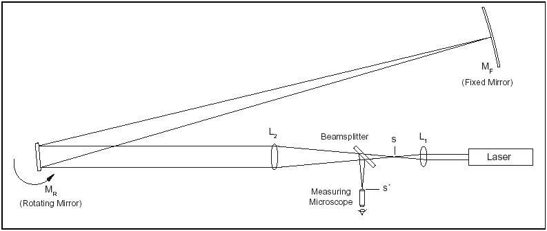

**Qualitative Description**

In this experiment, you will use a method for measuring the speed of light that is basically the same as that developed by Foucault in 1862. A diagram of the experimental setup is shown in Figure 6.2, above. With all the equipment properly aligned and with the rotating mirror stationary, the optical path is as follows. The parallel beam of light from the laser is focused to a point image at point s by lens $L_1$. Lens $L_2$ is positioned so that the image point at s is reflected from the rotating mirror $M_R$, and is focused onto the fixed, spherical mirror $M_F$. $M_F$ reflects the light back along the same path to again focus the image at point s. In order that the reflected point image can be viewed through the microscope, a beam splitter is placed in the optical path, so a reflected image of the returning light is also formed at point s'. Now, suppose $M_R$ is rotated slightly so that the reflected beam strikes $M_F$ at a different point. Because of the spherical shape of $M_F$, the beam will still be reflected directly back toward $M_R$. The return image of the source point will still be formed at points s and s'. The only significant difference in rotating $M_R$ by a slight amount is that the point of reflection on $M_F$ changes. Now imagine that $M_R$ is rotating continuously at a very high speed. In this case, the return image of the source point will no longer be formed at points s and s'. This is because, with $M_R$ rotating, a light pulse that travels from $M_R$ to $M_F$ and back finds $M_R$ at a different angle when it returns than when it was first reflected. As will be shown in the following derivation, by measuring the displacement of the image point caused by the rotation of $M_R$, the velocity of light can be determined.

**Quantitative Description**

In order to use the Foucault method to measure the speed of light, it's necessary to determine a precise relationship between the speed of light and the displacement of the image point. Of course, other variables of the experimental setup also affect the displacement. These include:

- Rate of rotation of $M_R$
- Distance between $M_R$ and $M_F$
- Magnification of $L_2$, which depends on the focal length of $L_2$ and also on the distances between $L_2$, $L_1$, and $M_F$.

Each of these variables will show up in the final expression that we derive for the speed of light.

To begin the derivation, consider a beam of light leaving the laser. It follows the path described in the qualitative description above. That is, first the beam is focused to a point at s, and then reflected from $M_R$ to $M_F$, and back to $M_R$. The beam then returns through the beam splitter, and is refocused to a point at point s', where it can be viewed through the microscope. This beam of light is reflected from a particular point on $M_F$. As the first step in the derivation, we must determine how the point of reflection on $M_F$ relates to the rotational angle of $M_R$.

Figure 6.3a shows the path of the beam of light, from the laser to $M_F$, when $M_R$ is at an angle $\theta$. In this case, the angle of incidence of the light path as it strikes $M_R$ is also $\theta$ and, since the angle of incidence equals the angle of reflection, the angle between the incident and reflected rays is just $2\theta$. As shown in the diagram, the pulse of light strikes $M_F$ at a point that we have labeled S. Figure 6.3b shows the path of the pulse of light if it leaves the laser at a slightly later time, when $M_R$ is at an angle $\theta_1 = \theta + \Delta\theta$. The angle of incidence is now equal to $\theta_1=\theta+\Delta\theta$, so that the angle between the incident and reflected rays is just $2\theta_1 = 2(\theta+\Delta\theta)$. This time we label the point where the pulse strikes $M_F$ as $S_1$. If we define D as the distance between $M_F$ and $M_R$, then the distance between S and $S_1$ can be calculated:

$$S_1-S=D(2\theta_1-2\theta)=D[2(\theta+\Delta\theta)-2\theta]=2D\Delta\theta$$

*(6.3)*

*Figure 6.3: Geometry of the beam path from the rotating mirror ($M_R$) to the fixed mirror ($M_F$) for two rotation angles, θ (a) and θ₁ = θ + Δθ (b), showing the corresponding reflection points S and S₁.*

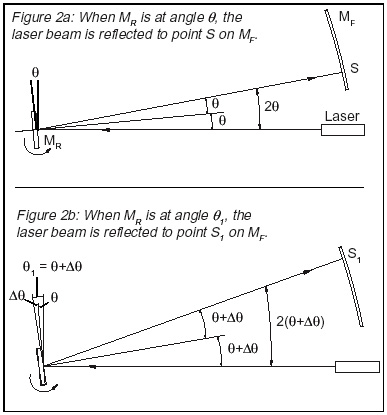

In the next step in the derivation, it is helpful to think of a single, very quick pulse of light leaving the laser. Suppose $M_R$ is rotating, and this pulse of light strikes $M_R$ when it is at angle $\theta$, as in Figure 6.3a. The pulse will then be reflected to point S on $M_F$. However, by the time the pulse returns to $M_R$, $M_R$ will have rotated to a new angle, say angle $\theta_1$. If $M_R$ had not been rotating, but had remained stationary, this returning pulse of light would be refocused at point s. Clearly, since $M_R$ is now in a different position, the light pulse will be refocused at a different point. We must now determine where that new point will be.

The situation is very much like that shown in Figure 6.3b, with one important difference: the beam of light that is returning to $M_R$ is coming from point S on $M_F$, instead of from point $S_1$. To make the situation simpler, it is convenient to remove the confusion of the rotating mirror and the beam splitter by looking at the virtual images of the beam path, as shown in Figure 6.4.

The critical geometry of the virtual images is the same as for the reflected images. Looking at the virtual images, the problem becomes a simple application of thin lens optics. With $M_R$ at angle $\theta_1$, point $S_1$ is on the focal axis of lens $L_2$. Point S is in the focal plane of lens $L_2$, but it is a distance $\Delta S = S_1 - S$ away from the focal axis. From thin lens theory, we know that an object of height $\Delta S$ in the focal plane of $L_2$ will be focused in the plane of point s with a height of $(-i/o)\Delta S$. Here i and o are the distances of the lens from the image and object, respectively, and the minus sign corresponds to the inversion of the image. As shown in Figure 6.4, reflection from the beam splitter forms a similar image of the same height.

*Figure 6.4: Analyzing the Virtual Images*

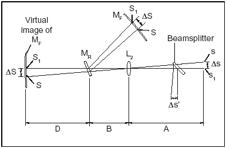

Therefore, ignoring the minus sign since we aren't concerned that the image is inverted, we can write an expression for the displacement ($\Delta s'$) of the image point:

$$\Delta s'=\Delta s=\left(\frac{i}{o}\right)\Delta S=\frac{A}{D+B}\Delta S$$

*(6.4)*

Combining Equations (6.3) and (6.4), and noting that $\Delta S = S_1 - S$, the displacement of the image point relates to the initial and secondary positions of $M_R$ by the formula:

$$\Delta s'=\frac{2DA\Delta\theta}{D+B}$$

*(6.5)*

The angle $\Delta\theta$ depends on the rotational velocity of $M_R$ and on the time it takes the light pulse to travel back and forth between the mirrors $M_R$ and $M_F$, a distance of 2D. The equation for this relationship is:

$$\Delta\theta=\frac{1D\omega}{c}$$

*(6.6)*

*(as printed in the source; note this may be intended as 2D based on the surrounding derivation)*

where c is the speed of light and $\omega$ is the rotational velocity of the mirror in radians per second. ($\frac{2D}{c}$ is the time it takes the light pulse to travel from $M_R$ to $M_F$ and back.)

Using Equation (6.6) to replace $\Delta\theta$ in Equation (6.5) gives:

$$\Delta s'=\frac{4AD^2\omega}{c(D+B)}$$

*(6.7)*

Equation (6.7) can be rearranged to provide our final equation for the speed of light:

$$c=\frac{4AD^2\omega}{(D+B)\Delta s'}$$

*(6.8)*

where: c = the speed of light, $\omega$ = the rotational velocity of the rotating mirror ($M_R$), A = the distance between lens $L_2$ and $L_1$, minus the focal length of $L_1$, B = the distance between lens $L_2$ and the rotating mirror ($M_R$), and D = the distance between the rotating mirror ($M_R$) and the fixed mirror ($M_F$).

$\Delta s'$ = the displacement of the image point, as viewed through the microscope. ($\Delta s' = s_1 - s$; where $s$ is the position of the image point when the rotating mirror ($M_R$) is stationary, and $s_1$ is the position of the image point when the rotating mirror is rotating with angular velocity $\omega$.)

Equation (6.8) was derived on the assumption that the image point is the result of a single, short pulse of light from the laser. But, looking back at Equations (6.3)-(6.6), the displacement of the image point depends only on the difference in the angular position of $M_R$ in the time it takes for the light to travel between the mirrors. The displacement does not depend on the specific mirror angles for any given pulse. If we think of the continuous laser beam as a series of infinitely small pulses, the image due to each pulse will be displaced by the same amount. All these images displaced by the same amount will, of course, result in a single image. By measuring the displacement of this image, the rate of rotation of $M_R$, and the relevant distances between components, the speed of light can be measured.

### 6.2.2 Procedure

**Equipment Setup**

*Figure 6.5: Equipment Alignment*

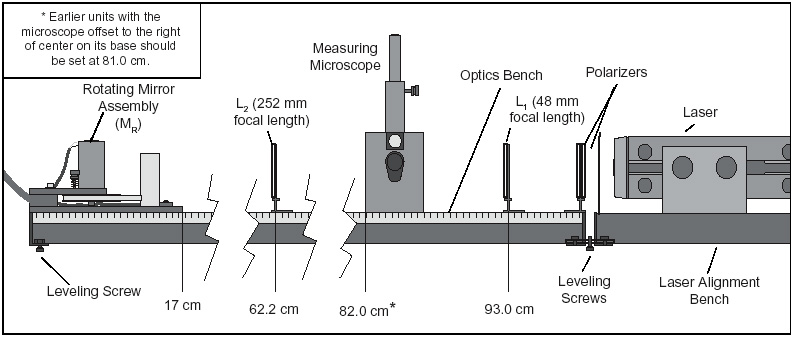

**IMPORTANT: Proper alignment is critical, not only for getting good results, but for getting any results at all. Please follow this alignment procedure carefully. Allow yourself about three hours to do it properly the first time. Once you have set up the equipment a few times, you may find that the alignment summary at the end of this section is a helpful guide.**

For reference as you set up the equipment, Figure 6.5 shows the approximate positioning of the components with respect to the metric scale on the side of the Optics Bench. The exact placement of each component depends on the position of the Fixed Mirror ($M_F$) and must be determined by following the steps of the alignment procedure described below.

*Figure 6.6: Placing Components Flush against the Fence for Proper Alignment*

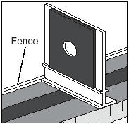

All component holders, the Measuring Microscope, and the Rotating Mirror Assembly should be mounted flush against the "fence" of the Optics Bench (Figure 6.6). This will insure that all components are mounted at right angles to the beam axis.

**To Setup and Align the Equipment:**

*Figure 6.7: Coupling the Optics Bench and the Laser Alignment Bench*

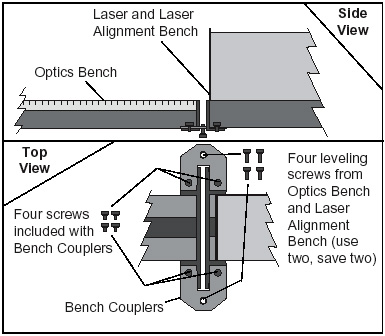

*Figure 6.8: Using the Alignment Jigs to Align the Laser*

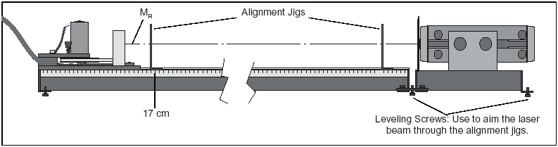

*Figure 6.9: Aligning the Rotating Mirror ($M_R$).*

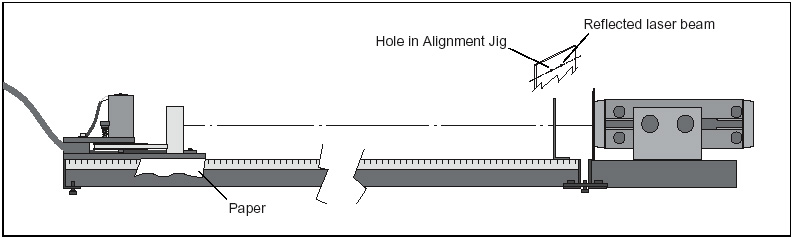

*Figure 6.10: Positioning and Aligning $L_1$*

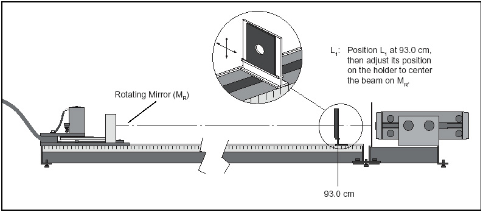

*Figure 6.11: Positioning the fixed mirror ($M_F$).*

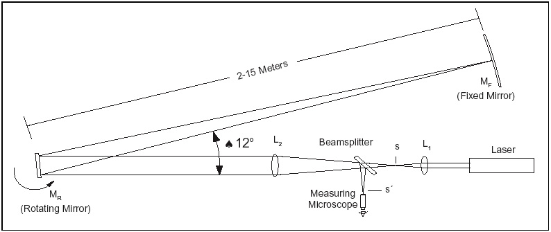

*Figure 6.12: Turning $L_2$ slightly askew to clean up the image.*

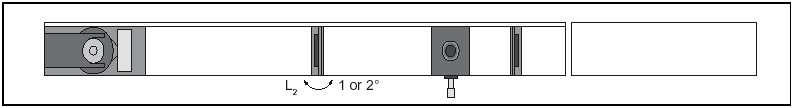

*Figure 6.13: Using the Alignment Jigs to Align the Laser*

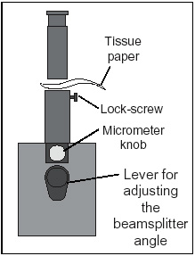

1. Place the Optics Bench on a flat, level surface.

2. Place the Laser, mounted on the Laser Alignment Bench, end-to-end with the Optics Bench, at the end corresponding to the 1 m mark of the metric scale.

3. Use the Bench Couplers and the provided screws to connect the Optics Bench and the Laser Alignment Bench. Details are shown in Figure 6.7. Do not yet tighten the screws holding the Bench Couplers. Note that the leveling screws must be removed from the Optics Bench and from the Laser Alignment Bench to attach the Bench Couplers. Two of the removed leveling screws are then inserted into the threaded holes in the Bench Couplers and are used for leveling.

4. Mount the Rotating Mirror Assembly on the opposite end of the bench. Be sure the base of the assembly is flush against the fence of the Optics Bench and align the front edge of the base with the 17 cm mark on the metric scale of the Optics Bench (see Figure 6.8).

5. The laser must be aligned so the beam strikes the center of the Rotating Mirror ($M_R$). Two alignment jigs are provided for this purpose. Place one jig at each end of the Optics Bench as shown in Figure 6.8, with the edges flush against the fence of the bench. When properly placed, the holes in the jigs define a straight line that is parallel to the axis of the Optics Bench.

6. Turn on the Laser.

   **Caution: Do not look into the laser beam, either directly or as it reflects from either mirror. Also, when arranging the equipment, be sure the beam path does not traverse an area where someone might inadvertently look into the beam.**

7. Adjust the position of the front of the laser so the beam passes directly through the hole in the first jig. (Use the two front leveling screws to adjust the height. Adjust the position of the laser on the Laser Alignment Bench to adjust the lateral position.) Then adjust the height and position of the rear of the laser so the beam passes directly through the hole in the second jig.

8. To fix the laser in position with respect to the Optics Bench, tighten the screws on the Bench Couplers. Then recheck the alignment of the laser.

9. Align the Rotating Mirror. $M_R$ must be aligned so that its axis of rotation is vertical and also perpendicular to the laser beam. To accomplish this, remove the second alignment jig and then rotate $M_R$ so that the laser beam reflects back toward the hole in the first alignment jig (Figure 6.9). Be sure to use the reflective side of the mirror. It helps to tighten the lockscrew on the rotating mirror assembly just enough so $M_R$ holds its position as you adjust its rotation. If needed, use pieces of paper to shim between the Rotating Mirror Assembly and the Optics Bench so that the laser beam is reflected back through the hole in the first jig.

10. Remove the first alignment jig.

11. Mount the 48 mm focal length lens ($L_1$) on the Optics Bench so that the centerline of the Component Holder is aligned with the 93.0 cm mark on the metric scale of the bench. Without moving the Component Holder, slide $L_1$ as needed on the holder to center the beam on $M_R$ (see Figure 6.10). Notice that $L_1$ has spread the beam at the position of $M_R$.

12. Mount the 252 mm focal length lens ($L_2$) on the Optics Bench so the centerline of the Component Holder aligns with the 62.2 cm mark on the metric scale of the bench. As for $L_1$ in step 11, adjust the position of $L_2$ on the Component Holder so that the beam is again centered on $M_R$.

13. Place the Measuring Microscope on the Optics Bench so that the left edge of the mounting stage is aligned with the 82.0 cm mark on the bench (see Figure 6.5). The lever that adjusts the tilt of the beam splitter should be on the same side as the metric scale of the Optics Bench. Position this lever so it points directly down.

    **CAUTION: Do not look through the microscope until the polarizers have been placed between the laser and the beam splitter (step 19 below). The beam splitter will slightly alter the position of the laser beam. Readjust $L_2$ on the Component Holder so the beam is again centered on $M_R$.**

14. Place the Fixed Mirror ($M_F$) from 2 to 15 meters from $M_R$, as shown in Figure 6.11. The angle between the axis of the Optics Bench and a line from $M_R$ to $M_F$ should be approximately 12 degrees. (If it is greater than 20 degrees, the reflected beam will be blocked by the Rotating Mirror enclosure.) Also be sure that $M_F$ is not on the same side of the optical bench as the micrometer knob, so you will be able to make the measurements without blocking the beam.

    NOTE: Best results are obtained when $M_F$ is 10 to 15 meters from $M_R$. See Notes on Accuracy near the front of the manual.

15. Position $M_R$ so the laser beam is reflected toward $M_F$. Place a piece of paper in the beam path and "walk" the beam toward $M_F$, adjusting the rotation of $M_R$ as needed.

16. Adjust the position of $M_F$ so the beam strikes it approximately in the center. Again, a piece of paper in the beam path will make the beam easier to see.

17. With a piece of paper still against the surface of $M_F$, slide $L_2$ back and forth along the Optics Bench to focus the beam to the smallest possible point on $M_F$.

18. Adjust the two alignment screws on the back of $M_F$ so the beam is reflected directly back to the center of $M_R$. This step is best performed with two people: one adjusting $M_F$, and one watching the beam position at $M_R$.

19. Place the polarizers (attached to either side of a single Component Holder) between the laser and $L_1$. Begin with the polarizers at right angles to each other, then rotate one until the image in the microscope is bright enough to view comfortably.

    If you can't find the point image there are several things you can try:
    - Vary the tilt of the beam splitter slightly (no more than a few degrees) and turn the micrometer knob to vary the transverse position of the microscope until the image comes into view.
    - Loosen the lock-screw on the microscope. As shown in Figure 6.13, remove the microscope and place a piece of tissue paper over the tube to locate the beam. Adjust the beam splitter angle and the micrometer knob to center the point image in the tube of the microscope.
    - Slide the Measuring Microscope a centimeter or so in either direction along the axis of the Optics Bench. Be sure that the Microscope stays flush against the fence of the Optics Bench. If this doesn't work, recheck the alignment, beginning with step 1.

20. Bring the cross hairs of the microscope into focus by sliding the microscope eyepiece up and down.

21. Focus the microscope by loosening the lock-screw and sliding the scope up and down. If the apparatus is properly aligned, you will see the point image through the microscope. Focus until the image is as sharp as possible.

    **IMPORTANT: In addition to the point image, you may also see some extraneous beam images resulting, for example, from reflection of the laser beam from $L_1$. To be sure you are observing the right image point, place a piece of paper between $M_R$ and $M_F$ while you watch the image in the microscope. If the point does not disappear, it is not the correct image.**

22. In addition to the point image, you may also see interference fringes through the microscope (as well as the extraneous beam images mentioned above). These fringes cause no difficulty as long as the point image is clearly visible. However, the fringes and extraneous beam images can sometimes be removed without losing the point image. This is accomplished by turning $L_2$ slightly askew, so it is no longer quite at a right angle to the beam axis (see Figure 6.12).

**Alignment Summary**

*Figure 6.14: Equipment alignment.*

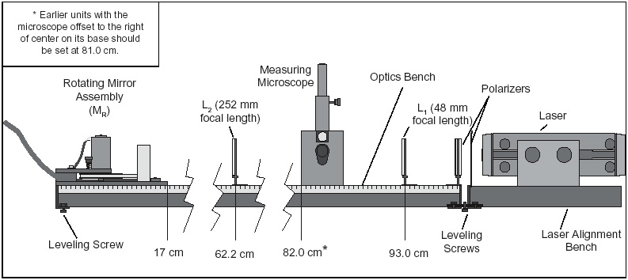

This summary is for those who are familiar with the equipment and the experiment, and just need a quick reminder of the steps in the alignment procedure. If you have not successfully aligned the apparatus before, we recommend that you take the time to go through the detailed alignment procedure in the preceding section.

1. Align the laser so the laser beam strikes the center of $M_R$ (use the alignment jigs).

2. Adjust the rotational axis of $M_R$ so it is perpendicular to the beam (i.e. as $M_R$ rotates, there must be a position at which it reflects the laser beam directly back into the laser aperture).

3. Insert $L_1$ to focus the laser beam to a point. Adjust $L_1$ so the beam is still centered on $M_R$.

4. Insert $L_2$ and adjust it so the beam is still centered on $M_R$.

5. Place the Measuring Microscope in position and, again, be sure that the beam is still centered on $M_R$.

   **CAUTION: Do not look through the microscope until the polarizers have been placed between the laser and the beam splitter.**

6. Position $M_F$ at the chosen distance from $M_R$ (2-15 meters), so the reflected image from $M_R$ strikes the center of $M_F$.

7. Adjust the position of $L_2$ to focus the beam to a point on $M_F$.

8. Adjust $M_F$ so the beam is reflected directly back onto $M_R$.

9. Insert the polarizers between the laser and the beam splitter.

10. Focus the microscope on the image point.

11. Remove polarizers.

**Alignment Hints**

Once you have the microscope focused, it may still be difficult to obtain a good spot. There may be several other lights visible in the microscope besides the spot reflected from the fixed mirror.

*Figure 6.15: Stray spots and stray interference pattern.*

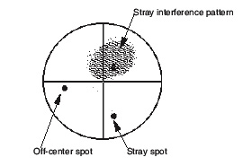

The most common of these are stray interference patterns. These are caused by multiple reflections from the surfaces of the lenses, and may be ignored. If necessary, you may be able to eliminate them by angling the lenses 1-2°.

Stray Spots are most often caused by reflections off the window of the rotating mirror housing. To determine which spot is the one you must measure, block the beam path between the rotating mirror and the fixed mirror. The relevant spot will disappear.

If the spot you need to measure is significantly off-center, you can move it by adjusting the angle of the beam splitter.

*Figure 6.16: Elongated spot with fringes.*

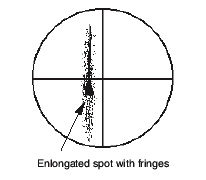

Another common problem is a spot that is "stretched" with no easily discernible maxima. Check first to make sure that this is the spot you need by blocking the beam path between the moving and fixed mirrors. If it is, then twist $L_2$ slightly until the image coalesces into a single spot.

*Figure 6.17: Elongated spot without fringes.*

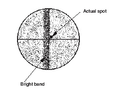

Once the mirror begins to rotate, it is safe to look into the microscope without the polarizers. You will notice that your carefully aligned pattern has changed: now the entire field is covered with a random interference pattern, and there is a bright band down the center of the field. Ignore the interference pattern; there's nothing you can do about it anyway. The band is the image of the laser when, once each rotation, the mirror reflects it into the microscope beam splitter. This is also unavoidable.

Your actual spot will probably be just to one side of the bright band. You can check for it by blocking and unblocking the beam path between the rotating mirror and fixed mirror and watching to see what disappears.

If you aligned everything perfectly, the spot will be hidden by the bright band; in this case, make sure that you have a spot when the rotating mirror is fixed and is reflecting the laser to the fixed mirror. If you do have the correct spot under stationary conditions, then misalign the fixed mirror very slightly (0.004° or less) around the horizontal axis. This will bring the actual spot out from under the bright band.

**Procedure**

**Making the Measurement**

The speed of light measurement is made by rotating the mirror at high speeds and using the microscope and micrometer to measure the corresponding deflection of the image point. By rotating the mirror first in one direction, then in the opposite direction, the total beam deflection is doubled, thereby doubling the accuracy of the measurement.

**Important — to Protect the Rotating Mirror Assembly:**

- Before turning on the motor, be sure the lockscrew for the rotating mirror is completely loosened, so the mirror rotates freely by hand.
- Whenever the speed of the motor is accelerated, the red LED on the front panel of the motor control box will light up. As the speed stabilizes, this light should go off. If it does not, turn off the motor. Something is interfering with the motor rotation. Check to be sure the lock-screw for $M_R$ is fully loosened.
- Never run the motor with the MAX REV/SEC button pushed for more than one minute at a time, and always allow about a minute between runs for the motor to cool off.

1. With the apparatus aligned and the beam image in sharp focus (see the previous section), set the direction switch on the rotating mirror power supply to CW, and turn on the motor. If the image was not in sharp focus, adjust the microscope. You should also turn $L_2$ slightly askew (about 1-2°) to improve the image. To get the best image you may need to adjust the microscope and $L_2$ several times. Let the motor warm up at about 600 revolutions/sec for at least 3 minutes.

2. Slowly increase the speed of rotation. Notice how the beam deflection increases.

3. Use the ADJUST knob to bring the rotational speed up to about 1,000 revolutions/sec. Then push the MAX REV/SEC button and hold it down. When the rotation speed stabilizes, rotate the micrometer knob on the microscope to align the center of the beam image with the cross hair in the microscope that is perpendicular to the direction of deflection. Record the speed at which the motor is rotating, turn off the motor, and record the micrometer reading.

4. Reverse the direction of the mirror rotation by switching the direction switch on the power supply to CCW. Allow the mirror to come to a complete stop before reversing the direction. Then repeat your measurement as in step 3 above.

   NOTES:
   - When reversing the direction of movement of the micrometer carriage, there will always be some movement of the micrometer knob before the carriage responds. Though this source of error is small, it can be eliminated. Just adjust the initial position of the micrometer stage so that you always turn the micrometer knob in the same direction as you adjust it.
   - When the mirror is rotated at 1,000 rev/sec or more, the image point will widen in the direction of displacement. Position the microscope cross hair in the center of the resulting image.
   - The micrometer on the Measuring Microscope is graduated in increments of 0.01 mm for the beam deflections.

5. The following equation was derived earlier in the manual:

   $$c=\frac{4AD^2\omega}{(D+B)\Delta s'}$$

   When adjusted to fit the parameters just measured, it becomes:

   $$c = \frac{8\pi A D^2 (\text{Rev/sec}_{cw} + \text{Rev/sec}_{ccw})}{(D+B)(s'_{cw} - s'_{ccw})}$$

   Use this equation, along with the diagram in Figure 6.14, to calculate c, the speed of light. (To measure A, measure the distance between $L_1$ and $L_2$, then subtract the focal length of $L_1$, 48 mm.)

### 6.2.3 Data Analysis

*(Not further developed in the source manual.)*

### 6.2.4 Interpretation of Results

*(Not further developed in the source manual.)*
