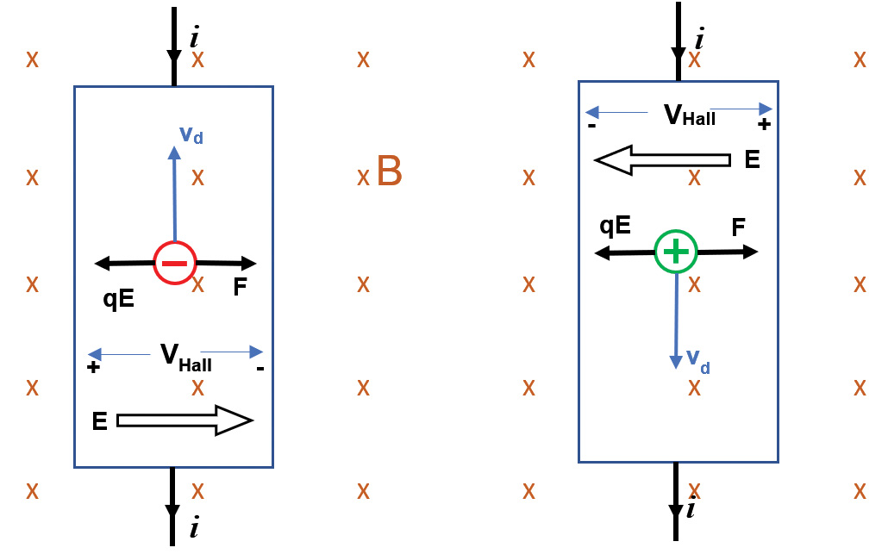
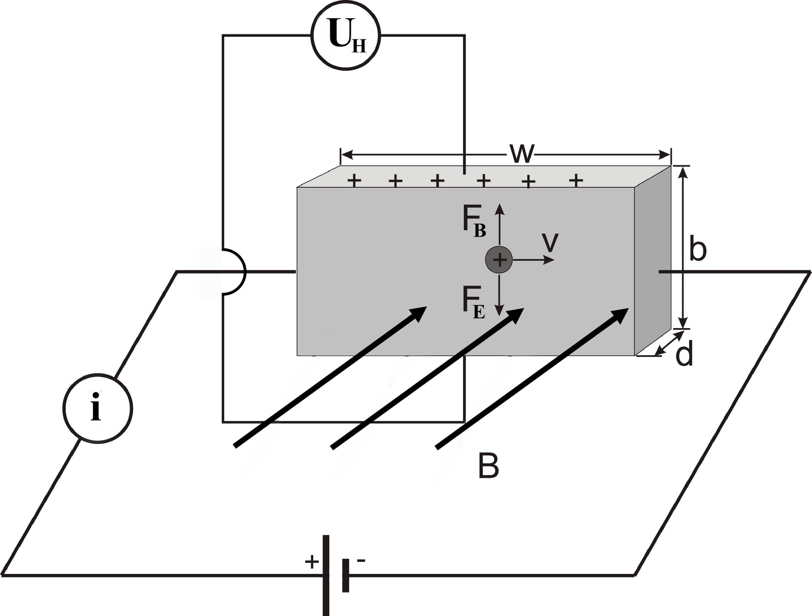
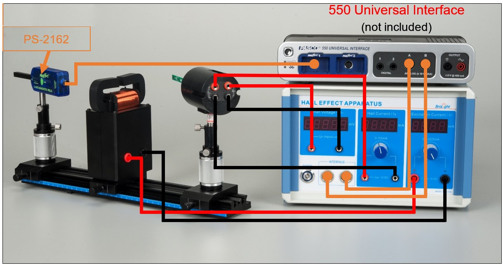
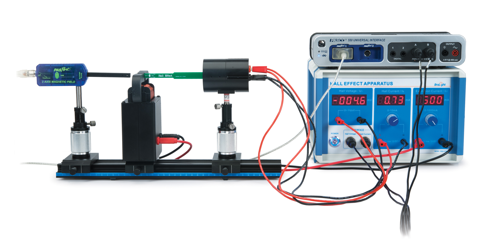
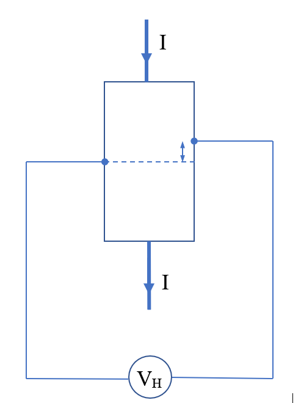

# L-7: Hall Effect

## 7.1 Introduction

The Hall Effect experiment (conducted by Edwin Hall in 1879) determines the sign
of the charge carriers in current flow. The conductor is immersed in a magnetic field,
causing the charge carriers to be deflected, creating an electric field. The direction
of the electric field will depend on the sign of the charge carriers, and the polarity of
the Hall voltage across the semiconductor reveals this sign.
    The magnitude of the Hall voltage is dependent on the current, the charge carrier
density, and the magnitude of the magnetic field. In modern day electronics, the Hall
Effect is used to measure the magnitude and direction of magnetic fields.
    There are two parts to this experiment. In the first part, the magnetic field will
be held constant and the current through the semi-conductor will be varied. In the
second part, the magnetic field will be varied by varying the current through the
electromagnet while the current through the semi-conductor will be held constant.
Rather than measuring the magnetic field for each data point, we will first character-
ize the magnetic field as a function of the current. In both cases, you will determine
the charge carrier density, $n$, from your data.

**Theory**

A current could be thought of as a negative charge moving in one direction (Fig-
ure 7.1, left) or as a positive charge moving in the opposite direction (Figure 7.1,
right). To determine which it actually is, a semiconductor is immersed in the mag-
netic field transverse to the direction of flow of current. The moving charge experi-
ences a $q\mathbf{v}\times\mathbf{B}$ force, causing a charge buildup on one side of the semiconductor. This
charge buildup acts like a tiny capacitor, creating an electric field and a restoring $q\mathbf{E}$
force.
   If the charge carrier is negative (Figure 7.1, left), there is a buildup of negative
charges on the right side of the conductor. If the charge carrier is positive (Figure 7.1,

*Figure 7.1: Motion of negative (left) and positive (right) charge carriers through the Hall magnetic field.*

*Figure 7.2: Current flowing through the rectangular hall chip.*

right), there is a buildup of negative charges on the left side of the conductor. Thus,
the Hall voltage, which is measured across the conductor, will either be positive or
negative, depending on the sign of the charge carriers.
    The charge carriers will come to equilibrium when the magnetic force equals the
electric force,

$$
\mathbf{F}_B + \mathbf{F}_E = 0
$$

or

$$
qvB = qE
$$
*(7.1)*

where $q$ is the moving charge, $v$ is the average [drift] speed of the charge carriers, $B$
is the magnetic field strength, and $E$ is the electric field strength. The drift speed is
related to the current, $i$, in the chip:

$$
i = \frac{\Delta \text{charge}}{\Delta t} = \frac{e(\text{volume charge density}) \times (\text{volume})}{\Delta t} = \frac{ne(bdw)}{\Delta t} = nebd\,v
$$

so the drift velocity, $v$, must be

$$
v = \frac{i}{nebd}
$$
*(7.2)*

where $w$ is the length of the chip, $d$ is the thickness of the chip, $b$ is the width of
the chip, $e$ is the magnitude of the electron charge, and $n$ is the number of charge
carriers per unit volume.
   The Hall Voltage, $V_H$, is related to the electric field strength:

$$
E = \frac{V_H}{b}
$$
*(7.3)*

Substituting equation 7.2 for $v$ and Equation 7.3 for $E$ into equation 7.1 gives

$$
\frac{iB}{nebd} = \frac{V_H}{b}
$$
*(7.4)*

Solving for the Hall Voltage gives

$$
V_H = \frac{iB}{ned}
$$
*(7.5)*

## 7.2 Procedure

Setup
  1. Connect the electromagnet to the banana jacks labeled Excitation Current ($I_m$)
     on the Hall Effect Apparatus (see Figure 7.3).

  2. On the back of the Hall Effect Probe, connect the ports labeled $I_s$ to the banana
     jacks labeled Hall Current ($I_s$) on the Hall Effect Apparatus. On the back of
     the Hall Effect Probe, connect the ports labeled $V_H$ to the banana jacks labeled
     Hall Voltage ($V_H$) on the Hall Effect Apparatus.

  3. Connect the PASPORT Extension Cable (PS-2500) between the 2-Axis Mag-
     netic Field Sensor (PS-2162) and a PASPORT port on the 550 or 850 Universal
     Interface.

  4. Connect the 8-pin DIN Extension Cable (UI-5218) between the port marked
     ‘Interface- Hall Voltage’ on the Hall Effect Apparatus and the Analog Input A
     on the 550 or 850 Universal Interface.

  5. Connect the 8-pin DIN Extension Cable (UI-5218) between the port marked
     “Interface- Hall Current” on the Hall Effect Apparatus and the Analog Input
     B on the 550 or 850 Universal Interface.

*Figure 7.3: Wiring diagram for the experiment.*

  6. Open the PASCO Capstone program and in the Hardware Setup, the Hall
     Current, Hall Voltage, and Magnetic Field sensors should be auto-recognized.

  7. Create a Digits display of the Magnetic Field Strength (Perpendicular) within
     Capstone.

  8. Create a table with the Hall Voltage (mV) and the Hall Current (mA) in
     Capstone.

  9. Change the sampling mode to Keep.

Part 1: Vary the Current throught the Semi-Conductor; Hold
Magnetic Field Constant

In this part of the experiment, the magnetic field will be held constant and the
current through the semi-conductor will be varied.

  1. Position the Hall Probe in the center of the magnet (see Figure 7.4).

  2. Set the Excitation Current ($I_M$) 0 − 1000 mA to a desired value (e.g. 500 mA)
     so the magnetic field strength will be constant.

  3. Make sure the Hall Current "$I_s$" 0 − 10 mA is zero.

  4. Click Preview and adjust the Hall Current to 0.5 mA. Press Keep to record
     the voltage and current. Then increase the Hall Current by increments of

*Figure 7.4: Complete setup of the Hall Effect experiment.*

## 0.5 mA, recording each value, until the Hall Current is 5.5 mA. Then press

   Stop. Return the Hall Current to zero.

5. Move the Hall Probe out of the magnet. Press the tare button on the side of
   the Magnetic Field Sensor. Move the Magnetic Field Sensor into the center of
   the magnet. Click Preview and record the magnetic field strength. Then press
   Stop.

6. Set the current 0 − 1000 mA to another value (e.g. 800 mA), then record data
   again, repeating Steps 3 through 5.

7. Fit the V vs. I data.

8. Hall Voltage Compensation: Because the leads that measure the Hall Voltage
   may not be exactly opposite each other across the semi-conductor, a voltage
   may appear that is due to the potential difference along the direction of the
   current. To measure this and compensate for it, slide the Hall Probe completely
   out of the magnet, set the magnet current to zero, and perform Step 4 to record
   the Hall Voltage without any magnetic field. Apply a linear fit to the V vs. I
   data. The slope of this line will be subtracted from the slopes of the other
   lines to compensate for the offset of the Hall Voltage due to misalignment of
   the leads.

*Figure 7.5: Misalignment of Hall Voltage Leads*

Part 2:Varying the Magnetic Field: Hold Current through
Semi-Conductor Constant

In this part of the experiment, the magnetic field will be varied by varying the current
through the electromagnet while the current through the semi-conductor will be held
constant. Rather than measuring the magnetic field for each data point, we will first
characterize the magnetic field as a function of the current.

  1. To discover the relationship between the magnetic field strength and the current
     through the magnet coils, create a table of Magnetic Field Strength (Perpen-
     dicular). In the second column, enter the Magnet Current (with units of mA).
     Pre-fill the column with values from 50 to 900 mA in steps of 50 mA. Create a
     graph of Magnetic Field Strength (Perpendicular) vs. Magnet Current (A).

  2. With the Hall Current set to zero, press the tare button on the side of the
     Magnetic Field Sensor. Move the Magnetic Field Sensor into the center of the
     magnet.

  3. Click Preview and adjust the “Excitation Current” (the current through the
     electromagnet) to 50 mA as read on the digital readout on the Hall Effect
     Apparatus. Then click Keep.

  4. Adjust the “Excitation Current” to each value in the table and record for each
     value. Then click Stop. Return the “Excitation Current” to zero to prevent
     the magnet from getting too hot.

  5. Create another graph and apply a fit. In the calculator, create an equation for
     the magnetic field, $B$:

$$
B = a + b*I + c*I^2 + d*I^3
$$

      in units of T where $I$ = [Magnet Current (A)] and $a$, $b$, $c$, and $d$ are fit coefficients.

  6. Create a scatter plot of Hall Voltage (mV) vs. $B$ (mT).

  7. Create a Digits display of the Hall current $I_s$ in Capstone.

  8. Create a table of the Hall Voltage (mV), the calculation $B$, and Magnet Current
     (mA).

  9. Set the Hall current $I_s$ (0–10 mA) to a desired value (e.g. 5 mA).

 10. Make sure the Excitation Current ($I_M$) 0–1000 mA is zero.

 11. Set the sampling rate to 10 Hz.

 12. Move the Magnetic Field Sensor out of the magnet and move the Hall Effect
     Probe into the center of the magnet.

 13. Click Preview and increase the Excitation Current to 50 mA and record. Con-
     tinue to increase the Excitation Current by steps of 50 mA up to 900 mA,
     keeping track of each data point in your table. Then click Stop.

 14. Set the Hall Current 0–10 mA to another value (e.g. 8 mA), then record the
     data again, repeating steps 10 through 13.

 15. On the graph, apply a fit to the V vs. $B$ data.

## 7.3 Data Analysis

The dimensions of the n-semiconductor strip: $w = 3.9$ mm, $b = 2.3$ mm, $d = 1.2$ mm.

  1. Part 1: For the constant magnetic field data, use the slope of the graph and
     equation 7.5 to determine the density of charge carriers ($n$). Remember to
     compensate by subtracting the slope of the graph for zero magnetic field from
     the slope of the run with the magnetic field.

  2. Determine the sign of the charge carriers by using the sign of the Hall voltage
     and making a diagram showing the direction of the magnetic field, drift velocity,
     and the Lorentz force.

 3. Part 2: For the constant current data, use the slope of the graph and equa-
    tion 7.6 to determine the density of charge carriers ($n$).

 4. For the constant current data, calculate the drift speed from equations 7.2
    and 7.6 using the slope of the Hall Voltage vs. $B$ graph

$$
V_H = (vb)B
$$
*(7.6)*

## 7.4 Interpretation of Results

- What are two applications of the Hall effect?

- How is the Hall voltage related to the magnetic flux density?

- How can you make the Hall voltage disappear?

## Additional Figures

