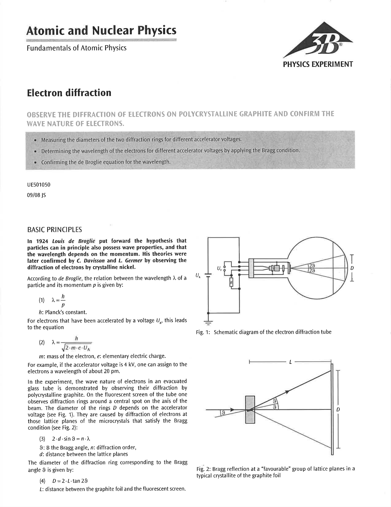
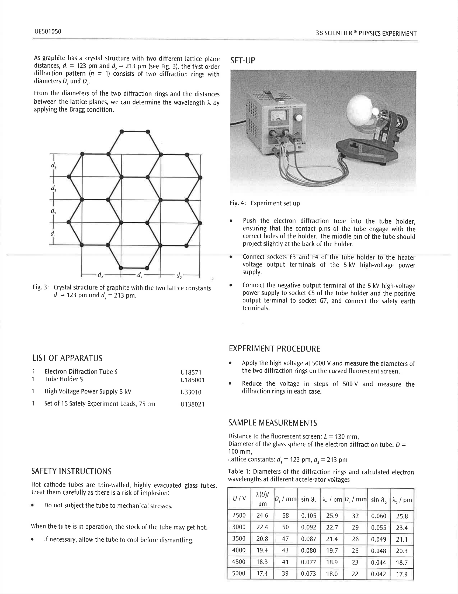

# L-8: Electron Diffraction

## 8.1 Introduction

In 1924 Louis de Broglie put forward the hypothesis that particles can in principle also possess wave properties, and that the wavelength depends on the momentum. His theories were later confirmed by C. Davisson and L. Germer by observing the diffraction of electrons by crystalline nickel.

According to de Broglie, the relation between the wavelength, $\lambda$, of a particle and its momentum, $p$, is given by:

$$
\lambda=\frac{h}{p}
$$
*(8.1)*

where $h$ is Planck's constant.

For electrons that have been accelerated by a voltage $V_A$, this leads to the equation

$$
\lambda=\frac{h}{\sqrt{2 m_e e V_A}}
$$
*(8.2)*

where $m_e$ is the mass of the electron and $e$ is the elementary electric charge. For example, if the accelerator voltage is 4 kV, one can assign to the electrons a wavelength of about 20 pm.

*Figure 8.1: Schematic diagram of the electron diffraction tube*

*Figure 8.2: Bragg reflection at a "favorable" group of lattice planes in a typical crystallite of the graphite foil*

In the experiment, the wave nature of electrons in an evacuated glass tube is demonstrated by observing their diffraction by poly-crystalline graphite. On the fluorescent screen of the tube one observes diffraction rings around a central spot on the axis of the beam. The diameter of the rings $D$ depends on the accelerator voltage (see Figure 8.1). They are caused by diffraction of electrons at those lattice planes of the microcrystals that satisfy the Bragg condition (see Figure 8.2)

$$
2 d \sin\,\theta=n \lambda
$$
*(8.3)*

where $\theta$ is the Bragg angle, $n$ is the diffraction order, and $d$ is the distance between the lattice planes.

The diameter of the diffraction ring corresponding to the Bragg angle, $\theta$, is given by

$$
D = 2 L \tan(2\theta)
$$
*(8.4)*

where $L$ is the distance between the graphite foil and the fluorescent screen.

*Figure 8.3: Crystal structure of graphite with the two lattice constants $d_1=0.123$ nm and $d_2=0.213$ nm*

As graphite has a crystal structure with two different lattice plane distances, $d_1=0.123$ nm and $d_2=0.213$ nm (see Figure 8.3), the first-order diffraction pattern ($n=1$) consists of two diffraction rings with diameters $D_1$ and $D_2$.

From the diameters of the two diffraction rings and the distances between the lattice planes, we can determine the wavelength $\lambda$ by applying the Bragg condition.

## 8.2 Procedure

**Setup**

*Figure 8.4: Experimental set up*

1. Push the electron diffraction tube into the tube holder, ensuring that the contact pins of the tube engage with the current holes of the holder. The middle pin of the tube should project slightly at the back of the holder.
2. Connect sockets F3 and F4 of the tube holder to the heater voltage output terminals of the 5 kV high-voltage power supply.
3. Connect the negative output terminal of the 5 kV high-voltage power supply to socket C5 of the tube holder and the positive output terminal to socket G7, and connect the safety earth terminals.

**Procedure**

1. Apply the high voltage at 5000 V and measure the diameters of the two diffraction rings on the curved fluorescent screen.
2. Reduce the voltage in steps of 500 V and measure the diffraction rings in each case.
3. Use the calculations from the Theory section as well as your measurements at each voltage to determine $\sin\,\theta$ and $\lambda$ of each ring.

## 8.3 Data Analysis

The theoretical de Broglie wavelengths $\lambda(V)$ are calculated from the values of the voltage V by applying Equation 8.2.

As the diameters of the diffraction rings are measured on the curved surface of the fluorescent screen, the curvature, defined by the diameter of the glass sphere, must be taken into account for determining the Bragg angle. Applying Equation 8.3 we obtain

$$
\lambda=2 d_{1/2} \sin(\theta_{1/2})
$$
*(8.5)*

where

$$
\sin(\theta_{1/2})=\frac{D}{4L}\, \sin\left(\frac{D_{1/2}}{2D}\right).
$$

Graphically compare the de Broglie wavelengths with the calculated wavelengths and fit the data.

## 8.4 Interpretation of Results
